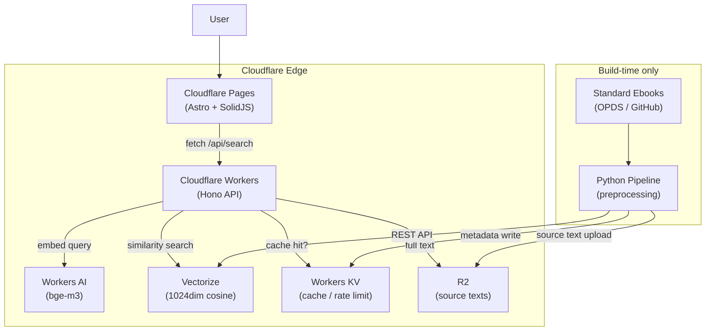
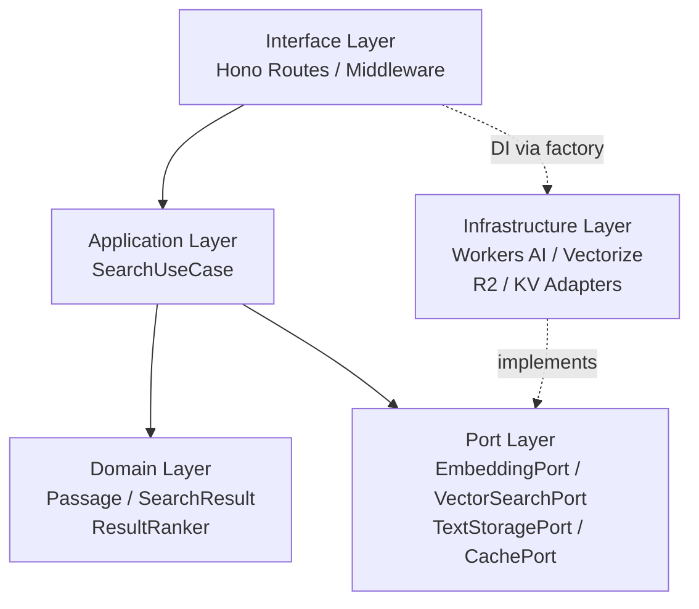
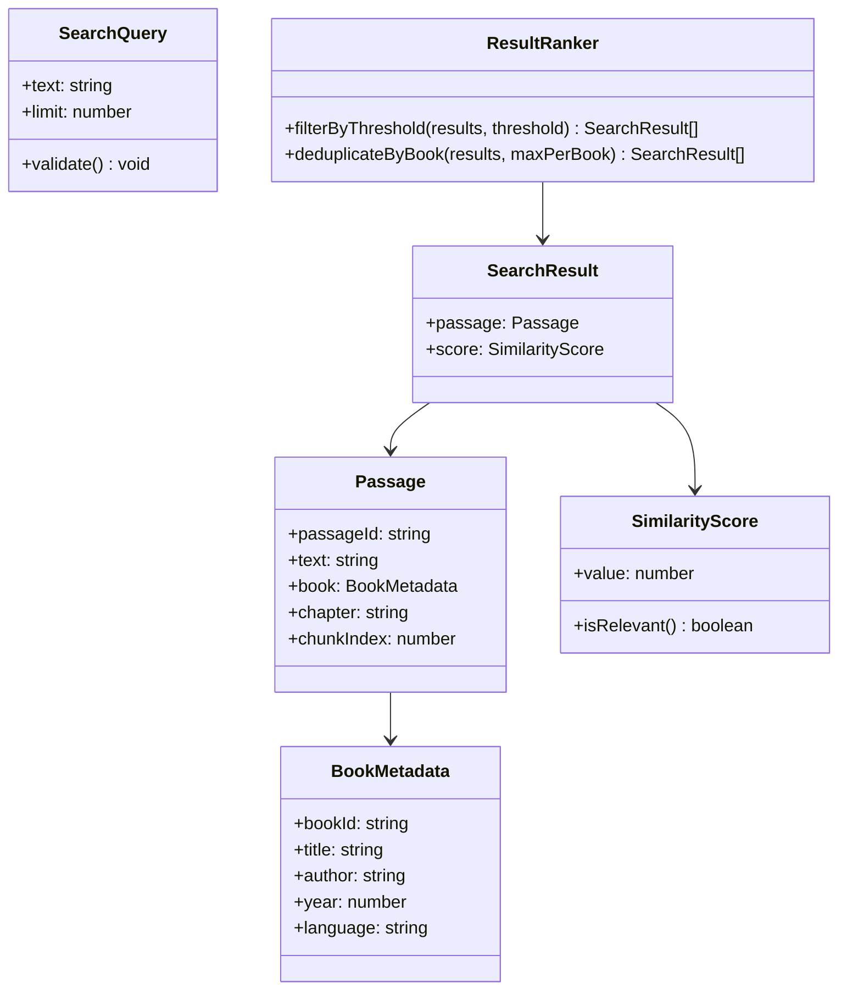
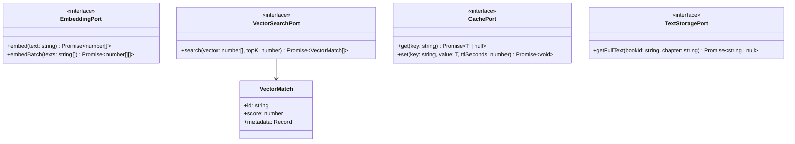
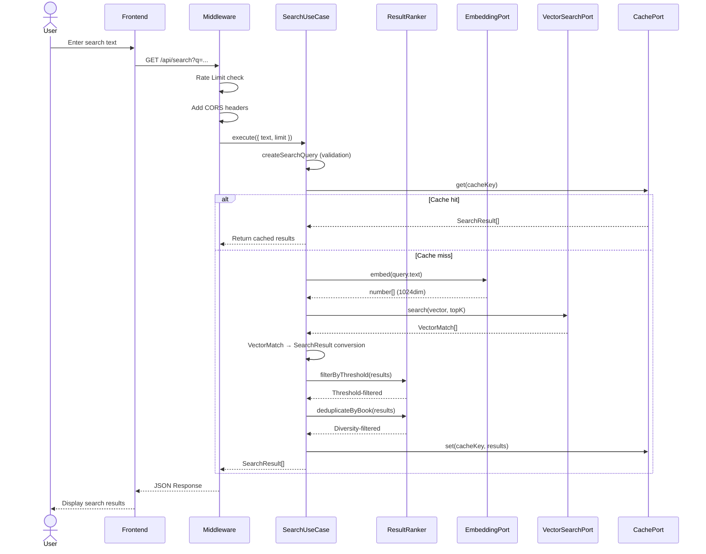
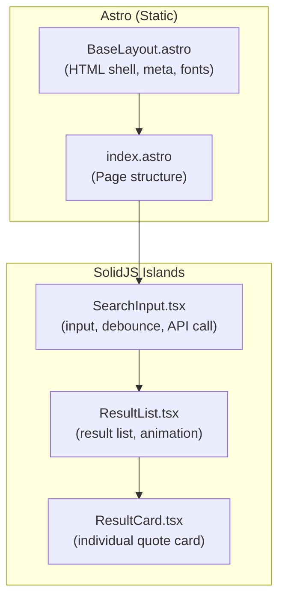
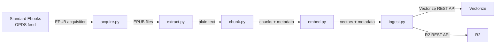
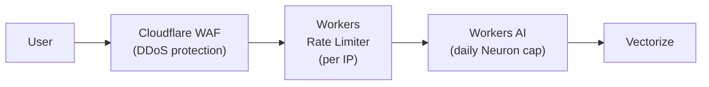
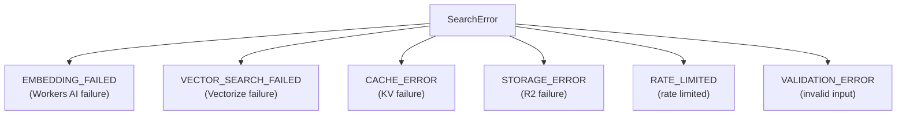

<!-- Translated from DESIGN.ja.md v1.0.1 -->
**[English](DESIGN.en.md)** | **[日本語](DESIGN.ja.md)** | **[中文](DESIGN.zh-CN.md)**

# Passage Technical Design Document

> 📋 **Document Information**
>
> *Project Name:* Passage
> *Version:* 1.0.1
> *Author:* 坂下 康信
> *Last Updated:* 2026-03-08
> *Status:* Final (Reviewed)

## 1. Overview

**Passage** is a web service that discovers "passages that resonate" from masterpieces of world literature through semantic search. When a user enters free-form text (mood, scene, emotion, etc.), the most semantically similar passages from literary works are displayed along with their sources.

While conventional quote aggregation sites contain a limited collection of famous quotes curated by hand, Passage vectorizes the full text of hundreds of literary works and enables natural language semantic search. Built on the Cloudflare Workers ecosystem, it achieves low latency through edge computing and zero operational overhead through serverless architecture.

**Design Goals**

- An intuitive UX that enables cross-work literary search using natural language
- A zero-configuration, zero-operation serverless architecture
- A hexagonal architecture that completely isolates domain logic from cloud services
- Sustainable operation at a running cost of less than $15/month
- A defensive design that prevents cost explosion even during traffic spikes

---

## 2. Background and Challenges

World literature contains millennia of accumulated human wisdom and emotion. However, finding "the perfect passage for your current mood" from within that vast body of text is a difficult task.

Existing quote sites (BrainyQuote, Goodreads, etc.) only contain famous lines curated by hand, resulting in narrow coverage. Keyword-based search cannot handle emotion-based queries such as "alone late at night, feeling melancholy, yet somehow refreshed."

> 💡 **Solution Approach:** Convert the full text of public domain literary works into vector embeddings and store them in Cloudflare Vectorize. Vectorize the user's natural language input using the same model and perform semantic search via cosine similarity. This enables returning semantically similar literary passages even for abstract queries involving emotions, scenes, and atmospheres.

---

## 3. Requirements Definition

### 3.1 Functional Requirements

- **FR-01** Users can enter free-form text and search for semantically similar passages from literary works
- **FR-02** Search results include the passage text, work title, author name, and chapter information
- **FR-03** A single search returns up to 20 results (default 10)
- **FR-04** Search results are sorted by cosine similarity score
- **FR-05** Multilingual queries (English, Japanese, French, etc.) can search English texts
- **FR-06** The API provides REST endpoints conforming to the OpenAPI specification
- **FR-07** The frontend is a single-page application containing search input and result display
- **FR-08** A health check endpoint is provided

### 3.2 Non-Functional Requirements

- **NFR-01** Search response time must be within 500ms (p95)
- **NFR-02** Must handle load of up to 1 million requests per month
- **NFR-03** Monthly operating cost must be $15 or less under normal conditions
- **NFR-04** Monthly cost must not exceed $120 even at 10 million requests per month
- **NFR-05** Frontend Lighthouse performance score must be 90 or above
- **NFR-06** API responses must include CORS support
- **NFR-07** IP-based rate limiting must cap requests at 30 per minute per IP
- **NFR-08** Service availability must be 99.9% or higher per month (in accordance with the Cloudflare Workers platform SLA)

### 3.3 Constraints

- Data sources are limited to public domain literary works (based on U.S. copyright law)
- Must comply with the Cloudflare Workers execution time limit (CPU time 30 seconds, Workers Paid)
- Must operate within the Vectorize limit of 10 million vectors per index
- Frontend static assets are hosted on Cloudflare Pages

---

## 4. Technology Stack

### 4.1 Runtime & Frameworks

- **TypeScript 5.x**
    - Unified across all layers: Workers API, Hono, and frontend. Improves developer experience and code quality through type safety
- **Hono 4.x** (MIT)
    - A web framework optimized for Cloudflare Workers. Provides middleware system, Zod integration, and automatic OpenAPI generation
    - Rationale: Similar API to Express/Fastify but native to edge runtimes. Extremely small bundle size (14KB) that fits within Workers constraints
- **Astro 5.x** (MIT)
    - A web framework with static site generation + island architecture. Zero-configuration deployment via the Cloudflare Pages adapter
    - Rationale: Eliminates unnecessary JS on content-focused pages while hydrating only the search UI as a SolidJS island
- **SolidJS 1.x** (MIT)
    - A UI library with fine-grained reactivity. High performance without a virtual DOM
    - Rationale: Bundle size is 1/5 or less compared to React, with minimal runtime overhead. Ideal as an Astro island

### 4.2 Cloudflare Services

- **Cloudflare Workers** (Paid plan, $5/month base)
    - API server. Executes at 200+ edge cities, zero data transfer fees (egress)
- **Workers AI**
    - `@cf/baai/bge-m3` embedding model. 1024 dimensions, multilingual support, 8,192 token context
    - `@cf/baai/bge-reranker-base` reranker (for v2 extension)
- **Vectorize**
    - Vector database. Up to 10 million vectors per index, cosine similarity search
- **Workers KV**
    - Persistence for search result caching and rate limit counters
- **R2**
    - Storage for literary work source texts. Free egress
- **Cloudflare Pages**
    - Static site hosting for the frontend

> 💡 **Rationale for Embedding Model Selection:** `bge-m3` was selected for the following three reasons. (1) Multilingual support: Enables searching English texts with Japanese or French queries. (2) Cost: $0.012/M tokens, approximately 6x cheaper than bge-base-en-v1.5 at $0.067/M. (3) Context length: Supports 8,192 token input, processing long paragraphs without truncation. In terms of accuracy, the English-specialized bge-base-en-v1.5 may have a slight advantage in some cases, so a comparative benchmark will be conducted during initial testing for the final decision.

### 4.3 Preprocessing Tools

- **Python 3.12+**
    - Used exclusively for the preprocessing pipeline. Not deployed to production
- **ebooklib** (AGPL-3.0)
    - EPUB file reading and parsing. Requires careful handling due to AGPL-3.0 license. In this project, usage is limited to the build-time preprocessing pipeline and is not included in the web service itself, so it falls outside the scope of license propagation. AGPL compliance is required if the pipeline itself is released as OSS
- **BeautifulSoup4** (MIT)
    - Text extraction from XHTML
- **NLTK** (Apache 2.0) *planned for v2*
    - Sentence-level splitting (`sent_tokenize`). Not used in v1, which adopts paragraph-level splitting
- **httpx** (BSD-3)
    - Asynchronous HTTP requests to Cloudflare REST APIs

### 4.4 Testing

- **Vitest** + Workers environment plugin
    - Domain layer unit tests, Workers API integration tests
- **Playwright**
    - Frontend E2E tests
- **pytest**
    - Preprocessing pipeline tests

### 4.5 Build & Deployment

- **Wrangler CLI**
    - Local development and deployment for Workers / Vectorize / KV / R2
- **GitHub Actions**
    - CI/CD pipeline. Automated testing, linting, and deployment

---

## 5. System Architecture Design

### 5.1 Design Principles

- **Hexagonal Architecture (Ports & Adapters)**: Completely isolates domain logic from Cloudflare services, maximizing testability
- **Dependency Inversion Principle (DIP)**: The domain layer defines Port interfaces, and the infrastructure layer implements them. The direction of dependency always flows from the outside inward
- **Single Responsibility Principle**: Each module has only one responsibility. Search logic, embedding generation, vector search, and caching are all independent modules
- **Defensive Design**: Rate limiting, timeouts, and fallbacks are implemented in multiple layers to prevent cost explosion and cascading failures

### 5.2 Overall Architecture Diagram



### 5.3 Layer Structure



- **Domain Layer**: Independent of Cloudflare. Responsible for search result value objects, scoring, and filtering logic
- **Port Layer**: Defines the interfaces that the domain requires from external services
- **Infrastructure Layer**: Port implementations using Cloudflare services. Confines service-specific processing here
- **Application Layer**: Orchestration that combines domain and ports. The execution unit for search use cases
- **Interface Layer**: Routing, validation, middleware, and entry points via Hono

### 5.4 Package Structure

```
passage/
├── packages/
│   ├── api/                          # Cloudflare Workers API
│   │   ├── src/
│   │   │   ├── domain/
│   │   │   │   ├── model/
│   │   │   │   │   ├── passage.ts
│   │   │   │   │   ├── search-query.ts
│   │   │   │   │   ├── search-result.ts
│   │   │   │   │   └── book-metadata.ts
│   │   │   │   └── service/
│   │   │   │       └── result-ranker.ts
│   │   │   ├── port/
│   │   │   │   ├── embedding-port.ts
│   │   │   │   ├── vector-search-port.ts
│   │   │   │   ├── text-storage-port.ts
│   │   │   │   ├── cache-port.ts
│   │   │   │   └── error/
│   │   │   │       └── search-error.ts
│   │   │   ├── application/
│   │   │   │   ├── search-use-case.ts
│   │   │   │   └── types.ts
│   │   │   ├── infrastructure/
│   │   │   │   ├── workers-ai-embedding-adapter.ts
│   │   │   │   ├── vectorize-search-adapter.ts
│   │   │   │   ├── r2-text-storage-adapter.ts
│   │   │   │   └── kv-cache-adapter.ts
│   │   │   ├── interface/
│   │   │   │   ├── routes/
│   │   │   │   │   ├── search.ts
│   │   │   │   │   └── health.ts
│   │   │   │   ├── middleware/
│   │   │   │   │   ├── rate-limiter.ts
│   │   │   │   │   ├── cors.ts
│   │   │   │   │   └── error-handler.ts
│   │   │   │   └── app.ts
│   │   │   ├── config/
│   │   │   │   └── bindings.ts
│   │   │   └── index.ts
│   │   ├── test/
│   │   ├── wrangler.toml
│   │   ├── tsconfig.json
│   │   ├── vitest.config.ts
│   │   └── package.json
│   ├── web/                          # Frontend (Astro + SolidJS)
│   │   ├── src/
│   │   │   ├── components/
│   │   │   │   ├── SearchInput.tsx    # SolidJS island
│   │   │   │   ├── ResultCard.tsx     # SolidJS island
│   │   │   │   └── ResultList.tsx     # SolidJS island
│   │   │   ├── layouts/
│   │   │   │   └── BaseLayout.astro
│   │   │   ├── pages/
│   │   │   │   └── index.astro
│   │   │   └── styles/
│   │   │       └── global.css
│   │   ├── astro.config.mjs
│   │   └── package.json
│   └── pipeline/                     # Python preprocessing
│       ├── src/
│       │   ├── acquire.py            # Standard Ebooks acquisition
│       │   ├── extract.py            # EPUB → text extraction
│       │   ├── chunk.py              # Chunk splitting
│       │   ├── embed.py              # Embedding generation
│       │   ├── ingest.py             # Ingestion into Vectorize/R2/KV
│       │   └── main.py               # Pipeline execution
│       ├── tests/
│       ├── pyproject.toml
│       └── README.md
├── .github/
│   └── workflows/
│       ├── ci.yml
│       └── deploy.yml
└── README.md
```

---

## 6. Domain Model Design

The domain layer has no dependencies on Cloudflare services whatsoever. It is composed of pure TypeScript code and is responsible for search result type definitions and scoring logic.

### 6.1 Class Diagram



### 6.2 Value Objects

All value objects guarantee immutability and type safety through `readonly` properties and the Branded Type pattern.

#### BookMetadata

Represents the metadata of a literary work.

```tsx
// domain/model/book-metadata.ts

export interface BookMetadata {
  readonly bookId: string;
  readonly title: string;
  readonly author: string;
  readonly year: number;
  readonly language: string;
}

export function createBookMetadata(params: {
  bookId: string;
  title: string;
  author: string;
  year: number;
  language: string;
}): BookMetadata {
  if (!params.bookId || !params.title || !params.author) {
    throw new Error(
      `BookMetadata requires non-empty bookId, title, and author`
    );
  }
  if (!Number.isInteger(params.year) || params.year < 0) {
    throw new Error(
      `BookMetadata year must be a non-negative integer: ${params.year}`
    );
  }
  return Object.freeze(params);
}
```

#### Passage

Represents a passage from a literary work. It is the smallest searchable unit and corresponds to a single vector in Vectorize.

```tsx
// domain/model/passage.ts

import type { BookMetadata } from "./book-metadata.js";

export interface Passage {
  readonly passageId: string;
  readonly text: string;
  readonly book: BookMetadata;
  readonly chapter: string;
  readonly chunkIndex: number;
}

export function createPassage(params: {
  passageId: string;
  text: string;
  book: BookMetadata;
  chapter: string;
  chunkIndex: number;
}): Passage {
  if (!params.passageId || !params.text) {
    throw new Error("Passage requires non-empty passageId and text");
  }
  if (params.chunkIndex < 0) {
    throw new Error("chunkIndex must be non-negative");
  }
  return Object.freeze({
    ...params,
    book: Object.freeze(params.book),
  });
}
```

#### SearchQuery

Represents a search query. Validation logic is consolidated in the domain layer.

```tsx
// domain/model/search-query.ts

export interface SearchQuery {
  readonly text: string;
  readonly limit: number;
}

const MAX_QUERY_LENGTH = 500;
const MIN_LIMIT = 1;
const MAX_LIMIT = 20;
const DEFAULT_LIMIT = 10;

export function createSearchQuery(params: {
  text: string;
  limit?: number;
}): SearchQuery {
  const trimmed = params.text.trim();

  if (trimmed.length === 0) {
    throw new SearchQueryValidationError("Search query must not be empty");
  }
  if (trimmed.length > MAX_QUERY_LENGTH) {
    throw new SearchQueryValidationError(
      `Search query must not exceed ${MAX_QUERY_LENGTH} characters`
    );
  }

  const limit = params.limit ?? DEFAULT_LIMIT;
  if (limit < MIN_LIMIT || limit > MAX_LIMIT) {
    throw new SearchQueryValidationError(
      `Limit must be between ${MIN_LIMIT} and ${MAX_LIMIT}`
    );
  }

  return Object.freeze({ text: trimmed, limit });
}

export class SearchQueryValidationError extends Error {
  constructor(message: string) {
    super(message);
    this.name = "SearchQueryValidationError";
  }
}
```

#### SimilarityScore

Represents a cosine similarity score. Vectorize's cosine metric returns a range from -1 (most dissimilar) to 1 (identical).

```tsx
// domain/model/search-result.ts

import type { Passage } from "./passage.js";

export interface SimilarityScore {
  readonly value: number;
}

const RELEVANCE_THRESHOLD = 0.3;

export function createSimilarityScore(value: number): SimilarityScore {
  if (value < -1 || value > 1) {
    throw new Error(`Similarity score must be between -1 and 1: ${value}`);
  }
  return Object.freeze({ value });
}

export function isRelevant(score: SimilarityScore): boolean {
  return score.value >= RELEVANCE_THRESHOLD;
}

export interface SearchResult {
  readonly passage: Passage;
  readonly score: SimilarityScore;
}
```

### 6.3 Domain Service: ResultRanker

A stateless domain service responsible for filtering search results and ensuring diversity. It implements a "diversity filter" that prevents results from a single work from dominating the top positions.

```tsx
// domain/service/result-ranker.ts

import type { SearchResult } from "../model/search-result.js";
import { isRelevant } from "../model/search-result.js";

export class ResultRanker {
  /**
   * Removes results with a similarity score below the threshold.
   * A quality gate to prevent returning low-quality results to the user.
   */
  filterByThreshold(results: readonly SearchResult[]): SearchResult[] {
    return results.filter((r) => isRelevant(r.score));
  }

  /**
   * Limits results from the same work to a maximum of maxPerBook items.
   * Prevents a specific work from monopolizing the top positions and ensures
   * diversity in search results.
   *
   * Algorithm:
   * Assumes input is sorted in descending order by score.
   * Counts the number of occurrences for each work and skips
   * subsequent results from that work once maxPerBook is exceeded.
   */
  deduplicateByBook(
    results: readonly SearchResult[],
    maxPerBook: number = 3
  ): SearchResult[] {
    const bookCounts = new Map<string, number>();
    const diversified: SearchResult[] = [];

    for (const result of results) {
      const bookId = result.passage.book.bookId;
      const count = bookCounts.get(bookId) ?? 0;

      if (count < maxPerBook) {
        diversified.push(result);
        bookCounts.set(bookId, count + 1);
      }
    }

    return diversified;
  }
}
```

---

## 7. Port Layer Design

The port layer defines the interfaces that the domain requires from external services. They are declared as TypeScript `interface` types, and the infrastructure layer provides the implementations.

### 7.1 Class Diagram



### 7.2 Interface Definitions

#### EmbeddingPort

A port that converts text into vector embeddings. An abstraction of Workers AI.

```tsx
// port/embedding-port.ts

export interface EmbeddingPort {
  /**
   * Converts a single text into a vector embedding.
   * @param text Input text
   * @returns A float array of 1024 dimensions
   */
  embed(text: string): Promise<number[]>;

  /**
   * Converts multiple texts into vector embeddings in batch.
   * Used for batch processing in the preprocessing pipeline.
   * @param texts Input text array (maximum 100 items)
   * @returns A float array of 1024 dimensions for each text
   */
  embedBatch(texts: string[]): Promise<number[][]>;
}
```

#### VectorSearchPort

A port that performs vector similarity search. An abstraction of Vectorize.

```tsx
// port/vector-search-port.ts

export interface VectorMatch {
  readonly id: string;
  readonly score: number;
  readonly metadata: Record<string, string | number>;
}

export interface VectorSearchPort {
  /**
   * Searches for the most similar vectors to the query vector.
   * @param vector Query vector (1024 dimensions)
   * @param topK Maximum number of results to return (1-20)
   * @returns Match results sorted in descending order by score
   */
  search(vector: number[], topK: number): Promise<VectorMatch[]>;
}
```

#### CachePort

A port for persisting search result caching and rate limiting. An abstraction of Workers KV.

```tsx
// port/cache-port.ts

export interface CachePort {
  get<T>(key: string): Promise<T | null>;
  set<T>(key: string, value: T, ttlSeconds: number): Promise<void>;
  increment(key: string, ttlSeconds: number): Promise<number>;
}
```

#### TextStoragePort

A port for retrieving source text. An abstraction of R2. Used in the v2 "surrounding context display" feature.

```tsx
// port/text-storage-port.ts

export interface TextStoragePort {
  getFullText(
    bookId: string,
    chapter: string
  ): Promise<string | null>;
}
```

### 7.3 Error Types

```tsx
// port/error/search-error.ts

export class SearchError extends Error {
  constructor(
    message: string,
    public readonly code: SearchErrorCode,
    public readonly cause?: unknown
  ) {
    super(message);
    this.name = "SearchError";
  }
}

export type SearchErrorCode =
  | "EMBEDDING_FAILED"
  | "VECTOR_SEARCH_FAILED"
  | "CACHE_ERROR"
  | "STORAGE_ERROR"
  | "RATE_LIMITED"
  | "VALIDATION_ERROR";
```

---

## 8. Infrastructure Layer Design

Implements the port layer interfaces using Cloudflare services. Each adapter confines Cloudflare-specific processing and exposes only the port interface externally.

### 8.1 Cloudflare Binding Type Definitions

TypeScript type definitions corresponding to the Wrangler configuration. All access to Cloudflare services is performed in a type-safe manner through this `Env` type.

```tsx
// config/bindings.ts

export interface Env {
  AI: Ai;
  VECTORIZE: VectorizeIndex;
  CACHE: KVNamespace;
  TEXTS: R2Bucket;
}
```

### 8.2 Workers AI Embedding Adapter

```tsx
// infrastructure/workers-ai-embedding-adapter.ts

import type { EmbeddingPort } from "../port/embedding-port.js";
import { SearchError } from "../port/error/search-error.js";

const MODEL = "@cf/baai/bge-m3" as const;
const MAX_BATCH_SIZE = 100;

export class WorkersAiEmbeddingAdapter implements EmbeddingPort {
  constructor(private readonly ai: Ai) {}

  async embed(text: string): Promise<number[]> {
    try {
      const response = await this.ai.run(MODEL, {
        text: [text],
      });
      const vectors = response.data;
      if (!vectors || vectors.length === 0) {
        throw new Error("Empty embedding response");
      }
      return vectors[0];
    } catch (error) {
      throw new SearchError(
        `Failed to generate embedding: ${error}`,
        "EMBEDDING_FAILED",
        error
      );
    }
  }

  async embedBatch(texts: string[]): Promise<number[][]> {
    if (texts.length > MAX_BATCH_SIZE) {
      throw new SearchError(
        `Batch size ${texts.length} exceeds maximum ${MAX_BATCH_SIZE}`,
        "EMBEDDING_FAILED"
      );
    }
    try {
      const response = await this.ai.run(MODEL, {
        text: texts,
      });
      return response.data;
    } catch (error) {
      throw new SearchError(
        `Failed to generate batch embeddings: ${error}`,
        "EMBEDDING_FAILED",
        error
      );
    }
  }
}
```

### 8.3 Vectorize Search Adapter

```tsx
// infrastructure/vectorize-search-adapter.ts

import type {
  VectorMatch,
  VectorSearchPort,
} from "../port/vector-search-port.js";
import { SearchError } from "../port/error/search-error.js";

export class VectorizeSearchAdapter implements VectorSearchPort {
  constructor(private readonly index: VectorizeIndex) {}

  async search(
    vector: number[],
    topK: number
  ): Promise<VectorMatch[]> {
    try {
      const results = await this.index.query(vector, {
        topK,
        returnMetadata: "all",
      });

      return results.matches.map((match) => ({
        id: match.id,
        score: match.score ?? 0,
        metadata: (match.metadata ?? {}) as Record<
          string,
          string | number
        >,
      }));
    } catch (error) {
      throw new SearchError(
        `Vector search failed: ${error}`,
        "VECTOR_SEARCH_FAILED",
        error
      );
    }
  }
}
```

### 8.4 KV Cache Adapter

```tsx
// infrastructure/kv-cache-adapter.ts

import type { CachePort } from "../port/cache-port.js";

export class KvCacheAdapter implements CachePort {
  constructor(private readonly kv: KVNamespace) {}

  async get<T>(key: string): Promise<T | null> {
    const value = await this.kv.get(key, "json");
    return value as T | null;
  }

  async set<T>(
    key: string,
    value: T,
    ttlSeconds: number
  ): Promise<void> {
    await this.kv.put(key, JSON.stringify(value), {
      expirationTtl: ttlSeconds,
    });
  }

  async increment(
    key: string,
    ttlSeconds: number
  ): Promise<number> {
    // KV does not support atomic increment, so this is
    // implemented as read-modify-write.
    // A design decision that prioritizes availability over
    // strict rate limiting accuracy.
    const current = await this.kv.get(key, "json") as number | null;
    const next = (current ?? 0) + 1;
    await this.kv.put(key, JSON.stringify(next), {
      expirationTtl: ttlSeconds,
    });
    return next;
  }
}
```

> ⚠️ **Non-atomicity of KV increment:** The read-modify-write in Workers KV is not atomic, and a race condition may occur with simultaneous requests from the same IP. Since the purpose of rate limiting is not strict flow control but rather prevention of obvious abuse, this design trade-off is within acceptable bounds. If strict rate limiting is required, consider using Durable Objects.

### 8.5 R2 Text Storage Adapter

```tsx
// infrastructure/r2-text-storage-adapter.ts

import type { TextStoragePort } from "../port/text-storage-port.js";
import { SearchError } from "../port/error/search-error.js";

export class R2TextStorageAdapter implements TextStoragePort {
  constructor(private readonly bucket: R2Bucket) {}

  async getFullText(
    bookId: string,
    chapter: string
  ): Promise<string | null> {
    // Path traversal prevention: sanitize input values
    const safeBookId = bookId.replace(/[^a-z0-9-]/g, "");
    const safeChapter = chapter.replace(/[^a-z0-9-]/g, "");
    if (!safeBookId || !safeChapter) return null;
    const key = `${safeBookId}/${safeChapter}.txt`;
    try {
      const object = await this.bucket.get(key);
      if (!object) return null;
      return await object.text();
    } catch (error) {
      throw new SearchError(
        `Failed to retrieve text: ${key}`,
        "STORAGE_ERROR",
        error
      );
    }
  }
}
```

---

## 9. Application Layer Design

The application layer is an orchestration layer that combines domain and ports to execute use cases.

### 9.1 SearchUseCase

```tsx
// application/search-use-case.ts

import type { EmbeddingPort } from "../port/embedding-port.js";
import type { VectorSearchPort } from "../port/vector-search-port.js";
import type { CachePort } from "../port/cache-port.js";
import {
  createSearchQuery,
  type SearchQuery,
} from "../domain/model/search-query.js";
import {
  createPassage,
  type Passage,
} from "../domain/model/passage.js";
import { createBookMetadata } from "../domain/model/book-metadata.js";
import {
  createSimilarityScore,
  type SearchResult,
} from "../domain/model/search-result.js";
import { ResultRanker } from "../domain/service/result-ranker.js";

const CACHE_TTL_SECONDS = 3600; // 1 hour

export class SearchUseCase {
  private readonly ranker = new ResultRanker();

  constructor(
    private readonly embedding: EmbeddingPort,
    private readonly vectorSearch: VectorSearchPort,
    private readonly cache: CachePort
  ) {}

  async execute(params: {
    text: string;
    limit?: number;
  }): Promise<SearchResult[]> {
    // 1. Query validation (executed in the domain layer)
    const query = createSearchQuery(params);

    // 2. Cache hit check
    const cacheKey = this.buildCacheKey(query);
    const cached = await this.cache.get<SearchResult[]>(cacheKey);
    if (cached) return cached;

    // 3. Vectorize the query text
    const queryVector = await this.embedding.embed(query.text);

    // 4. Vector similarity search
    //    Fetch 3x the requested amount (up to 50) to account for
    //    potential reduction from the diversity filter
    const fetchSize = Math.min(query.limit * 3, 50);
    const matches = await this.vectorSearch.search(
      queryVector,
      fetchSize
    );

    // 5. Convert VectorMatch to domain models
    const results: SearchResult[] = matches.map((match) => {
      const book = createBookMetadata({
        bookId: String(match.metadata.bookId ?? ""),
        title: String(match.metadata.title ?? ""),
        author: String(match.metadata.author ?? ""),
        year: Number(match.metadata.year ?? 0),
        language: String(match.metadata.language ?? "en"),
      });

      const passage = createPassage({
        passageId: match.id,
        text: String(match.metadata.text ?? ""),
        book,
        chapter: String(match.metadata.chapter ?? ""),
        chunkIndex: Number(match.metadata.chunkIndex ?? 0),
      });

      return {
        passage,
        score: createSimilarityScore(match.score),
      };
    });

    // 6. Filtering by domain service
    const filtered = this.ranker.filterByThreshold(results);
    const diversified = this.ranker.deduplicateByBook(filtered);
    const final = diversified.slice(0, query.limit);

    // 7. Save to cache
    if (final.length > 0) {
      await this.cache
        .set(cacheKey, final, CACHE_TTL_SECONDS)
        .catch((e) => console.error("[WARN] Cache write failed:", e));
    }

    return final;
  }

  private buildCacheKey(query: SearchQuery): string {
    // Generate a key from the combination of query text and limit
    // Normalization: only remove consecutive whitespace (case is preserved for consistency with embedding input)
    const normalized = query.text.replace(/\s+/g, " ");
    return `search:${normalized}:${query.limit}`;
  }
}
```

### 9.2 Sequence Diagram



---

## 10. API Design

### 10.1 Wrangler Configuration

```toml
# wrangler.toml
name = "passage-api"
main = "src/index.ts"
compatibility_date = "2026-01-01"

[ai]
binding = "AI"

[[vectorize]]
binding = "VECTORIZE"
index_name = "passage-index"

[[kv_namespaces]]
binding = "CACHE"
id = "<KV_NAMESPACE_ID>"

[[r2_buckets]]
binding = "TEXTS"
bucket_name = "passage-texts"
```

### 10.2 Entry Point and DI

Manual DI (Constructor Injection) is performed at the Worker entry point, explicitly assembling the dependency graph. No DI framework is used.

```tsx
// index.ts

import { createApp } from "./interface/app.js";
import type { Env } from "./config/bindings.js";
import { WorkersAiEmbeddingAdapter } from "./infrastructure/workers-ai-embedding-adapter.js";
import { VectorizeSearchAdapter } from "./infrastructure/vectorize-search-adapter.js";
import { KvCacheAdapter } from "./infrastructure/kv-cache-adapter.js";
import { SearchUseCase } from "./application/search-use-case.js";

export default {
  async fetch(
    request: Request,
    env: Env,
    ctx: ExecutionContext
  ): Promise<Response> {
    // Manual DI: Assembling dependencies
    const embedding = new WorkersAiEmbeddingAdapter(env.AI);
    const vectorSearch = new VectorizeSearchAdapter(env.VECTORIZE);
    const cache = new KvCacheAdapter(env.CACHE);
    const searchUseCase = new SearchUseCase(
      embedding,
      vectorSearch,
      cache
    );

    const app = createApp({ searchUseCase, cache });
    return app.fetch(request, env, ctx);
  },
};
```

### 10.3 Hono Application Definition

```tsx
// interface/app.ts

import { OpenAPIHono } from "@hono/zod-openapi";
import { cors } from "hono/cors";
import type { SearchUseCase } from "../application/search-use-case.js";
import type { CachePort } from "../port/cache-port.js";
import { searchRoute } from "./routes/search.js";
import { healthRoute } from "./routes/health.js";
import { rateLimiter } from "./middleware/rate-limiter.js";
import { errorHandler } from "./middleware/error-handler.js";

interface AppDeps {
  searchUseCase: SearchUseCase;
  cache: CachePort;
}

export function createApp(deps: AppDeps) {
  const app = new OpenAPIHono();

  // Global middleware
  app.use("*", cors({ origin: "*" }));
  app.use("/api/*", rateLimiter(deps.cache));
  app.onError(errorHandler);

  // Route registration
  searchRoute(app, deps.searchUseCase);
  healthRoute(app);

  // OpenAPI documentation
  app.doc("/openapi.json", {
    openapi: "3.1.0",
    info: {
      title: "Passage API",
      version: "1.0.0",
      description:
        "Semantic search across world literature",
    },
  });

  return app;
}
```

### 10.4 Search Endpoint

```tsx
// interface/routes/search.ts

import { createRoute, z } from "@hono/zod-openapi";
import type { OpenAPIHono } from "@hono/zod-openapi";
import type { SearchUseCase } from "../../application/search-use-case.js";

const SearchQuerySchema = z.object({
  q: z
    .string()
    .min(1, "Query must not be empty")
    .max(500, "Query must not exceed 500 characters")
    .openapi({ description: "Search query text", example: "lonely night, yet strangely refreshing" }),
  limit: z.coerce
    .number()
    .int()
    .min(1)
    .max(20)
    .default(10)
    .openapi({ description: "Maximum number of results" }),
});

const PassageSchema = z.object({
  passageId: z.string(),
  text: z.string(),
  book: z.object({
    bookId: z.string(),
    title: z.string(),
    author: z.string(),
    year: z.number(),
    language: z.string(),
  }),
  chapter: z.string(),
  score: z.number(),
});

const SearchResponseSchema = z.object({
  results: z.array(PassageSchema),
  count: z.number(),
  query: z.string(),
});

const route = createRoute({
  method: "get",
  path: "/api/search",
  request: { query: SearchQuerySchema },
  responses: {
    200: {
      content: {
        "application/json": { schema: SearchResponseSchema },
      },
      description: "Search results",
    },
  },
});

export function searchRoute(
  app: OpenAPIHono,
  useCase: SearchUseCase
) {
  app.openapi(route, async (c) => {
    const { q, limit } = c.req.valid("query");

    const results = await useCase.execute({
      text: q,
      limit,
    });

    return c.json({
      results: results.map((r) => ({
        passageId: r.passage.passageId,
        text: r.passage.text,
        book: {
          bookId: r.passage.book.bookId,
          title: r.passage.book.title,
          author: r.passage.book.author,
          year: r.passage.book.year,
          language: r.passage.book.language,
        },
        chapter: r.passage.chapter,
        score: r.score.value,
      })),
      count: results.length,
      query: q,
    });
  });
}
```

### 10.5 Rate Limiter Middleware

```tsx
// interface/middleware/rate-limiter.ts

import type { MiddlewareHandler } from "hono";
import type { CachePort } from "../../port/cache-port.js";

const MAX_REQUESTS_PER_MINUTE = 30;
const WINDOW_SECONDS = 60;

export function rateLimiter(
  cache: CachePort
): MiddlewareHandler {
  return async (c, next) => {
    const ip =
      c.req.header("cf-connecting-ip") ?? "unknown";
    const key = `ratelimit:${ip}`;

    const count = await cache.increment(
      key,
      WINDOW_SECONDS
    );

    // Always include rate limit headers
    c.header("X-RateLimit-Limit", String(MAX_REQUESTS_PER_MINUTE));
    c.header("X-RateLimit-Remaining", String(Math.max(0, MAX_REQUESTS_PER_MINUTE - count)));

    if (count > MAX_REQUESTS_PER_MINUTE) {
      return c.json(
        {
          error: "Too many requests",
          retryAfter: WINDOW_SECONDS,
        },
        429
      );
    }

    await next();
  };
}
```

### 10.6 Error Handler

```tsx
// interface/middleware/error-handler.ts

import type { ErrorHandler } from "hono";
import { SearchError } from "../../port/error/search-error.js";
import { SearchQueryValidationError } from "../../domain/model/search-query.js";

export const errorHandler: ErrorHandler = (err, c) => {
  console.error(`[ERROR] ${err.message}`, err);

  if (err instanceof SearchQueryValidationError) {
    return c.json({ error: err.message }, 400);
  }

  if (err instanceof SearchError) {
    switch (err.code) {
      case "RATE_LIMITED":
        return c.json({ error: "Too many requests" }, 429);
      case "VALIDATION_ERROR":
        return c.json({ error: err.message }, 400);
      default:
        return c.json(
          { error: "Internal search error" },
          500
        );
    }
  }

  return c.json({ error: "Internal server error" }, 500);
};
```

---

## 11. Frontend Design

### 11.1 Technology Selection

- **Astro**: Generates static HTML and minimizes JS bundles. Edge deployment via the Cloudflare Pages adapter
- **SolidJS**: Only the interactive parts (search input and result display) are hydrated as islands
- **Vanilla CSS**: No CSS framework is used. A consistent design system using custom properties (CSS variables)

### 11.2 Component Structure



### 11.3 SearchInput Component

```tsx
// components/SearchInput.tsx

import { createSignal, Show, onCleanup } from "solid-js";
import { ResultList } from "./ResultList.js";

const API_BASE = import.meta.env.PUBLIC_API_URL;
const DEBOUNCE_MS = 400;

interface SearchResult {
  passageId: string;
  text: string;
  book: {
    title: string;
    author: string;
    year: number;
  };
  chapter: string;
  score: number;
}

export function SearchInput() {
  const [query, setQuery] = createSignal("");
  const [results, setResults] = createSignal<SearchResult[]>([]);
  const [loading, setLoading] = createSignal(false);
  const [error, setError] = createSignal<string | null>(null);
  let debounceTimer: ReturnType<typeof setTimeout>;
  onCleanup(() => clearTimeout(debounceTimer));

  async function handleSearch(text: string) {
    setQuery(text);
    clearTimeout(debounceTimer);

    if (text.trim().length === 0) {
      setResults([]);
      return;
    }

    debounceTimer = setTimeout(async () => {
      setLoading(true);
      setError(null);
      try {
        const url = new URL("/api/search", API_BASE);
        url.searchParams.set("q", text.trim());
        url.searchParams.set("limit", "10");

        const res = await fetch(url.toString());
        if (!res.ok) throw new Error(`HTTP ${res.status}`);

        const data = await res.json();
        setResults(data.results);
      } catch (e) {
        setError("Search failed. Please try again.");
        setResults([]);
      } finally {
        setLoading(false);
      }
    }, DEBOUNCE_MS);
  }

  return (
    <div class="search-container">
      <textarea
        class="search-input"
        placeholder="Describe a feeling, a scene, a mood..."
        value={query()}
        onInput={(e) => handleSearch(e.currentTarget.value)}
        rows={3}
      />
      <Show when={loading()}>
        <div class="loading-indicator" aria-label="Searching..." />
      </Show>
      <Show when={error()}>
        <p class="error-message">{error()}</p>
      </Show>
      <ResultList results={results()} />
    </div>
  );
}
```

### 11.4 UI Design Concept

A dark-themed design that evokes a literary atmosphere.

- **Typography**: Serif typefaces (EB Garamond / Cormorant Garamond) as the primary font. Recreates the appearance of classic books
- **Color Palette**: Deep navy background with antique gold accents. Quote text displayed in cream color
- **Animation**: Fade-in of search results, subtle scroll-linked card effects. Utilizes the View Transitions API
- **Responsive**: Designed mobile-first. Search input is always fixed at the top of the viewport

---

## 12. Preprocessing Pipeline Design

### 12.1 Pipeline Overview



### 12.2 EPUB Acquisition ([acquire.py](http://acquire.py))

Bulk-downloads EPUB files from the Standard Ebooks OPDS feed. OPDS is an extension of Atom feeds that provides catalog information and download links for all books.

```python
# pipeline/src/acquire.py

import httpx
from pathlib import Path
from xml.etree import ElementTree

OPDS_URL = "https://standardebooks.org/feeds/opds"
OUTPUT_DIR = Path("data/epubs")

# ElementTree namespace prefix (including curly braces in the constant)
ATOM_NS = "{http://www.w3.org/2005/Atom}"
OPDS_NS = "{http://opds-spec.org/2010/catalog}"

def fetch_catalog(url: str) -> list[dict]:
    """Parses the OPDS catalog and returns a list of book information."""
    entries = []
    next_url = url

    while next_url:
        resp = httpx.get(next_url, follow_redirects=True, timeout=30)
        resp.raise_for_status()
        root = ElementTree.fromstring(resp.content)

        for entry in root.findall(f"{ATOM_NS}entry"):
            title = entry.findtext(f"{ATOM_NS}title", "")
            author = entry.findtext(
                f"{ATOM_NS}author/{ATOM_NS}name", ""
            )

            # Extract EPUB download link
            epub_link = None
            for link in entry.findall(f"{ATOM_NS}link"):
                if "application/epub+zip" in link.get("type", ""):
                    epub_link = link.get("href")
                    break

            if epub_link:
                entries.append({
                    "title": title,
                    "author": author,
                    "epub_url": epub_link,
                })

        # Pagination: get next page link
        next_el = root.find(
            f'{ATOM_NS}link[@rel="next"]'
        )
        next_url = (
            next_el.get("href") if next_el is not None else None
        )

    return entries

def download_epub(url: str, output_path: Path) -> None:
    """Downloads and saves an EPUB file."""
    if output_path.exists():
        return  # Already downloaded

    resp = httpx.get(url, follow_redirects=True, timeout=60)
    resp.raise_for_status()
    output_path.parent.mkdir(parents=True, exist_ok=True)
    output_path.write_bytes(resp.content)
```

### 12.3 Text Extraction ([extract.py](http://extract.py))

Parses XHTML from EPUB files and extracts plain text while maintaining chapter structure. Leverages Standard Ebooks' semantic markup, splitting chapters by `<section>` elements.

```python
# pipeline/src/extract.py

import ebooklib
from ebooklib import epub
from bs4 import BeautifulSoup
from dataclasses import dataclass

@dataclass
class Chapter:
    title: str
    text: str
    index: int

@dataclass
class ExtractedBook:
    book_id: str
    title: str
    author: str
    language: str
    year: int
    chapters: list[Chapter]

def extract_book(epub_path: str) -> ExtractedBook:
    """Extracts structured text from an EPUB file."""
    book = epub.read_epub(epub_path)

    # Retrieve metadata
    title = book.get_metadata("DC", "title")[0][0]
    author = book.get_metadata("DC", "creator")[0][0]
    language = book.get_metadata("DC", "language")[0][0]

    # Retrieve publication year (Standard Ebooks format)
    date_str = book.get_metadata("DC", "date")[0][0]
    year = int(date_str[:4]) if date_str else 0

    # Generate book_id (slug of author name and title)
    book_id = _slugify(f"{author}-{title}")

    chapters = []
    for idx, item in enumerate(
        book.get_items_of_type(ebooklib.ITEM_DOCUMENT)
    ):
        soup = BeautifulSoup(
            item.get_content(), "html.parser"
        )
        body = soup.find("body")
        if not body:
            continue

        # Retrieve chapter title
        heading = body.find(["h1", "h2", "h3"])
        chapter_title = (
            heading.get_text(strip=True) if heading else f"Chapter {idx + 1}"
        )

        # Extract text (separate paragraphs with newlines)
        paragraphs = []
        for p in body.find_all("p"):
            text = p.get_text(strip=True)
            if text:
                paragraphs.append(text)

        if paragraphs:
            chapters.append(
                Chapter(
                    title=chapter_title,
                    text="\n\n".join(paragraphs),
                    index=idx,
                )
            )

    return ExtractedBook(
        book_id=book_id,
        title=title,
        author=author,
        language=language,
        year=year,
        chapters=chapters,
    )

def _slugify(text: str) -> str:
    import re
    slug = text.lower().strip()
    slug = re.sub(r"[^a-z0-9]+", "-", slug)
    return slug.strip("-")
```

### 12.4 Chunk Splitting ([chunk.py](http://chunk.py))

Splits text by paragraph, merging paragraphs that are too short with adjacent ones. Attaches metadata (work title, author, chapter, position) to each chunk.

```python
# pipeline/src/chunk.py

from dataclasses import dataclass

MIN_CHUNK_CHARS = 80
MAX_CHUNK_CHARS = 1500

@dataclass
class TextChunk:
    chunk_id: str          # "{book_id}:{chunk_index}"
    text: str
    book_id: str
    title: str
    author: str
    year: int
    language: str
    chapter: str
    chunk_index: int

def chunk_book(
    book: "ExtractedBook",
) -> list[TextChunk]:
    """Splits an entire book into chunks."""
    chunks: list[TextChunk] = []
    global_index = 0

    for chapter in book.chapters:
        paragraphs = chapter.text.split("\n\n")
        buffer = ""

        for para in paragraphs:
            candidate = (
                f"{buffer}\n\n{para}".strip()
                if buffer
                else para
            )

            if len(candidate) > MAX_CHUNK_CHARS and buffer:
                # If the buffer is long enough, finalize it as a chunk
                chunks.append(
                    TextChunk(
                        chunk_id=f"{book.book_id}:{global_index:05d}",
                        text=buffer,
                        book_id=book.book_id,
                        title=book.title,
                        author=book.author,
                        year=book.year,
                        language=book.language,
                        chapter=chapter.title,
                        chunk_index=global_index,
                    )
                )
                global_index += 1
                buffer = para
            else:
                buffer = candidate

        # Flush the remaining buffer
        if buffer and len(buffer) >= MIN_CHUNK_CHARS:
            chunks.append(
                TextChunk(
                    chunk_id=f"{book.book_id}:{global_index:05d}",
                    text=buffer,
                    book_id=book.book_id,
                    title=book.title,
                    author=book.author,
                    year=book.year,
                    language=book.language,
                    chapter=chapter.title,
                    chunk_index=global_index,
                )
            )
            global_index += 1
        elif buffer and chunks:
            # If too short, merge with the previous chunk
            last = chunks[-1]
            chunks[-1] = TextChunk(
                chunk_id=last.chunk_id,
                text=f"{last.text}\n\n{buffer}",
                book_id=last.book_id,
                title=last.title,
                author=last.author,
                year=last.year,
                language=last.language,
                chapter=last.chapter,
                chunk_index=last.chunk_index,
            )

    return chunks
```

> 💡 **Rationale for Chunk Splitting Strategy:** The reason for using paragraph-level splitting as the default is that paragraphs naturally form semantic units in literary text. Compared to fixed-length token splitting or sentence splitting, paragraph splitting provides the best balance between context preservation and search granularity. The MIN/MAX_CHUNK_CHARS thresholds were derived from bge-m3's recommended input length of 512 tokens (approximately 2,000 characters in English).

### 12.5 Embedding Generation & Storage ([embed.py](http://embed.py), [ingest.py](http://ingest.py))

Generates embeddings using the Cloudflare REST API and stores them in Vectorize. Batch uploads in NDJSON format to maximize throughput.

```python
# pipeline/src/embed.py

import httpx
import json
from dataclasses import dataclass

CF_API_BASE = "https://api.cloudflare.com/client/v4/accounts"
EMBEDDING_MODEL = "@cf/baai/bge-m3"
BATCH_SIZE = 50  # Maximum 100 texts per Workers AI request

def generate_embeddings(
    texts: list[str],
    account_id: str,
    api_token: str,
) -> list[list[float]]:
    """Generates embeddings using the Cloudflare Workers AI API."""
    url = f"{CF_API_BASE}/{account_id}/ai/run/{EMBEDDING_MODEL}"
    headers = {"Authorization": f"Bearer {api_token}"}

    all_embeddings: list[list[float]] = []

    for i in range(0, len(texts), BATCH_SIZE):
        batch = texts[i : i + BATCH_SIZE]
        resp = httpx.post(
            url,
            headers=headers,
            json={"text": batch},
            timeout=120,
        )
        resp.raise_for_status()
        result = resp.json()
        all_embeddings.extend(result["result"]["data"])
        print(
            f"  Embedded {len(all_embeddings)}/{len(texts)} chunks"
        )

    return all_embeddings
```

```python
# pipeline/src/ingest.py

import httpx
import json
import io
from pathlib import Path

CF_API_BASE = "https://api.cloudflare.com/client/v4/accounts"
VECTORIZE_BATCH_SIZE = 1000  # Vectorize HTTP API limit: 5000

def upload_to_vectorize(
    chunks: list["TextChunk"],
    embeddings: list[list[float]],
    account_id: str,
    api_token: str,
    index_name: str,
) -> None:
    """Batch uploads to Vectorize in NDJSON format."""
    url = (
        f"{CF_API_BASE}/{account_id}"
        f"/vectorize/v2/indexes/{index_name}/upsert"
    )
    headers = {"Authorization": f"Bearer {api_token}"}

    for i in range(0, len(chunks), VECTORIZE_BATCH_SIZE):
        batch_chunks = chunks[i : i + VECTORIZE_BATCH_SIZE]
        batch_vectors = embeddings[i : i + VECTORIZE_BATCH_SIZE]

        # Generate NDJSON format
        ndjson = io.BytesIO()
        for chunk, vector in zip(batch_chunks, batch_vectors):
            record = {
                "id": chunk.chunk_id,
                "values": vector,
                "metadata": {
                    "text": chunk.text[:2000],
                    "bookId": chunk.book_id,
                    "title": chunk.title,
                    "author": chunk.author,
                    "year": chunk.year,
                    "language": chunk.language,
                    "chapter": chunk.chapter,
                    "chunkIndex": chunk.chunk_index,
                },
            }
            ndjson.write(
                json.dumps(record).encode() + b"\n"
            )

        ndjson.seek(0)
        resp = httpx.post(
            url,
            headers=headers,
            files={"vectors": ("batch.ndjson", ndjson)},
            timeout=120,
        )
        resp.raise_for_status()
        print(
            f"  Uploaded {min(i + VECTORIZE_BATCH_SIZE, len(chunks))}"
            f"/{len(chunks)} vectors"
        )
```

---

## 13. Data Model Design

### 13.1 Vectorize Index

**Index Name:** `passage-index`

**Index Configuration:**

- Dimensions: 1024 (bge-m3 output)
- Distance metric: cosine
- Maximum vectors: approximately 270,000 (900 books x 300 chunks/book)

**Vector Schema:**

- `id`: String in `{book_id}:{chunk_index:05d}` format (e.g., `shakespeare-hamlet:00042`)
- `values`: Float array of 1024 dimensions
- `metadata`:
    - `text` (string): Chunk text (limited to 2,000 characters to fit within the 10KiB metadata limit)
    - `bookId` (string): Work identifier
    - `title` (string): Work title
    - `author` (string): Author name
    - `year` (number): Publication year
    - `language` (string): Language code
    - `chapter` (string): Chapter title
    - `chunkIndex` (number): Sequential chunk number

**Metadata Indexes:**

- `bookId` (string type): Used for per-work filtering
- `author` (string type): Used for per-author filtering

> 📊 **Metadata Size Estimation:** Chunk text 2,000 characters (approximately 2KB) + work title 200 characters + author name 100 characters + other fields 200 characters = approximately 3KB total. This leaves ample margin against Vectorize's 10KiB metadata limit.

Index creation commands:

```bash
npx wrangler vectorize create passage-index \
  --dimensions=1024 \
  --metric=cosine

npx wrangler vectorize create-metadata-index passage-index \
  --property-name=bookId --type=string

npx wrangler vectorize create-metadata-index passage-index \
  --property-name=author --type=string
```

### 13.2 Workers KV

**Namespace:** `passage-cache`

**Key Design:**

- Search cache: `search:{normalized_query}:{limit}` → JSON (SearchResult[])
    - TTL: 3,600 seconds (1 hour)
- Rate limit: `ratelimit:{ip_address}` → number
    - TTL: 60 seconds (1-minute window)

### 13.3 R2 Bucket

**Bucket Name:** `passage-texts`

**Object Key Design:**

- `{book_id}/{chapter_slug}.txt` : Full text per chapter
- `{book_id}/metadata.json` : Work metadata (title, author, chapter list, etc.)
- `catalog.json` : Catalog information for all works

R2 is not required in v1 (since Vectorize metadata contains all the information needed for search). It will be utilized in the v2 "surrounding context display" feature.

---

## 14. Search Quality Optimization

### 14.1 Chunk Strategy Evaluation Criteria

The quality of chunk splitting directly impacts search result quality. Evaluation is based on the following criteria:

- **Recall**: The proportion of passages matching the user's intent that appear in search results
- **Precision**: The proportion of search results that are actually relevant
- **Diversity**: The proportion of results obtained from multiple works and authors
- **Readability**: Whether the returned passage makes sense without additional context

### 14.2 Query Preprocessing

Query text is normalized before input to the embedding model.

- Trimming leading and trailing whitespace
- Normalizing consecutive whitespace
- Normalizing consecutive whitespace in cache key generation (case is preserved for consistency with embedding input)

Automatic query language detection is not performed. bge-m3 is multilingual and can convert Japanese, English, and French queries directly into embeddings.

### 14.3 Result Quality Improvements (v2 Roadmap)

**Reranking:** Perform precise reranking on candidates obtained from the initial vector search using `bge-reranker-base`. Two-stage pipeline:

1. Vectorize topK=50 (no metadata, IDs and scores only) → 50 candidates
2. Score each candidate text against the query using bge-reranker-base
3. Return the top 20 results after reranking

**Multi-granularity Search:** Store two types of chunks (paragraph-level and sentence-level) in parallel and blend them during search.

---

## 15. Cost Analysis

### 15.1 Data Scale Estimates

- Standard Ebooks collection: approximately 900 books
- Average chunks per book: approximately 300
- Total chunks: approximately 270,000
- Average tokens per chunk: approximately 300
- Total tokens: approximately 81,000,000 (81M tokens)

### 15.2 Initial Build Cost (One-time)

- Embedding generation: 81M tokens x $0.012/M = **$0.97**
- Vectorize writes: Batch uploads are free (storage billing only)
- R2 uploads: Writes are free (storage is $0.015/GB per month, a few hundred MB is effectively free)
- **Total: approximately $1**

### 15.3 Monthly Operating Cost

**Normal Conditions (100K queries/month)**

- Workers Paid base fee: $5.00
- Workers AI (query embedding): 100K x 20 tokens x $0.012/M = $0.02
- Vectorize stored: 270K x 1024dim = 276M dim. Excess 266M x $0.05/100M = $0.13
- Vectorize queried: 100K x 1024dim = 102M dim. Excess 52M x $0.01/M = $0.52
- KV reads: 100K requests = within free tier
- **Total: approximately $5.67/month**

**Viral Traffic (1M queries/month)**

- Workers Paid base fee: $5.00
- Workers AI: 1M x 20 tokens x $0.012/M = $0.24
- Workers requests: 1M - included in 10M tier = within free tier
- Vectorize queried: 1024M dim. Excess 974M x $0.01/M = $9.74
- **Total: approximately $15.11/month**

**Extreme Traffic (10M queries/month)**

- Workers AI: $2.40
- Vectorize queried: $97.40
- Workers requests: approximately $2.70
- **Total: approximately $107.50/month**

> 💡 **Cost Safety Assessment:** 10 million queries per month corresponds to a daily average of 330,000 requests (approximately 4 requests per second). While this represents considerable viral traffic for a personal project, it stays within $107/month. Since Cloudflare charges zero data transfer fees (egress), cost explosion due to bandwidth billing as seen with AWS/GCP is structurally impossible. NFR-04's "$120 or less" is achieved with the cost analysis result of $107.50.

---

## 16. Security & Rate Limiting

### 16.1 Defense-in-Depth Design



- **Layer 1: Cloudflare WAF/DDoS Protection**
    - Automatically mitigates DDoS attacks at Cloudflare's network layer
    - Basic DDoS protection is active even on the free plan
- **Layer 2: Workers Rate Limiter**
    - KV-based IP rate limiting (30 req/min/IP)
    - Notifies clients with 429 responses
- **Layer 3: Workers AI Daily Cap**
    - The free tier's 10,000 Neurons/day acts as a hard limit
    - Usage alerts can also be configured on the Paid plan

### 16.2 Cost Protection

- Configure **Billing Alerts** in the Cloudflare dashboard (3 tiers at $20, $50, $100)
- Monitor daily Neuron consumption of Workers AI and alert on anomalies
- Periodically aggregate Rate Limiter counter values to detect abnormal traffic patterns

### 16.3 CORS, CSP & Traceability

**CORS Configuration:**

- Production: `Access-Control-Allow-Origin: https://passage.example.com` (only the frontend origin is allowed)
- Development: `Access-Control-Allow-Origin: *`
- Allowed methods: `GET, OPTIONS`
- Allowed headers: `Content-Type`

**Security Headers:**

- `Content-Security-Policy: default-src 'self'; script-src 'self'; style-src 'self' 'unsafe-inline'; font-src 'self' https://fonts.gstatic.com; connect-src 'self' https://api.passage.example.com`
- `X-Content-Type-Options: nosniff`
- `X-Frame-Options: DENY`
- `Referrer-Policy: strict-origin-when-cross-origin`

**Request Traceability:**

- A `X-Request-ID` header is added to all API responses (generated with `crypto.randomUUID()`)
- Structured logs include a `requestId` field to enable per-request tracing

---

## 17. Error Handling

### 17.1 Error Classification



### 17.2 Error Response Format

All error responses are returned in a unified JSON format.

```tsx
interface ErrorResponse {
  error: string;       // Human-readable error message
  code?: string;       // Machine-readable error code
  retryAfter?: number; // Recommended retry delay in seconds for 429 responses
}
```

HTTP status code mapping:

- 400: Validation error (empty query, limit out of range)
- 429: Rate limit exceeded
- 500: Internal error (embedding failure, Vectorize failure)
- 503: Service temporarily unavailable

### 17.3 Graceful Degradation

- **Cache failure**: Cache read/write failures are ignored, always falling back to Vectorize
- **R2 failure**: No impact in v1 since R2 is not used. In v2, search results are returned without source text

---

## 18. Testing Strategy

### 18.1 Test Pyramid

- **Unit tests (Domain layer)**: Zero external dependencies. Value object validation, ResultRanker filtering logic
- **Unit tests (Application layer)**: Mock Port interfaces to test SearchUseCase orchestration
- **Integration tests**: End-to-end tests in the Workers environment using Wrangler's `unstable_dev` API
- **E2E tests**: Frontend search flow verification using Playwright

### 18.2 Domain Layer Test Example

```tsx
import { describe, it, expect } from "vitest";
import { ResultRanker } from "../src/domain/service/result-ranker.js";
import type { SearchResult } from "../src/domain/model/search-result.js";

describe("ResultRanker", () => {
  const ranker = new ResultRanker();

  function makeResult(
    bookId: string,
    score: number
  ): SearchResult {
    return {
      passage: {
        passageId: `${bookId}:00001`,
        text: "Some passage text",
        book: {
          bookId,
          title: `Book ${bookId}`,
          author: "Author",
          year: 1900,
          language: "en",
        },
        chapter: "Chapter 1",
        chunkIndex: 1,
      },
      score: { value: score },
    };
  }

  describe("filterByThreshold", () => {
    it("should remove results below 0.3", () => {
      const results = [
        makeResult("a", 0.8),
        makeResult("b", 0.2),
        makeResult("c", 0.5),
      ];
      const filtered = ranker.filterByThreshold(results);
      expect(filtered).toHaveLength(2);
      expect(filtered[0].score.value).toBe(0.8);
      expect(filtered[1].score.value).toBe(0.5);
    });
  });

  describe("deduplicateByBook", () => {
    it("should limit results per book to maxPerBook", () => {
      const results = [
        makeResult("hamlet", 0.95),
        makeResult("hamlet", 0.90),
        makeResult("hamlet", 0.85),
        makeResult("hamlet", 0.80),
        makeResult("macbeth", 0.75),
      ];
      const deduped = ranker.deduplicateByBook(results, 2);
      expect(deduped).toHaveLength(3);
      expect(
        deduped.filter(
          (r) => r.passage.book.bookId === "hamlet"
        )
      ).toHaveLength(2);
    });
  });
});
```

### 18.3 Application Layer Test Example

```tsx
import { describe, it, expect, vi } from "vitest";
import { SearchUseCase } from "../src/application/search-use-case.js";

describe("SearchUseCase", () => {
  function createMocks() {
    return {
      embedding: {
        embed: vi.fn().mockResolvedValue(new Array(1024).fill(0.1)),
        embedBatch: vi.fn(),
      },
      vectorSearch: {
        search: vi.fn().mockResolvedValue([
          {
            id: "book-a:00001",
            score: 0.85,
            metadata: {
              text: "A beautiful passage",
              bookId: "book-a",
              title: "Book A",
              author: "Author A",
              year: 1850,
              language: "en",
              chapter: "Chapter 1",
              chunkIndex: 1,
            },
          },
        ]),
      },
      cache: {
        get: vi.fn().mockResolvedValue(null),
        set: vi.fn().mockResolvedValue(undefined),
        increment: vi.fn(),
      },
    };
  }

  it("should return search results for valid query", async () => {
    const mocks = createMocks();
    const useCase = new SearchUseCase(
      mocks.embedding,
      mocks.vectorSearch,
      mocks.cache
    );

    const results = await useCase.execute({
      text: "lonely night",
    });

    expect(results).toHaveLength(1);
    expect(results[0].passage.text).toBe(
      "A beautiful passage"
    );
    expect(mocks.embedding.embed).toHaveBeenCalledWith(
      "lonely night"
    );
    expect(mocks.cache.set).toHaveBeenCalled();
  });

  it("should return cached results on cache hit", async () => {
    const mocks = createMocks();
    const cachedResults = [
      {
        passage: {
          passageId: "cached:00001",
          text: "Cached passage",
          book: {
            bookId: "cached",
            title: "Cached",
            author: "Author",
            year: 1900,
            language: "en",
          },
          chapter: "Ch1",
          chunkIndex: 0,
        },
        score: { value: 0.9 },
      },
    ];
    mocks.cache.get.mockResolvedValue(cachedResults);

    const useCase = new SearchUseCase(
      mocks.embedding,
      mocks.vectorSearch,
      mocks.cache
    );
    const results = await useCase.execute({
      text: "lonely night",
    });

    expect(results).toEqual(cachedResults);
    // Verify that neither embedding nor vectorSearch were called
    expect(mocks.embedding.embed).not.toHaveBeenCalled();
    expect(mocks.vectorSearch.search).not.toHaveBeenCalled();
  });
});
```

---

## 19. CI/CD & Deployment Strategy

### 19.1 GitHub Actions

```yaml
# .github/workflows/ci.yml
name: CI

on:
  push:
    branches: [main]
  pull_request:
    branches: [main]

jobs:
  api-test:
    runs-on: ubuntu-latest
    defaults:
      run:
        working-directory: packages/api
    steps:
      - uses: actions/checkout@v4
      - uses: actions/setup-node@v4
        with:
          node-version: "22"
          cache: "npm"
          cache-dependency-path: packages/api/package-lock.json
      - run: npm ci
      - run: npm run lint
      - run: npm run typecheck
      - run: npm test

  web-test:
    runs-on: ubuntu-latest
    defaults:
      run:
        working-directory: packages/web
    steps:
      - uses: actions/checkout@v4
      - uses: actions/setup-node@v4
        with:
          node-version: "22"
          cache: "npm"
          cache-dependency-path: packages/web/package-lock.json
      - run: npm ci
      - run: npm run build

  pipeline-test:
    runs-on: ubuntu-latest
    defaults:
      run:
        working-directory: packages/pipeline
    steps:
      - uses: actions/checkout@v4
      - uses: actions/setup-python@v5
        with:
          python-version: "3.12"
      - run: pip install -e ".[dev]"
      - run: pytest
```

```yaml
# .github/workflows/deploy.yml
name: Deploy

on:
  push:
    branches: [main]

jobs:
  deploy-api:
    runs-on: ubuntu-latest
    defaults:
      run:
        working-directory: packages/api
    steps:
      - uses: actions/checkout@v4
      - uses: actions/setup-node@v4
        with:
          node-version: "22"
      - run: npm ci
      - run: npx wrangler deploy
        env:
          CLOUDFLARE_API_TOKEN: $ secrets.CF_API_TOKEN

  deploy-web:
    runs-on: ubuntu-latest
    defaults:
      run:
        working-directory: packages/web
    steps:
      - uses: actions/checkout@v4
      - uses: actions/setup-node@v4
        with:
          node-version: "22"
      - run: npm ci
      - run: npm run build
      - run: npx wrangler pages deploy dist
        env:
          CLOUDFLARE_API_TOKEN: $ secrets.CF_API_TOKEN
```

> 💡 **Integration with Branch Protection:** deploy.yml is executed directly on pushes to the main branch. To ensure production safety, set up GitHub branch protection rules to require all ci.yml jobs to pass before merging into main. This logically serializes CI and CD.

### 19.2 Environment Configuration

- **Development**: Local development via `wrangler dev`. Local emulation of Vectorize/KV/R2
- **Preview**: Automatically generated preview URLs for each PR (Cloudflare Pages feature)
- **Production**: Automatic deployment on merge to the `main` branch. The CI workflow also runs simultaneously, and developers are notified if tests fail

---

## 20. Monitoring & Observability

### 20.1 Log Design

In the Workers environment, `console.log` is sent to Cloudflare's logging system. Structured logs are output in JSON format.

```tsx
function log(
  level: "info" | "warn" | "error",
  message: string,
  context?: Record<string, unknown>
): void {
  console[level](JSON.stringify({
    timestamp: new Date().toISOString(),
    level,
    message,
    ...context,
  }));
}
```

**Log Output Points:**

- On search request receipt: Query text length, client IP (hashed)
- On embedding generation completion: Latency
- On Vectorize search completion: Latency, result count
- On cache hit/miss: Cache key
- On error occurrence: Error code, stack trace

### 20.2 Metrics

Monitor the following via `wrangler tail` and the Cloudflare Analytics API:

- Requests per minute
- Response time (p50, p95, p99)
- Error rate (4xx, 5xx)
- Cache hit rate
- Workers AI Neuron consumption per day

### 20.3 Alerts

- Cloudflare Billing Alert: 3 tiers at $20, $50, $100
- Alert when daily Neuron consumption of Workers AI exceeds 8,000 (80% of the free tier's 10,000)

---

## 21. Future Extensions

The following are outside the current scope but are architecturally feasible extension candidates:

- **Reranking**: Two-stage search pipeline using `bge-reranker-base`. Significant accuracy improvement is expected
- **Multi-granularity**: Parallel search at sentence-level and paragraph-level. Achieves both precise "single sentence" matching and contextual understanding
- **Surrounding Context Display**: Retrieve surrounding paragraphs from R2 and display with match highlighting
- **Author/Era Filters**: Filtered search leveraging Vectorize metadata filtering
- **Bookmarks & Sharing**: Functionality for users to save favorite quotes and share them on social media
- **Data Source Expansion**: Additional ingestion from Project Gutenberg. Scaling to thousands of books
- **Multilingual Text**: Adding source texts in languages other than English, such as French and German
- **MCP Server**: Publishing as a Model Context Protocol server. Enables LLMs to directly search literary quotes
- **PWA Support**: Offline caching via Service Workers and installable web app capabilities

---

## 22. Glossary

- **bge-m3**: A multilingual, multi-functional embedding model developed by BAAI (Beijing Academy of Artificial Intelligence). Stands for Multi-Functionality, Multi-Linguality, Multi-Granularity
- **CORS (Cross-Origin Resource Sharing)**: A browser security mechanism that controls HTTP requests between different origins
- **cosine similarity**: A method of measuring similarity by the cosine of the angle between two vectors. Ranges from -1 (opposite directions) to 1 (same direction)
- **embedding**: The process of converting data such as text or images into fixed-length numerical vectors. Semantically similar data is mapped to nearby vectors
- **Hono**: A TypeScript web framework optimized for Cloudflare Workers. An OSS project originating from Japan
- **NDJSON (Newline Delimited JSON)**: A format where each line is an independent JSON object. Suitable for streaming processing and batch uploads
- **OPDS (Open Publication Distribution System)**: A protocol for distributing electronic book catalogs. Defined as an extension of Atom feeds
- **Standard Ebooks**: A volunteer project that formats and distributes public domain e-books in high quality. All outputs are dedicated to the public domain
- **Vectorize**: Cloudflare's globally distributed vector database. Integrates with Workers AI to enable semantic search at the edge
- **Workers KV**: Cloudflare's edge-distributed key-value store. Uses an eventual consistency model, optimized for low-latency reads

---

## 23. Change Log

- **v1.0.0** (2026-03-08): Initial version created
- **v1.0.1** (2026-03-08): Enterprise review response. Cost target consistency fix, cache key normalization bug fix, BookMetadata year validation added, R2 path traversal prevention, SolidJS resource leak fix, AGPL license risk note added, security headers specified, unused dependencies removed, availability NFR added, fetchSize optimization, CI/CD integration note added
