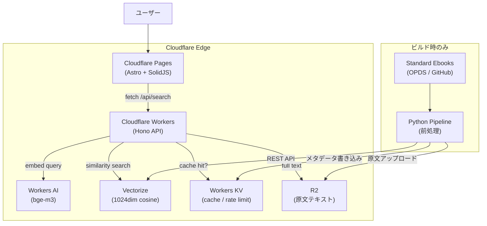
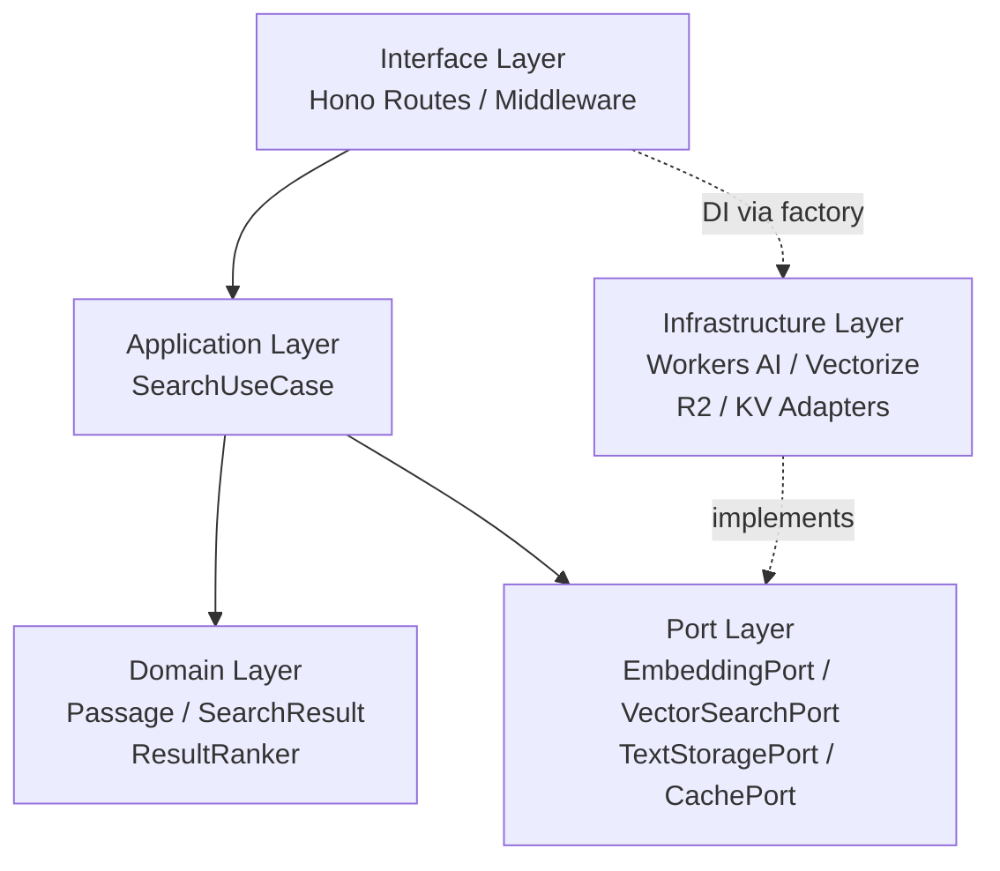
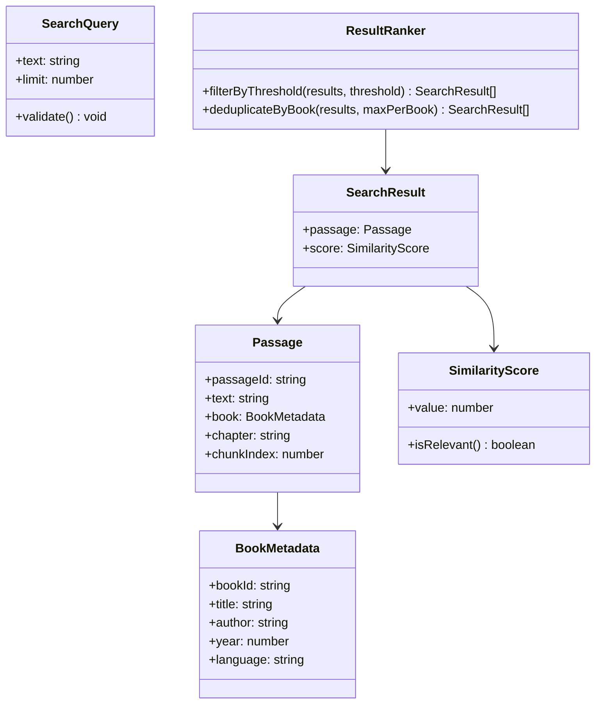
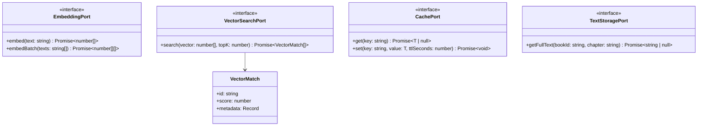
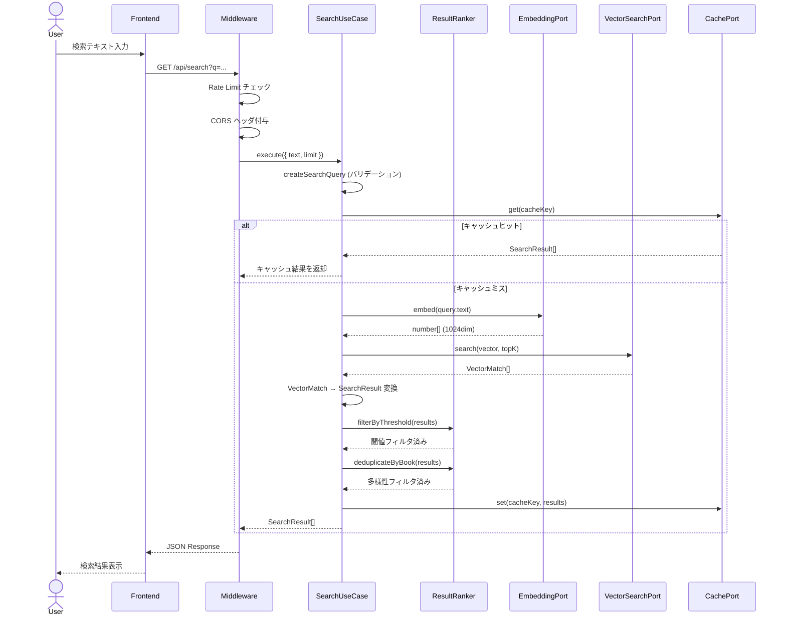
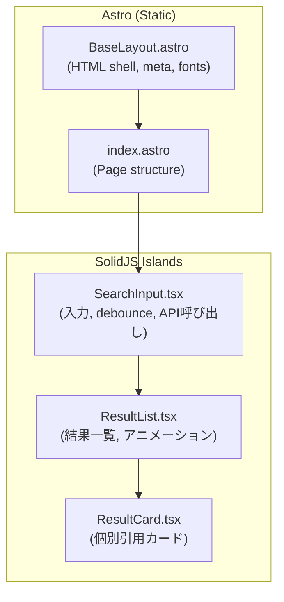
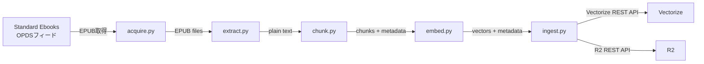
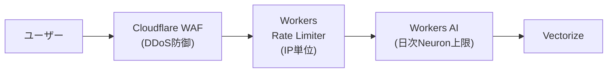
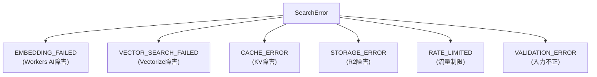

# Passage 技術設計書

> 📋 **文書情報**
>
> *プロジェクト名:* Passage
> *バージョン:* 1.0.1
> *著者:* 坂下 康信
> *最終更新:* 2026-03-08
> *ステータス:* Final (Reviewed)

## 1. 概要

**Passage** は、世界文学の名著から「心に響く一節」をセマンティック検索で発見するWebサービスである。ユーザーが自由なテキスト（気分、情景、感情など）を入力すると、意味的に最も近い文学作品の一節が引用元とともに表示される。

従来の引用まとめサイトが人手でキュレーションされた限られた名言を収録するのに対し、Passageは数百冊の文学作品の全文をベクトル化し、自然言語による意味検索を可能にする。Cloudflare Workersエコシステム上に構築し、エッジコンピューティングによる低レイテンシと、サーバーレスアーキテクチャによる運用負荷ゼロを実現する。

**設計目標**

- 自然言語で文学作品を横断検索できる直感的なUX
- ゼロ設定・ゼロ運用のサーバーレスアーキテクチャ
- ドメインロジックをクラウドサービスから完全に隔離するヘキサゴナルアーキテクチャ
- 月$15以下のランニングコストでの持続可能な運用
- アクセス急増時でもコスト爆発を防ぐ防御的設計

---

## 2. 背景と課題

世界文学には数千年にわたる人類の知恵と感情が凝縮されている。しかし、その膨大なテキストの中から「今の気分にぴったりの一節」を見つけることは困難である。

既存の引用サイト（BrainyQuote、Goodreadsなど）は、人手でキュレーションされた有名な一文のみを収録しており、カバー範囲が狭い。キーワード検索では「夜中一人でしんみり。でも、なんだか少し爽快。」のような感情ベースのクエリに対応できない。

> 💡 **解決方針:** パブリックドメインの文学作品全文をベクトル埋め込みに変換し、Cloudflare Vectorizeに格納する。ユーザーの自然言語入力を同一モデルでベクトル化し、コサイン類似度による意味検索を行う。これにより、感情・情景・雰囲気といった抽象的なクエリに対しても、意味的に近い文学の一節を返すことができる。

---

## 3. 要件定義

### 3.1 機能要件

- **FR-01** ユーザーが自由なテキストを入力し、意味的に類似する文学作品の一節を検索できる
- **FR-02** 検索結果には一節のテキスト、作品名、著者名、章情報を含む
- **FR-03** 1回の検索で最大20件の結果を返す（デフォルト10件）
- **FR-04** 検索結果はコサイン類似度スコア順にソートされる
- **FR-05** 多言語のクエリ（英語、日本語、フランス語など）で英語テキストを検索できる
- **FR-06** APIはOpenAPI仕様に準拠したRESTエンドポイントを提供する
- **FR-07** フロントエンドは検索入力と結果表示を含む単一ページアプリケーションである
- **FR-08** ヘルスチェックエンドポイントを提供する

### 3.2 非機能要件

- **NFR-01** 検索レスポンスタイムが500ms以内であること（p95）
- **NFR-02** 月間100万リクエストまでの負荷に耐えること
- **NFR-03** 月額運用コストが通常時$15以下であること
- **NFR-04** 月間1,000万リクエスト時でも月額$120を超えないこと
- **NFR-05** フロントエンドのLighthouseパフォーマンススコアが90以上であること
- **NFR-06** APIレスポンスにCORS対応を含むこと
- **NFR-07** IPベースのレート制限により、1IPあたり毎分30リクエストを上限とすること
- **NFR-08** サービス可用性が月間99.9%以上であること（Cloudflare Workers基盤のSLA準拠）

### 3.3 制約事項

- データソースはパブリックドメインの文学作品に限定する（米国著作権法基準）
- Cloudflare Workersの実行時間制限（CPU時間30秒、Workers Paid）を遵守する
- Vectorizeの1インデックスあたり最大1,000万ベクトルの制約内で運用する
- フロントエンドの静的アセットはCloudflare Pagesでホスティングする

---

## 4. 技術スタック

### 4.1 ランタイム・フレームワーク

- **TypeScript 5.x**
    - Workers API、Hono、フロントエンドの全レイヤーで統一。型安全性による開発体験とコード品質の向上
- **Hono 4.x** (MIT)
    - Cloudflare Workers向けに最適化されたWebフレームワーク。ミドルウェア機構、Zod統合、OpenAPI自動生成を提供
    - 選定理由: Express/Fastifyと類似のAPIだが、エッジランタイムネイティブ。バンドルサイズが極小（14KB）で、Workers の制約内に収まる
- **Astro 5.x** (MIT)
    - 静的サイト生成 + アイランドアーキテクチャのWebフレームワーク。Cloudflare Pagesアダプタによるゼロ設定デプロイ
    - 選定理由: コンテンツ主体のページで不要なJSを排除しつつ、検索UIのみSolidJSアイランドとしてハイドレーション
- **SolidJS 1.x** (MIT)
    - 細粒度リアクティビティの UIライブラリ。仮想DOMなしで高パフォーマンス
    - 選定理由: Reactと比較してバンドルサイズが1/5以下、ランタイムオーバーヘッドが最小。Astroのアイランドとして最適

### 4.2 Cloudflareサービス

- **Cloudflare Workers** (Paid plan, $5/月ベース)
    - APIサーバー。エッジ200都市以上で実行、データ転送料（egress）ゼロ
- **Workers AI**
    - `@cf/baai/bge-m3` embeddingモデル。1024次元、多言語対応、8,192トークンコンテキスト
    - `@cf/baai/bge-reranker-base` リランカー（v2拡張用）
- **Vectorize**
    - ベクトルデータベース。1インデックスあたり最大1,000万ベクトル、コサイン類似度検索
- **Workers KV**
    - 検索結果キャッシュおよびレート制限カウンターの永続化
- **R2**
    - 文学作品の原文テキスト保管。egress無料
- **Cloudflare Pages**
    - フロントエンドの静的サイトホスティング

> 💡 **embeddingモデルの選定根拠:** `bge-m3` を選定した理由は以下の3点である。(1) 多言語対応: 日本語やフランス語のクエリで英語テキストを検索可能。(2) コスト: $0.012/Mトークンで、bge-base-en-v1.5の$0.067/Mと比較して約6倍安価。(3) コンテキスト長: 8,192トークンの入力をサポートし、長い段落もトランケーションなしで処理可能。精度面では、英語特化のbge-base-en-v1.5がやや優位な場合があるため、初期ベンチマークで比較検証を行い、最終判断する。

### 4.3 前処理ツール

- **Python 3.12+**
    - 前処理パイプライン専用。本番にはデプロイしない
- **ebooklib** (AGPL-3.0)
    - EPUBファイルの読み込み・解析。AGPL-3.0ライセンスのため取り扱いに注意が必要。本プロジェクトではビルド時の前処理パイプラインに限定使用し、Webサービス本体には含めないためライセンス伝播の対象外。パイプライン自体をOSS公開する場合はAGPL準拠が必要
- **BeautifulSoup4** (MIT)
    - XHTML からのテキスト抽出
- **NLTK** (Apache 2.0) *v2予定*
    - センテンスレベル分割（`sent_tokenize`）。v1では段落単位分割を採用しており未使用
- **httpx** (BSD-3)
    - Cloudflare REST APIへの非同期HTTPリクエスト

### 4.4 テスト

- **Vitest** + Workers環境プラグイン
    - ドメイン層のユニットテスト、Workers APIの統合テスト
- **Playwright**
    - フロントエンドのE2Eテスト
- **pytest**
    - 前処理パイプラインのテスト

### 4.5 ビルド・デプロイ

- **Wrangler CLI**
    - Workers / Vectorize / KV / R2 のローカル開発・デプロイ
- **GitHub Actions**
    - CI/CDパイプライン。テスト、lint、デプロイの自動化

---

## 5. システムアーキテクチャ設計

### 5.1 設計原則

- **ヘキサゴナルアーキテクチャ（Ports & Adapters）**: ドメインロジックをCloudflareサービスから完全に隔離し、テスタビリティを最大化する
- **依存性逆転の原則（DIP）**: ドメイン層がPortインターフェースを定義し、インフラ層がそれを実装する。依存の方向は常に外側から内側へ
- **単一責任の原則**: 各モジュールは1つの責務のみを持つ。検索ロジック、embedding生成、ベクトル検索、キャッシュは全て独立したモジュール
- **防御的設計**: レート制限、タイムアウト、フォールバックを多層的に実装し、コスト爆発と障害の連鎖を防止する

### 5.2 全体構成図



### 5.3 レイヤー構成



- **Domain Layer**: Cloudflare非依存。検索結果の値オブジェクト、スコアリング、フィルタリングのロジックを担当
- **Port Layer**: ドメインが外部サービスに求めるインターフェースを定義
- **Infrastructure Layer**: Cloudflareサービスを用いたPort実装。サービス固有の処理をここに閉じ込める
- **Application Layer**: ドメインとPortを組み合わせるオーケストレーション。検索ユースケースの実行単位
- **Interface Layer**: Honoによるルーティング、バリデーション、ミドルウェア、エントリポイント

### 5.4 パッケージ構造

```
passage/
├── packages/
│   ├── api/                          # Cloudflare Workers API
│   │   ├── src/
│   │   │   ├── domain/
│   │   │   │   ├── model/
│   │   │   │   │   ├── passage.ts
│   │   │   │   │   ├── search-query.ts
│   │   │   │   │   ├── search-result.ts
│   │   │   │   │   └── book-metadata.ts
│   │   │   │   └── service/
│   │   │   │       └── result-ranker.ts
│   │   │   ├── port/
│   │   │   │   ├── embedding-port.ts
│   │   │   │   ├── vector-search-port.ts
│   │   │   │   ├── text-storage-port.ts
│   │   │   │   ├── cache-port.ts
│   │   │   │   └── error/
│   │   │   │       └── search-error.ts
│   │   │   ├── application/
│   │   │   │   ├── search-use-case.ts
│   │   │   │   └── types.ts
│   │   │   ├── infrastructure/
│   │   │   │   ├── workers-ai-embedding-adapter.ts
│   │   │   │   ├── vectorize-search-adapter.ts
│   │   │   │   ├── r2-text-storage-adapter.ts
│   │   │   │   └── kv-cache-adapter.ts
│   │   │   ├── interface/
│   │   │   │   ├── routes/
│   │   │   │   │   ├── search.ts
│   │   │   │   │   └── health.ts
│   │   │   │   ├── middleware/
│   │   │   │   │   ├── rate-limiter.ts
│   │   │   │   │   ├── cors.ts
│   │   │   │   │   └── error-handler.ts
│   │   │   │   └── app.ts
│   │   │   ├── config/
│   │   │   │   └── bindings.ts
│   │   │   └── index.ts
│   │   ├── test/
│   │   ├── wrangler.toml
│   │   ├── tsconfig.json
│   │   ├── vitest.config.ts
│   │   └── package.json
│   ├── web/                          # Frontend (Astro + SolidJS)
│   │   ├── src/
│   │   │   ├── components/
│   │   │   │   ├── SearchInput.tsx    # SolidJS island
│   │   │   │   ├── ResultCard.tsx     # SolidJS island
│   │   │   │   └── ResultList.tsx     # SolidJS island
│   │   │   ├── layouts/
│   │   │   │   └── BaseLayout.astro
│   │   │   ├── pages/
│   │   │   │   └── index.astro
│   │   │   └── styles/
│   │   │       └── global.css
│   │   ├── astro.config.mjs
│   │   └── package.json
│   └── pipeline/                     # Python前処理
│       ├── src/
│       │   ├── acquire.py            # Standard Ebooks取得
│       │   ├── extract.py            # EPUB→テキスト抽出
│       │   ├── chunk.py              # チャンク分割
│       │   ├── embed.py              # Embedding生成
│       │   ├── ingest.py             # Vectorize/R2/KVへの投入
│       │   └── main.py               # パイプライン実行
│       ├── tests/
│       ├── pyproject.toml
│       └── README.md
├── .github/
│   └── workflows/
│       ├── ci.yml
│       └── deploy.yml
└── README.md
```

---

## 6. ドメインモデル設計

ドメイン層はCloudflareサービスに一切依存しない。純粋なTypeScriptコードで構成され、検索結果の型定義とスコアリングロジックを担当する。

### 6.1 クラス図



### 6.2 値オブジェクト

全ての値オブジェクトは `readonly` プロパティと Branded Type パターンで不変性と型安全性を保証する。

#### BookMetadata

作品のメタデータを表す。

```tsx
// domain/model/book-metadata.ts

export interface BookMetadata {
  readonly bookId: string;
  readonly title: string;
  readonly author: string;
  readonly year: number;
  readonly language: string;
}

export function createBookMetadata(params: {
  bookId: string;
  title: string;
  author: string;
  year: number;
  language: string;
}): BookMetadata {
  if (!params.bookId || !params.title || !params.author) {
    throw new Error(
      `BookMetadata requires non-empty bookId, title, and author`
    );
  }
  if (!Number.isInteger(params.year) || params.year < 0) {
    throw new Error(
      `BookMetadata year must be a non-negative integer: ${params.year}`
    );
  }
  return Object.freeze(params);
}
```

#### Passage

文学作品の一節を表す。検索対象の最小単位であり、Vectorize上の1ベクトルに対応する。

```tsx
// domain/model/passage.ts

import type { BookMetadata } from "./book-metadata.js";

export interface Passage {
  readonly passageId: string;
  readonly text: string;
  readonly book: BookMetadata;
  readonly chapter: string;
  readonly chunkIndex: number;
}

export function createPassage(params: {
  passageId: string;
  text: string;
  book: BookMetadata;
  chapter: string;
  chunkIndex: number;
}): Passage {
  if (!params.passageId || !params.text) {
    throw new Error("Passage requires non-empty passageId and text");
  }
  if (params.chunkIndex < 0) {
    throw new Error("chunkIndex must be non-negative");
  }
  return Object.freeze({
    ...params,
    book: Object.freeze(params.book),
  });
}
```

#### SearchQuery

検索クエリを表す。バリデーションロジックをドメイン層に集約する。

```tsx
// domain/model/search-query.ts

export interface SearchQuery {
  readonly text: string;
  readonly limit: number;
}

const MAX_QUERY_LENGTH = 500;
const MIN_LIMIT = 1;
const MAX_LIMIT = 20;
const DEFAULT_LIMIT = 10;

export function createSearchQuery(params: {
  text: string;
  limit?: number;
}): SearchQuery {
  const trimmed = params.text.trim();

  if (trimmed.length === 0) {
    throw new SearchQueryValidationError("Search query must not be empty");
  }
  if (trimmed.length > MAX_QUERY_LENGTH) {
    throw new SearchQueryValidationError(
      `Search query must not exceed ${MAX_QUERY_LENGTH} characters`
    );
  }

  const limit = params.limit ?? DEFAULT_LIMIT;
  if (limit < MIN_LIMIT || limit > MAX_LIMIT) {
    throw new SearchQueryValidationError(
      `Limit must be between ${MIN_LIMIT} and ${MAX_LIMIT}`
    );
  }

  return Object.freeze({ text: trimmed, limit });
}

export class SearchQueryValidationError extends Error {
  constructor(message: string) {
    super(message);
    this.name = "SearchQueryValidationError";
  }
}
```

#### SimilarityScore

コサイン類似度スコアを表す。Vectorizeのcosineメトリックは-1（最も非類似）から1（同一）の範囲を返す。

```tsx
// domain/model/search-result.ts

import type { Passage } from "./passage.js";

export interface SimilarityScore {
  readonly value: number;
}

const RELEVANCE_THRESHOLD = 0.3;

export function createSimilarityScore(value: number): SimilarityScore {
  if (value < -1 || value > 1) {
    throw new Error(`Similarity score must be between -1 and 1: ${value}`);
  }
  return Object.freeze({ value });
}

export function isRelevant(score: SimilarityScore): boolean {
  return score.value >= RELEVANCE_THRESHOLD;
}

export interface SearchResult {
  readonly passage: Passage;
  readonly score: SimilarityScore;
}
```

### 6.3 ドメインサービス: ResultRanker

検索結果のフィルタリングと多様性確保を担当するステートレスなドメインサービス。同一作品の結果が上位を独占することを防ぐ「多様性フィルタ」を実装する。

```tsx
// domain/service/result-ranker.ts

import type { SearchResult } from "../model/search-result.js";
import { isRelevant } from "../model/search-result.js";

export class ResultRanker {
  /**
   * 類似度スコアが閾値未満の結果を除外する。
   * 低品質な結果をユーザーに返さないための品質ゲート。
   */
  filterByThreshold(results: readonly SearchResult[]): SearchResult[] {
    return results.filter((r) => isRelevant(r.score));
  }

  /**
   * 同一作品からの結果を最大 maxPerBook 件に制限する。
   * 特定の作品が上位を独占することを防ぎ、検索結果の多様性を確保する。
   *
   * アルゴリズム:
   * 入力はスコア降順であることを前提とする。
   * 各作品の出現回数をカウントし、maxPerBook を超えた時点で
   * その作品の後続結果をスキップする。
   */
  deduplicateByBook(
    results: readonly SearchResult[],
    maxPerBook: number = 3
  ): SearchResult[] {
    const bookCounts = new Map<string, number>();
    const diversified: SearchResult[] = [];

    for (const result of results) {
      const bookId = result.passage.book.bookId;
      const count = bookCounts.get(bookId) ?? 0;

      if (count < maxPerBook) {
        diversified.push(result);
        bookCounts.set(bookId, count + 1);
      }
    }

    return diversified;
  }
}
```

---

## 7. ポート層設計

ポート層はドメインが外部サービスに求めるインターフェースを定義する。TypeScriptの `interface` として宣言し、インフラ層が実装を提供する。

### 7.1 クラス図



### 7.2 インターフェース定義

#### EmbeddingPort

テキストをベクトル埋め込みに変換するポート。Workers AIの抽象化。

```tsx
// port/embedding-port.ts

export interface EmbeddingPort {
  /**
   * 単一テキストをベクトル埋め込みに変換する。
   * @param text 入力テキスト
   * @returns 1024次元のfloat配列
   */
  embed(text: string): Promise<number[]>;

  /**
   * 複数テキストを一括でベクトル埋め込みに変換する。
   * 前処理パイプラインでのバッチ処理に使用。
   * @param texts 入力テキスト配列（最大100件）
   * @returns 各テキストに対応する1024次元のfloat配列
   */
  embedBatch(texts: string[]): Promise<number[][]>;
}
```

#### VectorSearchPort

ベクトル類似度検索を行うポート。Vectorizeの抽象化。

```tsx
// port/vector-search-port.ts

export interface VectorMatch {
  readonly id: string;
  readonly score: number;
  readonly metadata: Record<string, string | number>;
}

export interface VectorSearchPort {
  /**
   * クエリベクトルに最も類似するベクトルを検索する。
   * @param vector クエリベクトル（1024次元）
   * @param topK 返却する最大件数（1-20）
   * @returns スコア降順にソートされたマッチ結果
   */
  search(vector: number[], topK: number): Promise<VectorMatch[]>;
}
```

#### CachePort

検索結果キャッシュおよびレート制限の永続化ポート。Workers KVの抽象化。

```tsx
// port/cache-port.ts

export interface CachePort {
  get<T>(key: string): Promise<T | null>;
  set<T>(key: string, value: T, ttlSeconds: number): Promise<void>;
  increment(key: string, ttlSeconds: number): Promise<number>;
}
```

#### TextStoragePort

原文テキストの取得ポート。R2の抽象化。v2の「周辺コンテキスト表示」機能で使用する。

```tsx
// port/text-storage-port.ts

export interface TextStoragePort {
  getFullText(
    bookId: string,
    chapter: string
  ): Promise<string | null>;
}
```

### 7.3 エラー型

```tsx
// port/error/search-error.ts

export class SearchError extends Error {
  constructor(
    message: string,
    public readonly code: SearchErrorCode,
    public readonly cause?: unknown
  ) {
    super(message);
    this.name = "SearchError";
  }
}

export type SearchErrorCode =
  | "EMBEDDING_FAILED"
  | "VECTOR_SEARCH_FAILED"
  | "CACHE_ERROR"
  | "STORAGE_ERROR"
  | "RATE_LIMITED"
  | "VALIDATION_ERROR";
```

---

## 8. インフラストラクチャ層設計

Cloudflareサービスを用いてポート層のインターフェースを実装する。各アダプタはCloudflare固有の処理を閉じ込め、ポートインターフェースのみを外部に公開する。

### 8.1 Cloudflareバインディング型定義

Wrangler設定に対応するTypeScriptの型定義。全てのCloudflareサービスへのアクセスはこの `Env` 型を通じて型安全に行われる。

```tsx
// config/bindings.ts

export interface Env {
  AI: Ai;
  VECTORIZE: VectorizeIndex;
  CACHE: KVNamespace;
  TEXTS: R2Bucket;
}
```

### 8.2 Workers AI Embedding Adapter

```tsx
// infrastructure/workers-ai-embedding-adapter.ts

import type { EmbeddingPort } from "../port/embedding-port.js";
import { SearchError } from "../port/error/search-error.js";

const MODEL = "@cf/baai/bge-m3" as const;
const MAX_BATCH_SIZE = 100;

export class WorkersAiEmbeddingAdapter implements EmbeddingPort {
  constructor(private readonly ai: Ai) {}

  async embed(text: string): Promise<number[]> {
    try {
      const response = await this.ai.run(MODEL, {
        text: [text],
      });
      const vectors = response.data;
      if (!vectors || vectors.length === 0) {
        throw new Error("Empty embedding response");
      }
      return vectors[0];
    } catch (error) {
      throw new SearchError(
        `Failed to generate embedding: ${error}`,
        "EMBEDDING_FAILED",
        error
      );
    }
  }

  async embedBatch(texts: string[]): Promise<number[][]> {
    if (texts.length > MAX_BATCH_SIZE) {
      throw new SearchError(
        `Batch size ${texts.length} exceeds maximum ${MAX_BATCH_SIZE}`,
        "EMBEDDING_FAILED"
      );
    }
    try {
      const response = await this.ai.run(MODEL, {
        text: texts,
      });
      return response.data;
    } catch (error) {
      throw new SearchError(
        `Failed to generate batch embeddings: ${error}`,
        "EMBEDDING_FAILED",
        error
      );
    }
  }
}
```

### 8.3 Vectorize Search Adapter

```tsx
// infrastructure/vectorize-search-adapter.ts

import type {
  VectorMatch,
  VectorSearchPort,
} from "../port/vector-search-port.js";
import { SearchError } from "../port/error/search-error.js";

export class VectorizeSearchAdapter implements VectorSearchPort {
  constructor(private readonly index: VectorizeIndex) {}

  async search(
    vector: number[],
    topK: number
  ): Promise<VectorMatch[]> {
    try {
      const results = await this.index.query(vector, {
        topK,
        returnMetadata: "all",
      });

      return results.matches.map((match) => ({
        id: match.id,
        score: match.score ?? 0,
        metadata: (match.metadata ?? {}) as Record<
          string,
          string | number
        >,
      }));
    } catch (error) {
      throw new SearchError(
        `Vector search failed: ${error}`,
        "VECTOR_SEARCH_FAILED",
        error
      );
    }
  }
}
```

### 8.4 KV Cache Adapter

```tsx
// infrastructure/kv-cache-adapter.ts

import type { CachePort } from "../port/cache-port.js";

export class KvCacheAdapter implements CachePort {
  constructor(private readonly kv: KVNamespace) {}

  async get<T>(key: string): Promise<T | null> {
    const value = await this.kv.get(key, "json");
    return value as T | null;
  }

  async set<T>(
    key: string,
    value: T,
    ttlSeconds: number
  ): Promise<void> {
    await this.kv.put(key, JSON.stringify(value), {
      expirationTtl: ttlSeconds,
    });
  }

  async increment(
    key: string,
    ttlSeconds: number
  ): Promise<number> {
    // KVはatomic incrementをサポートしないため、
    // read-modify-writeで実装する。
    // レート制限の厳密性よりも可用性を優先する設計判断。
    const current = await this.kv.get(key, "json") as number | null;
    const next = (current ?? 0) + 1;
    await this.kv.put(key, JSON.stringify(next), {
      expirationTtl: ttlSeconds,
    });
    return next;
  }
}
```

> ⚠️ **KV incrementの非原子性について:** Workers KVのread-modify-writeは原子的ではなく、同一IPからの同時リクエストでレースコンディションが発生する可能性がある。レート制限の目的は厳密な流量制御ではなく、明らかな濫用の防止であるため、この設計上のトレードオフは許容範囲内である。厳密なレート制限が必要な場合は、Durable Objectsの使用を検討する。

### 8.5 R2 Text Storage Adapter

```tsx
// infrastructure/r2-text-storage-adapter.ts

import type { TextStoragePort } from "../port/text-storage-port.js";
import { SearchError } from "../port/error/search-error.js";

export class R2TextStorageAdapter implements TextStoragePort {
  constructor(private readonly bucket: R2Bucket) {}

  async getFullText(
    bookId: string,
    chapter: string
  ): Promise<string | null> {
    // パストラバーサル防止: 入力値のサニタイズ
    const safeBookId = bookId.replace(/[^a-z0-9-]/g, "");
    const safeChapter = chapter.replace(/[^a-z0-9-]/g, "");
    if (!safeBookId || !safeChapter) return null;
    const key = `${safeBookId}/${safeChapter}.txt`;
    try {
      const object = await this.bucket.get(key);
      if (!object) return null;
      return await object.text();
    } catch (error) {
      throw new SearchError(
        `Failed to retrieve text: ${key}`,
        "STORAGE_ERROR",
        error
      );
    }
  }
}
```

---

## 9. アプリケーション層設計

アプリケーション層はドメインとポートを組み合わせてユースケースを実行するオーケストレーション層である。

### 9.1 SearchUseCase

```tsx
// application/search-use-case.ts

import type { EmbeddingPort } from "../port/embedding-port.js";
import type { VectorSearchPort } from "../port/vector-search-port.js";
import type { CachePort } from "../port/cache-port.js";
import {
  createSearchQuery,
  type SearchQuery,
} from "../domain/model/search-query.js";
import {
  createPassage,
  type Passage,
} from "../domain/model/passage.js";
import { createBookMetadata } from "../domain/model/book-metadata.js";
import {
  createSimilarityScore,
  type SearchResult,
} from "../domain/model/search-result.js";
import { ResultRanker } from "../domain/service/result-ranker.js";

const CACHE_TTL_SECONDS = 3600; // 1時間

export class SearchUseCase {
  private readonly ranker = new ResultRanker();

  constructor(
    private readonly embedding: EmbeddingPort,
    private readonly vectorSearch: VectorSearchPort,
    private readonly cache: CachePort
  ) {}

  async execute(params: {
    text: string;
    limit?: number;
  }): Promise<SearchResult[]> {
    // 1. クエリのバリデーション（ドメイン層で実行）
    const query = createSearchQuery(params);

    // 2. キャッシュヒット判定
    const cacheKey = this.buildCacheKey(query);
    const cached = await this.cache.get<SearchResult[]>(cacheKey);
    if (cached) return cached;

    // 3. クエリテキストをベクトル化
    const queryVector = await this.embedding.embed(query.text);

    // 4. ベクトル類似度検索
    //    多様性フィルタで結果が減る可能性を考慮し、
    //    要求の3倍（最大50件）を取得してからフィルタリングする
    const fetchSize = Math.min(query.limit * 3, 50);
    const matches = await this.vectorSearch.search(
      queryVector,
      fetchSize
    );

    // 5. VectorMatchをドメインモデルに変換
    const results: SearchResult[] = matches.map((match) => {
      const book = createBookMetadata({
        bookId: String(match.metadata.bookId ?? ""),
        title: String(match.metadata.title ?? ""),
        author: String(match.metadata.author ?? ""),
        year: Number(match.metadata.year ?? 0),
        language: String(match.metadata.language ?? "en"),
      });

      const passage = createPassage({
        passageId: match.id,
        text: String(match.metadata.text ?? ""),
        book,
        chapter: String(match.metadata.chapter ?? ""),
        chunkIndex: Number(match.metadata.chunkIndex ?? 0),
      });

      return {
        passage,
        score: createSimilarityScore(match.score),
      };
    });

    // 6. ドメインサービスによるフィルタリング
    const filtered = this.ranker.filterByThreshold(results);
    const diversified = this.ranker.deduplicateByBook(filtered);
    const final = diversified.slice(0, query.limit);

    // 7. キャッシュに保存
    if (final.length > 0) {
      await this.cache
        .set(cacheKey, final, CACHE_TTL_SECONDS)
        .catch((e) => console.error("[WARN] Cache write failed:", e));
    }

    return final;
  }

  private buildCacheKey(query: SearchQuery): string {
    // クエリテキストとlimitの組み合わせでキーを生成
    // 正規化: 連続空白の除去のみ（大文字小文字はembedding入力との一貫性のため保持）
    const normalized = query.text.replace(/\s+/g, " ");
    return `search:${normalized}:${query.limit}`;
  }
}
```

### 9.2 シーケンス図



---

## 10. API設計

### 10.1 Wrangler設定

```toml
# wrangler.toml
name = "passage-api"
main = "src/index.ts"
compatibility_date = "2026-01-01"

[ai]
binding = "AI"

[[vectorize]]
binding = "VECTORIZE"
index_name = "passage-index"

[[kv_namespaces]]
binding = "CACHE"
id = "<KV_NAMESPACE_ID>"

[[r2_buckets]]
binding = "TEXTS"
bucket_name = "passage-texts"
```

### 10.2 エントリポイントとDI

Workerエントリポイントで手動DI（Constructor Injection）を行い、依存関係を明示的に組み立てる。DIフレームワークは使用しない。

```tsx
// index.ts

import { createApp } from "./interface/app.js";
import type { Env } from "./config/bindings.js";
import { WorkersAiEmbeddingAdapter } from "./infrastructure/workers-ai-embedding-adapter.js";
import { VectorizeSearchAdapter } from "./infrastructure/vectorize-search-adapter.js";
import { KvCacheAdapter } from "./infrastructure/kv-cache-adapter.js";
import { SearchUseCase } from "./application/search-use-case.js";

export default {
  async fetch(
    request: Request,
    env: Env,
    ctx: ExecutionContext
  ): Promise<Response> {
    // Manual DI: 依存関係の組み立て
    const embedding = new WorkersAiEmbeddingAdapter(env.AI);
    const vectorSearch = new VectorizeSearchAdapter(env.VECTORIZE);
    const cache = new KvCacheAdapter(env.CACHE);
    const searchUseCase = new SearchUseCase(
      embedding,
      vectorSearch,
      cache
    );

    const app = createApp({ searchUseCase, cache });
    return app.fetch(request, env, ctx);
  },
};
```

### 10.3 Honoアプリケーション定義

```tsx
// interface/app.ts

import { OpenAPIHono } from "@hono/zod-openapi";
import { cors } from "hono/cors";
import type { SearchUseCase } from "../application/search-use-case.js";
import type { CachePort } from "../port/cache-port.js";
import { searchRoute } from "./routes/search.js";
import { healthRoute } from "./routes/health.js";
import { rateLimiter } from "./middleware/rate-limiter.js";
import { errorHandler } from "./middleware/error-handler.js";

interface AppDeps {
  searchUseCase: SearchUseCase;
  cache: CachePort;
}

export function createApp(deps: AppDeps) {
  const app = new OpenAPIHono();

  // グローバルミドルウェア
  app.use("*", cors({ origin: "*" }));
  app.use("/api/*", rateLimiter(deps.cache));
  app.onError(errorHandler);

  // ルート登録
  searchRoute(app, deps.searchUseCase);
  healthRoute(app);

  // OpenAPIドキュメント
  app.doc("/openapi.json", {
    openapi: "3.1.0",
    info: {
      title: "Passage API",
      version: "1.0.0",
      description:
        "Semantic search across world literature",
    },
  });

  return app;
}
```

### 10.4 検索エンドポイント

```tsx
// interface/routes/search.ts

import { createRoute, z } from "@hono/zod-openapi";
import type { OpenAPIHono } from "@hono/zod-openapi";
import type { SearchUseCase } from "../../application/search-use-case.js";

const SearchQuerySchema = z.object({
  q: z
    .string()
    .min(1, "Query must not be empty")
    .max(500, "Query must not exceed 500 characters")
    .openapi({ description: "Search query text", example: "lonely night, yet strangely refreshing" }),
  limit: z.coerce
    .number()
    .int()
    .min(1)
    .max(20)
    .default(10)
    .openapi({ description: "Maximum number of results" }),
});

const PassageSchema = z.object({
  passageId: z.string(),
  text: z.string(),
  book: z.object({
    bookId: z.string(),
    title: z.string(),
    author: z.string(),
    year: z.number(),
    language: z.string(),
  }),
  chapter: z.string(),
  score: z.number(),
});

const SearchResponseSchema = z.object({
  results: z.array(PassageSchema),
  count: z.number(),
  query: z.string(),
});

const route = createRoute({
  method: "get",
  path: "/api/search",
  request: { query: SearchQuerySchema },
  responses: {
    200: {
      content: {
        "application/json": { schema: SearchResponseSchema },
      },
      description: "Search results",
    },
  },
});

export function searchRoute(
  app: OpenAPIHono,
  useCase: SearchUseCase
) {
  app.openapi(route, async (c) => {
    const { q, limit } = c.req.valid("query");

    const results = await useCase.execute({
      text: q,
      limit,
    });

    return c.json({
      results: results.map((r) => ({
        passageId: r.passage.passageId,
        text: r.passage.text,
        book: {
          bookId: r.passage.book.bookId,
          title: r.passage.book.title,
          author: r.passage.book.author,
          year: r.passage.book.year,
          language: r.passage.book.language,
        },
        chapter: r.passage.chapter,
        score: r.score.value,
      })),
      count: results.length,
      query: q,
    });
  });
}
```

### 10.5 Rate Limiterミドルウェア

```tsx
// interface/middleware/rate-limiter.ts

import type { MiddlewareHandler } from "hono";
import type { CachePort } from "../../port/cache-port.js";

const MAX_REQUESTS_PER_MINUTE = 30;
const WINDOW_SECONDS = 60;

export function rateLimiter(
  cache: CachePort
): MiddlewareHandler {
  return async (c, next) => {
    const ip =
      c.req.header("cf-connecting-ip") ?? "unknown";
    const key = `ratelimit:${ip}`;

    const count = await cache.increment(
      key,
      WINDOW_SECONDS
    );

    // レート制限ヘッダを常に付与
    c.header("X-RateLimit-Limit", String(MAX_REQUESTS_PER_MINUTE));
    c.header("X-RateLimit-Remaining", String(Math.max(0, MAX_REQUESTS_PER_MINUTE - count)));

    if (count > MAX_REQUESTS_PER_MINUTE) {
      return c.json(
        {
          error: "Too many requests",
          retryAfter: WINDOW_SECONDS,
        },
        429
      );
    }

    await next();
  };
}
```

### 10.6 エラーハンドラ

```tsx
// interface/middleware/error-handler.ts

import type { ErrorHandler } from "hono";
import { SearchError } from "../../port/error/search-error.js";
import { SearchQueryValidationError } from "../../domain/model/search-query.js";

export const errorHandler: ErrorHandler = (err, c) => {
  console.error(`[ERROR] ${err.message}`, err);

  if (err instanceof SearchQueryValidationError) {
    return c.json({ error: err.message }, 400);
  }

  if (err instanceof SearchError) {
    switch (err.code) {
      case "RATE_LIMITED":
        return c.json({ error: "Too many requests" }, 429);
      case "VALIDATION_ERROR":
        return c.json({ error: err.message }, 400);
      default:
        return c.json(
          { error: "Internal search error" },
          500
        );
    }
  }

  return c.json({ error: "Internal server error" }, 500);
};
```

---

## 11. フロントエンド設計

### 11.1 技術選定

- **Astro**: 静的HTMLを生成し、JSバンドルを最小化。Cloudflare Pagesアダプタでエッジデプロイ
- **SolidJS**: 検索入力・結果表示のインタラクティブ部分のみアイランドとしてハイドレーション
- **Vanilla CSS**: CSSフレームワークは使用しない。カスタムプロパティ（CSS変数）による一貫したデザインシステム

### 11.2 コンポーネント構成



### 11.3 SearchInputコンポーネント

```tsx
// components/SearchInput.tsx

import { createSignal, Show, onCleanup } from "solid-js";
import { ResultList } from "./ResultList.js";

const API_BASE = import.meta.env.PUBLIC_API_URL;
const DEBOUNCE_MS = 400;

interface SearchResult {
  passageId: string;
  text: string;
  book: {
    title: string;
    author: string;
    year: number;
  };
  chapter: string;
  score: number;
}

export function SearchInput() {
  const [query, setQuery] = createSignal("");
  const [results, setResults] = createSignal<SearchResult[]>([]);
  const [loading, setLoading] = createSignal(false);
  const [error, setError] = createSignal<string | null>(null);
  let debounceTimer: ReturnType<typeof setTimeout>;
  onCleanup(() => clearTimeout(debounceTimer));

  async function handleSearch(text: string) {
    setQuery(text);
    clearTimeout(debounceTimer);

    if (text.trim().length === 0) {
      setResults([]);
      return;
    }

    debounceTimer = setTimeout(async () => {
      setLoading(true);
      setError(null);
      try {
        const url = new URL("/api/search", API_BASE);
        url.searchParams.set("q", text.trim());
        url.searchParams.set("limit", "10");

        const res = await fetch(url.toString());
        if (!res.ok) throw new Error(`HTTP ${res.status}`);

        const data = await res.json();
        setResults(data.results);
      } catch (e) {
        setError("Search failed. Please try again.");
        setResults([]);
      } finally {
        setLoading(false);
      }
    }, DEBOUNCE_MS);
  }

  return (
    <div class="search-container">
      <textarea
        class="search-input"
        placeholder="Describe a feeling, a scene, a mood..."
        value={query()}
        onInput={(e) => handleSearch(e.currentTarget.value)}
        rows={3}
      />
      <Show when={loading()}>
        <div class="loading-indicator" aria-label="Searching..." />
      </Show>
      <Show when={error()}>
        <p class="error-message">{error()}</p>
      </Show>
      <ResultList results={results()} />
    </div>
  );
}
```

### 11.4 UIデザインコンセプト

文学的な雰囲気を表現するダーク基調のデザイン。

- **タイポグラフィ**: セリフ体（EB Garamond / Cormorant Garamond）をメインに使用。古典的な書籍の佇まいを再現
- **カラーパレット**: 深いネイビー背景に、アンティークゴールドのアクセント。引用テキストはクリーム色で表示
- **アニメーション**: 検索結果のフェードイン、カードの微細なスクロール連動。View Transitions APIを活用
- **レスポンシブ**: モバイルファーストで設計。検索入力は常にビューポート上部に固定

---

## 12. 前処理パイプライン設計

### 12.1 パイプライン全体像



### 12.2 EPUB取得 ([acquire.py](http://acquire.py))

Standard EbooksのOPDSフィードからEPUBファイルを一括ダウンロードする。OPDSはAtomフィードの拡張で、カタログの全書籍情報とダウンロードリンクを提供する。

```python
# pipeline/src/acquire.py

import httpx
from pathlib import Path
from xml.etree import ElementTree

OPDS_URL = "https://standardebooks.org/feeds/opds"
OUTPUT_DIR = Path("data/epubs")

# ElementTree名前空間プレフィックス（波括弧を定数に含める）
ATOM_NS = "{http://www.w3.org/2005/Atom}"
OPDS_NS = "{http://opds-spec.org/2010/catalog}"

def fetch_catalog(url: str) -> list[dict]:
    """OPDSカタログをパースし、書籍情報のリストを返す。"""
    entries = []
    next_url = url

    while next_url:
        resp = httpx.get(next_url, follow_redirects=True, timeout=30)
        resp.raise_for_status()
        root = ElementTree.fromstring(resp.content)

        for entry in root.findall(f"{ATOM_NS}entry"):
            title = entry.findtext(f"{ATOM_NS}title", "")
            author = entry.findtext(
                f"{ATOM_NS}author/{ATOM_NS}name", ""
            )

            # EPUBダウンロードリンクを抽出
            epub_link = None
            for link in entry.findall(f"{ATOM_NS}link"):
                if "application/epub+zip" in link.get("type", ""):
                    epub_link = link.get("href")
                    break

            if epub_link:
                entries.append({
                    "title": title,
                    "author": author,
                    "epub_url": epub_link,
                })

        # ページネーション: 次ページのリンクを取得
        next_el = root.find(
            f'{ATOM_NS}link[@rel="next"]'
        )
        next_url = (
            next_el.get("href") if next_el is not None else None
        )

    return entries

def download_epub(url: str, output_path: Path) -> None:
    """EPUBファイルをダウンロードして保存する。"""
    if output_path.exists():
        return  # 既にダウンロード済み

    resp = httpx.get(url, follow_redirects=True, timeout=60)
    resp.raise_for_status()
    output_path.parent.mkdir(parents=True, exist_ok=True)
    output_path.write_bytes(resp.content)
```

### 12.3 テキスト抽出 ([extract.py](http://extract.py))

EPUBファイルからXHTMLを解析し、チャプター構造を維持したプレーンテキストを抽出する。Standard EbooksのセマンティックマークアップHを活用し、`<section>` 要素で章分割を行う。

```python
# pipeline/src/extract.py

import ebooklib
from ebooklib import epub
from bs4 import BeautifulSoup
from dataclasses import dataclass

@dataclass
class Chapter:
    title: str
    text: str
    index: int

@dataclass
class ExtractedBook:
    book_id: str
    title: str
    author: str
    language: str
    year: int
    chapters: list[Chapter]

def extract_book(epub_path: str) -> ExtractedBook:
    """EPUBファイルから構造化テキストを抽出する。"""
    book = epub.read_epub(epub_path)

    # メタデータ取得
    title = book.get_metadata("DC", "title")[0][0]
    author = book.get_metadata("DC", "creator")[0][0]
    language = book.get_metadata("DC", "language")[0][0]

    # 出版年の取得 (Standard Ebooks形式)
    date_str = book.get_metadata("DC", "date")[0][0]
    year = int(date_str[:4]) if date_str else 0

    # book_idの生成 (著者名-タイトルのslug)
    book_id = _slugify(f"{author}-{title}")

    chapters = []
    for idx, item in enumerate(
        book.get_items_of_type(ebooklib.ITEM_DOCUMENT)
    ):
        soup = BeautifulSoup(
            item.get_content(), "html.parser"
        )
        body = soup.find("body")
        if not body:
            continue

        # 章タイトルの取得
        heading = body.find(["h1", "h2", "h3"])
        chapter_title = (
            heading.get_text(strip=True) if heading else f"Chapter {idx + 1}"
        )

        # テキスト抽出 (段落ごとに改行で区切る)
        paragraphs = []
        for p in body.find_all("p"):
            text = p.get_text(strip=True)
            if text:
                paragraphs.append(text)

        if paragraphs:
            chapters.append(
                Chapter(
                    title=chapter_title,
                    text="\n\n".join(paragraphs),
                    index=idx,
                )
            )

    return ExtractedBook(
        book_id=book_id,
        title=title,
        author=author,
        language=language,
        year=year,
        chapters=chapters,
    )

def _slugify(text: str) -> str:
    import re
    slug = text.lower().strip()
    slug = re.sub(r"[^a-z0-9]+", "-", slug)
    return slug.strip("-")
```

### 12.4 チャンク分割 ([chunk.py](http://chunk.py))

段落単位で分割し、短すぎる段落は前後と結合する。各チャンクにメタデータ（作品名、著者、章、位置）を付与する。

```python
# pipeline/src/chunk.py

from dataclasses import dataclass

MIN_CHUNK_CHARS = 80
MAX_CHUNK_CHARS = 1500

@dataclass
class TextChunk:
    chunk_id: str          # "{book_id}:{chunk_index}"
    text: str
    book_id: str
    title: str
    author: str
    year: int
    language: str
    chapter: str
    chunk_index: int

def chunk_book(
    book: "ExtractedBook",
) -> list[TextChunk]:
    """書籍全体をチャンクに分割する。"""
    chunks: list[TextChunk] = []
    global_index = 0

    for chapter in book.chapters:
        paragraphs = chapter.text.split("\n\n")
        buffer = ""

        for para in paragraphs:
            candidate = (
                f"{buffer}\n\n{para}".strip()
                if buffer
                else para
            )

            if len(candidate) > MAX_CHUNK_CHARS and buffer:
                # バッファが十分な長さならチャンクとして確定
                chunks.append(
                    TextChunk(
                        chunk_id=f"{book.book_id}:{global_index:05d}",
                        text=buffer,
                        book_id=book.book_id,
                        title=book.title,
                        author=book.author,
                        year=book.year,
                        language=book.language,
                        chapter=chapter.title,
                        chunk_index=global_index,
                    )
                )
                global_index += 1
                buffer = para
            else:
                buffer = candidate

        # 残りのバッファをフラッシュ
        if buffer and len(buffer) >= MIN_CHUNK_CHARS:
            chunks.append(
                TextChunk(
                    chunk_id=f"{book.book_id}:{global_index:05d}",
                    text=buffer,
                    book_id=book.book_id,
                    title=book.title,
                    author=book.author,
                    year=book.year,
                    language=book.language,
                    chapter=chapter.title,
                    chunk_index=global_index,
                )
            )
            global_index += 1
        elif buffer and chunks:
            # 短すぎる場合、直前のチャンクに結合
            last = chunks[-1]
            chunks[-1] = TextChunk(
                chunk_id=last.chunk_id,
                text=f"{last.text}\n\n{buffer}",
                book_id=last.book_id,
                title=last.title,
                author=last.author,
                year=last.year,
                language=last.language,
                chapter=last.chapter,
                chunk_index=last.chunk_index,
            )

    return chunks
```

> 💡 **チャンク分割戦略の根拠:** 段落単位を基本とする理由は、文学テキストにおいて段落がそのまま意味の塊であるためである。固定長トークン分割やセンテンス分割と比較して、段落分割は文脈の保持と検索粒度のバランスが最も良い。MIN/MAX_CHUNK_CHARSの閾値は、bge-m3の512トークン推奨入力長（英語で約2,000文字相当）から逆算して設定した。

### 12.5 Embedding生成・格納 ([embed.py](http://embed.py), [ingest.py](http://ingest.py))

Cloudflare REST APIを用いてembeddingを生成し、Vectorizeに格納する。NDJSON形式でバッチアップロードを行い、スループットを最大化する。

```python
# pipeline/src/embed.py

import httpx
import json
from dataclasses import dataclass

CF_API_BASE = "https://api.cloudflare.com/client/v4/accounts"
EMBEDDING_MODEL = "@cf/baai/bge-m3"
BATCH_SIZE = 50  # Workers AIの1リクエストあたり最大100テキスト

def generate_embeddings(
    texts: list[str],
    account_id: str,
    api_token: str,
) -> list[list[float]]:
    """Cloudflare Workers AI APIでembeddingを生成する。"""
    url = f"{CF_API_BASE}/{account_id}/ai/run/{EMBEDDING_MODEL}"
    headers = {"Authorization": f"Bearer {api_token}"}

    all_embeddings: list[list[float]] = []

    for i in range(0, len(texts), BATCH_SIZE):
        batch = texts[i : i + BATCH_SIZE]
        resp = httpx.post(
            url,
            headers=headers,
            json={"text": batch},
            timeout=120,
        )
        resp.raise_for_status()
        result = resp.json()
        all_embeddings.extend(result["result"]["data"])
        print(
            f"  Embedded {len(all_embeddings)}/{len(texts)} chunks"
        )

    return all_embeddings
```

```python
# pipeline/src/ingest.py

import httpx
import json
import io
from pathlib import Path

CF_API_BASE = "https://api.cloudflare.com/client/v4/accounts"
VECTORIZE_BATCH_SIZE = 1000  # Vectorize HTTP APIの上限: 5000

def upload_to_vectorize(
    chunks: list["TextChunk"],
    embeddings: list[list[float]],
    account_id: str,
    api_token: str,
    index_name: str,
) -> None:
    """NDJSON形式でVectorizeにバッチアップロードする。"""
    url = (
        f"{CF_API_BASE}/{account_id}"
        f"/vectorize/v2/indexes/{index_name}/upsert"
    )
    headers = {"Authorization": f"Bearer {api_token}"}

    for i in range(0, len(chunks), VECTORIZE_BATCH_SIZE):
        batch_chunks = chunks[i : i + VECTORIZE_BATCH_SIZE]
        batch_vectors = embeddings[i : i + VECTORIZE_BATCH_SIZE]

        # NDJSON形式の生成
        ndjson = io.BytesIO()
        for chunk, vector in zip(batch_chunks, batch_vectors):
            record = {
                "id": chunk.chunk_id,
                "values": vector,
                "metadata": {
                    "text": chunk.text[:2000],
                    "bookId": chunk.book_id,
                    "title": chunk.title,
                    "author": chunk.author,
                    "year": chunk.year,
                    "language": chunk.language,
                    "chapter": chunk.chapter,
                    "chunkIndex": chunk.chunk_index,
                },
            }
            ndjson.write(
                json.dumps(record).encode() + b"\n"
            )

        ndjson.seek(0)
        resp = httpx.post(
            url,
            headers=headers,
            files={"vectors": ("batch.ndjson", ndjson)},
            timeout=120,
        )
        resp.raise_for_status()
        print(
            f"  Uploaded {min(i + VECTORIZE_BATCH_SIZE, len(chunks))}"
            f"/{len(chunks)} vectors"
        )
```

---

## 13. データモデル設計

### 13.1 Vectorizeインデックス

**インデックス名:** `passage-index`

**インデックス設定:**

- 次元数: 1024（bge-m3出力）
- 距離メトリック: cosine
- 最大ベクトル数: 約270,000（900冊 x 300チャンク/冊）

**ベクトルスキーマ:**

- `id`: `{book_id}:{chunk_index:05d}` 形式の文字列（例: `shakespeare-hamlet:00042`）
- `values`: 1024次元のfloat配列
- `metadata`:
    - `text` (string): チャンクテキスト（最大2,000文字。10KiBメタデータ制限内に収まるよう制限）
    - `bookId` (string): 作品識別子
    - `title` (string): 作品名
    - `author` (string): 著者名
    - `year` (number): 出版年
    - `language` (string): 言語コード
    - `chapter` (string): 章タイトル
    - `chunkIndex` (number): チャンク通し番号

**メタデータインデックス:**

- `bookId` (string型): 作品単位のフィルタリングに使用
- `author` (string型): 著者単位のフィルタリングに使用

> 📊 **メタデータサイズの見積もり:** チャンクテキスト2,000文字（約2KB） + 作品名200文字 + 著者名100文字 + その他フィールド200文字 = 合計約3KB。Vectorizeの10KiBメタデータ制限に対して十分な余裕がある。

インデックスの作成コマンド:

```bash
npx wrangler vectorize create passage-index \
  --dimensions=1024 \
  --metric=cosine

npx wrangler vectorize create-metadata-index passage-index \
  --property-name=bookId --type=string

npx wrangler vectorize create-metadata-index passage-index \
  --property-name=author --type=string
```

### 13.2 Workers KV

**名前空間:** `passage-cache`

**キー設計:**

- 検索キャッシュ: `search:{normalized_query}:{limit}` → JSON (SearchResult[])
    - TTL: 3,600秒（1時間）
- レート制限: `ratelimit:{ip_address}` → number
    - TTL: 60秒（1分間ウィンドウ）

### 13.3 R2バケット

**バケット名:** `passage-texts`

**オブジェクトキー設計:**

- `{book_id}/{chapter_slug}.txt` : 章ごとの全文テキスト
- `{book_id}/metadata.json` : 作品メタデータ（タイトル、著者、章一覧など）
- `catalog.json` : 全作品のカタログ情報

R2はv1では必須ではない（Vectorizeのメタデータに検索に必要な情報が全て含まれるため）。v2の「周辺コンテキスト表示」機能で活用する。

---

## 14. 検索品質最適化

### 14.1 チャンク戦略の評価基準

チャンク分割の品質は検索結果の品質に直結する。以下の基準で評価する。

- **再現率（Recall）**: ユーザーの意図に合致する一節が検索結果に含まれる割合
- **精度（Precision）**: 検索結果のうち、実際に関連性がある一節の割合
- **多様性（Diversity）**: 結果が複数の作品・著者から得られる割合
- **可読性（Readability）**: 返却される一節が文脈なしでも意味を成すか

### 14.2 クエリ前処理

embeddingモデルへの入力前に、クエリテキストを正規化する。

- 前後の空白除去
- 連続空白の正規化
- キャッシュキー生成時の連続空白正規化（大文字小文字はembedding入力との一貫性のため保持）

クエリ言語の自動検出は行わない。bge-m3は多言語対応であり、日本語・英語・フランス語のクエリをそのままembeddingに変換できる。

### 14.3 結果品質の向上（v2ロードマップ）

**リランキング:** 初回のベクトル検索で取得した候補に対し、`bge-reranker-base`で精密なリランキングを行う。2段階パイプライン:

1. Vectorize topK=50（メタデータなし、IDとスコアのみ） → 候補50件
2. bge-reranker-baseでクエリと各候補テキストのペアをスコアリング
3. リランク後の上位20件を返却

**マルチグラニュラリティ検索:** 段落レベルとセンテンスレベルの2種類のチャンクを並行して格納し、検索時にブレンドする。

---

## 15. コスト分析

### 15.1 データ規模の見積もり

- Standard Ebooks収録: 約900冊
- 平均チャンク数/冊: 約300
- 総チャンク数: 約270,000
- 平均チャンクトークン数: 約300
- 総トークン数: 約81,000,000（81Mトークン）

### 15.2 初期構築コスト（1回のみ）

- Embedding生成: 81Mトークン x $0.012/M = **$0.97**
- Vectorize書き込み: バッチアップロードは無料（ストレージ課金のみ）
- R2アップロード: 書き込みは無料（ストレージは月$0.015/GB、数百MBなので実質無料）
- **合計: 約$1**

### 15.3 月次運用コスト

**通常時（月10万クエリ）**

- Workers Paid基本料金: $5.00
- Workers AI（クエリembedding）: 10万 x 20トークン x $0.012/M = $0.02
- Vectorize stored: 270K x 1024dim = 276M dim。超過266M x $0.05/100M = $0.13
- Vectorize queried: 10万 x 1024dim = 102M dim。超過52M x $0.01/M = $0.52
- KV reads: 10万回 = 無料枠内
- **合計: 約$5.67/月**

**バズ時（月100万クエリ）**

- Workers Paid基本料金: $5.00
- Workers AI: 100万 x 20トークン x $0.012/M = $0.24
- Workers requests: 100万 - 1000万含む = 無料枠内
- Vectorize queried: 1024M dim。超過974M x $0.01/M = $9.74
- **合計: 約$15.11/月**

**爆発時（月1,000万クエリ）**

- Workers AI: $2.40
- Vectorize queried: $97.40
- Workers requests: 約$2.70
- **合計: 約$107.50/月**

> 💡 **コスト安全性の評価:** 月1,000万クエリは、日平均33万リクエストに相当する（毎秒約4リクエスト）。個人プロジェクトとしてはかなりのバズ状態であるが、月$107で収まる。Cloudflareはデータ転送料（egress）がゼロであるため、AWS/GCPのような帯域課金によるコスト爆発が構造的に起こりえない。NFR-04の「$120以下」はコスト分析結果$107.50で達成される。

---

## 16. セキュリティ・Rate Limiting

### 16.1 多層防御設計



- **第1層: Cloudflare WAF/DDoS防御**
    - Cloudflareのネットワーク層でDDoS攻撃を自動緩和
    - 無料プランでも基本的なDDoS防御が有効
- **第2層: Workers Rate Limiter**
    - KVベースのIPレート制限（30req/min/IP）
    - 429レスポンスでクライアントに通知
- **第3層: Workers AI日次上限**
    - 無料枠10,000 Neurons/日がハードリミットとして機能
    - Paid planでも利用量アラートを設定可能

### 16.2 コスト保護

- Cloudflareダッシュボードで**Billing Alerts**を設定（$20, $50, $100の3段階）
- Workers AIの日次Neuron消費量を監視し、異常検知時にアラート
- Rate Limiterのカウンタ値を定期的に集計し、異常なトラフィックパターンを検出

### 16.3 CORS・CSP・トレーサビリティ

**CORS設定:**

- 本番環境: `Access-Control-Allow-Origin: https://passage.example.com`（フロントエンドオリジンのみ許可）
- 開発環境: `Access-Control-Allow-Origin: *`
- 許可メソッド: `GET, OPTIONS`
- 許可ヘッダ: `Content-Type`

**セキュリティヘッダ:**

- `Content-Security-Policy: default-src 'self'; script-src 'self'; style-src 'self' 'unsafe-inline'; font-src 'self' https://fonts.gstatic.com; connect-src 'self' https://api.passage.example.com`
- `X-Content-Type-Options: nosniff`
- `X-Frame-Options: DENY`
- `Referrer-Policy: strict-origin-when-cross-origin`

**リクエストトレーサビリティ:**

- 全APIレスポンスに `X-Request-ID` ヘッダを付与（`crypto.randomUUID()` で生成）
- 構造化ログに `requestId` フィールドを含め、リクエスト単位の追跡を可能にする

---

## 17. エラーハンドリング

### 17.1 エラー分類



### 17.2 エラーレスポンス形式

全てのエラーレスポンスは統一されたJSON形式で返却する。

```tsx
interface ErrorResponse {
  error: string;       // 人間可読なエラーメッセージ
  code?: string;       // 機械可読なエラーコード
  retryAfter?: number; // 429時のリトライ推奨秒数
}
```

HTTPステータスコードのマッピング:

- 400: バリデーションエラー（クエリ空、limit範囲外）
- 429: レート制限超過
- 500: 内部エラー（embedding失敗、Vectorize障害）
- 503: サービス一時利用不可

### 17.3 グレースフルデグラデーション

- **キャッシュ障害**: キャッシュの読み書き失敗は無視し、常にVectorizeへフォールバック
- **R2障害**: v1ではR2を使用しないため影響なし。v2では原文テキストなしで検索結果のみ返却

---

## 18. テスト戦略

### 18.1 テストピラミッド

- **ユニットテスト（ドメイン層）**: 外部依存ゼロ。値オブジェクトのバリデーション、ResultRankerのフィルタリングロジック
- **ユニットテスト（アプリケーション層）**: Portインターフェースをモック化してSearchUseCaseのオーケストレーションをテスト
- **統合テスト**: Wrangler の `unstable_dev` APIを用いてWorkers環境でのエンドツーエンドテスト
- **E2Eテスト**: Playwrightによるフロントエンドの検索フロー検証

### 18.2 ドメイン層テスト例

```tsx
import { describe, it, expect } from "vitest";
import { ResultRanker } from "../src/domain/service/result-ranker.js";
import type { SearchResult } from "../src/domain/model/search-result.js";

describe("ResultRanker", () => {
  const ranker = new ResultRanker();

  function makeResult(
    bookId: string,
    score: number
  ): SearchResult {
    return {
      passage: {
        passageId: `${bookId}:00001`,
        text: "Some passage text",
        book: {
          bookId,
          title: `Book ${bookId}`,
          author: "Author",
          year: 1900,
          language: "en",
        },
        chapter: "Chapter 1",
        chunkIndex: 1,
      },
      score: { value: score },
    };
  }

  describe("filterByThreshold", () => {
    it("should remove results below 0.3", () => {
      const results = [
        makeResult("a", 0.8),
        makeResult("b", 0.2),
        makeResult("c", 0.5),
      ];
      const filtered = ranker.filterByThreshold(results);
      expect(filtered).toHaveLength(2);
      expect(filtered[0].score.value).toBe(0.8);
      expect(filtered[1].score.value).toBe(0.5);
    });
  });

  describe("deduplicateByBook", () => {
    it("should limit results per book to maxPerBook", () => {
      const results = [
        makeResult("hamlet", 0.95),
        makeResult("hamlet", 0.90),
        makeResult("hamlet", 0.85),
        makeResult("hamlet", 0.80),
        makeResult("macbeth", 0.75),
      ];
      const deduped = ranker.deduplicateByBook(results, 2);
      expect(deduped).toHaveLength(3);
      expect(
        deduped.filter(
          (r) => r.passage.book.bookId === "hamlet"
        )
      ).toHaveLength(2);
    });
  });
});
```

### 18.3 アプリケーション層テスト例

```tsx
import { describe, it, expect, vi } from "vitest";
import { SearchUseCase } from "../src/application/search-use-case.js";

describe("SearchUseCase", () => {
  function createMocks() {
    return {
      embedding: {
        embed: vi.fn().mockResolvedValue(new Array(1024).fill(0.1)),
        embedBatch: vi.fn(),
      },
      vectorSearch: {
        search: vi.fn().mockResolvedValue([
          {
            id: "book-a:00001",
            score: 0.85,
            metadata: {
              text: "A beautiful passage",
              bookId: "book-a",
              title: "Book A",
              author: "Author A",
              year: 1850,
              language: "en",
              chapter: "Chapter 1",
              chunkIndex: 1,
            },
          },
        ]),
      },
      cache: {
        get: vi.fn().mockResolvedValue(null),
        set: vi.fn().mockResolvedValue(undefined),
        increment: vi.fn(),
      },
    };
  }

  it("should return search results for valid query", async () => {
    const mocks = createMocks();
    const useCase = new SearchUseCase(
      mocks.embedding,
      mocks.vectorSearch,
      mocks.cache
    );

    const results = await useCase.execute({
      text: "lonely night",
    });

    expect(results).toHaveLength(1);
    expect(results[0].passage.text).toBe(
      "A beautiful passage"
    );
    expect(mocks.embedding.embed).toHaveBeenCalledWith(
      "lonely night"
    );
    expect(mocks.cache.set).toHaveBeenCalled();
  });

  it("should return cached results on cache hit", async () => {
    const mocks = createMocks();
    const cachedResults = [
      {
        passage: {
          passageId: "cached:00001",
          text: "Cached passage",
          book: {
            bookId: "cached",
            title: "Cached",
            author: "Author",
            year: 1900,
            language: "en",
          },
          chapter: "Ch1",
          chunkIndex: 0,
        },
        score: { value: 0.9 },
      },
    ];
    mocks.cache.get.mockResolvedValue(cachedResults);

    const useCase = new SearchUseCase(
      mocks.embedding,
      mocks.vectorSearch,
      mocks.cache
    );
    const results = await useCase.execute({
      text: "lonely night",
    });

    expect(results).toEqual(cachedResults);
    // embeddingもvectorSearchも呼ばれないことを確認
    expect(mocks.embedding.embed).not.toHaveBeenCalled();
    expect(mocks.vectorSearch.search).not.toHaveBeenCalled();
  });
});
```

---

## 19. CI/CD・デプロイ戦略

### 19.1 GitHub Actions

```yaml
# .github/workflows/ci.yml
name: CI

on:
  push:
    branches: [main]
  pull_request:
    branches: [main]

jobs:
  api-test:
    runs-on: ubuntu-latest
    defaults:
      run:
        working-directory: packages/api
    steps:
      - uses: actions/checkout@v4
      - uses: actions/setup-node@v4
        with:
          node-version: "22"
          cache: "npm"
          cache-dependency-path: packages/api/package-lock.json
      - run: npm ci
      - run: npm run lint
      - run: npm run typecheck
      - run: npm test

  web-test:
    runs-on: ubuntu-latest
    defaults:
      run:
        working-directory: packages/web
    steps:
      - uses: actions/checkout@v4
      - uses: actions/setup-node@v4
        with:
          node-version: "22"
          cache: "npm"
          cache-dependency-path: packages/web/package-lock.json
      - run: npm ci
      - run: npm run build

  pipeline-test:
    runs-on: ubuntu-latest
    defaults:
      run:
        working-directory: packages/pipeline
    steps:
      - uses: actions/checkout@v4
      - uses: actions/setup-python@v5
        with:
          python-version: "3.12"
      - run: pip install -e ".[dev]"
      - run: pytest
```

```yaml
# .github/workflows/deploy.yml
name: Deploy

on:
  push:
    branches: [main]

jobs:
  deploy-api:
    runs-on: ubuntu-latest
    defaults:
      run:
        working-directory: packages/api
    steps:
      - uses: actions/checkout@v4
      - uses: actions/setup-node@v4
        with:
          node-version: "22"
      - run: npm ci
      - run: npx wrangler deploy
        env:
          CLOUDFLARE_API_TOKEN: $ secrets.CF_API_TOKEN 

  deploy-web:
    runs-on: ubuntu-latest
    defaults:
      run:
        working-directory: packages/web
    steps:
      - uses: actions/checkout@v4
      - uses: actions/setup-node@v4
        with:
          node-version: "22"
      - run: npm ci
      - run: npm run build
      - run: npx wrangler pages deploy dist
        env:
          CLOUDFLARE_API_TOKEN: $ secrets.CF_API_TOKEN 
```

> 💡 **ブランチ保護との連携:** deploy.ymlはmainブランチへのpush時に直接実行される。本番環境の安全性を確保するため、GitHubのブランチ保護ルールでmainへのマージ前にci.ymlの全ジョブ通過を必須に設定すること。これによりCIとCDが論理的に直列化される。

### 19.2 環境構成

- **Development**: `wrangler dev` によるローカル開発。Vectorize/KV/R2のローカルエミュレーション
- **Preview**: PRごとに自動生成されるプレビューURL（Cloudflare Pages機能）
- **Production**: `main` ブランチへのマージで自動デプロイ。CIワークフローも同時に実行され、テスト失敗時は開発者に通知される

---

## 20. 監視・可観測性

### 20.1 ログ設計

Workers環境では `console.log` がCloudflareのログシステムに送信される。構造化ログをJSON形式で出力する。

```tsx
function log(
  level: "info" | "warn" | "error",
  message: string,
  context?: Record<string, unknown>
): void {
  console[level](JSON.stringify({
    timestamp: new Date().toISOString(),
    level,
    message,
    ...context,
  }));
}
```

**ログ出力ポイント:**

- 検索リクエスト受信時: クエリテキスト長、クライアントIP（ハッシュ化）
- embedding生成完了時: レイテンシ
- Vectorize検索完了時: レイテンシ、結果件数
- キャッシュヒット/ミス: キャッシュキー
- エラー発生時: エラーコード、スタックトレース

### 20.2 メトリクス

`wrangler tail` および Cloudflare Analytics APIで以下を監視する。

- リクエスト数/分
- レスポンスタイム（p50, p95, p99）
- エラー率（4xx, 5xx）
- キャッシュヒット率
- Workers AI Neuron消費量/日

### 20.3 アラート

- Cloudflare Billing Alert: $20, $50, $100 の3段階
- Workers AIの日次Neuron消費が8,000を超えた場合（無料枠10,000の80%）

---

## 21. 将来の拡張

以下は現行スコープ外だが、アーキテクチャ上は対応可能な拡張候補である。

- **リランキング**: `bge-reranker-base` による2段階検索パイプライン。精度の大幅向上が期待される
- **マルチグラニュラリティ**: センテンスレベルと段落レベルの並行検索。「一文」の精密マッチングと文脈理解の両立
- **周辺コンテキスト表示**: R2から前後の段落を取得し、マッチ箇所をハイライト表示
- **著者/時代フィルタ**: Vectorizeのメタデータフィルタリングを活用した絞り込み検索
- **ブックマーク・共有**: ユーザーがお気に入りの引用を保存し、SNSに共有する機能
- **データソース拡張**: Project Gutenbergからの追加取り込み。数千冊規模への拡張
- **多言語テキスト**: フランス語、ドイツ語など英語以外の原文テキストの追加
- **MCP Server**: Model Context Protocolサーバーとしての公開。LLMから直接文学引用を検索可能にする
- **PWA対応**: Service Workerによるオフラインキャッシュとインストール可能なWebアプリ化

---

## 22. 用語集

- **bge-m3**: BAAI（Beijing Academy of Artificial Intelligence）が開発した多言語・多機能embeddingモデル。Multi-Functionality, Multi-Linguality, Multi-Granularityの略
- **CORS (Cross-Origin Resource Sharing)**: 異なるオリジン間のHTTPリクエストを制御するブラウザセキュリティメカニズム
- **cosine similarity**: 2つのベクトル間の角度のコサイン値で類似度を測定する手法。-1（正反対）から1（同一方向）の範囲
- **embedding**: テキストや画像などのデータを固定長の数値ベクトルに変換する処理。意味的に類似したデータは近いベクトルにマッピングされる
- **Hono**: Cloudflare Workers向けに最適化されたTypeScript Webフレームワーク。日本発のOSSプロジェクト
- **NDJSON (Newline Delimited JSON)**: 各行が独立したJSONオブジェクトである形式。ストリーミング処理やバッチアップロードに適する
- **OPDS (Open Publication Distribution System)**: 電子書籍カタログの配信プロトコル。Atom フィードの拡張として定義される
- **Standard Ebooks**: パブリックドメインの電子書籍を高品質にフォーマットして配布するボランティアプロジェクト。全成果物をパブリックドメインに献呈している
- **Vectorize**: Cloudflareのグローバル分散ベクトルデータベース。Workers AIと統合し、エッジでのセマンティック検索を実現する
- **Workers KV**: Cloudflareのエッジ分散Key-Valueストア。結果整合性モデルで、低レイテンシの読み取りに最適化されている

---

## 23. 変更履歴

- **v1.0.0** (2026-03-08): 初版作成
- **v1.0.1** (2026-03-08): エンタープライズレビュー対応。コスト目標値の整合性修正、キャッシュキー正規化バグ修正、BookMetadata年バリデーション追加、R2パストラバーサル防止、SolidJSリソースリーク修正、AGPLライセンスリスク注記追加、セキュリティヘッダ具体化、未使用依存の整理、可用性NFR追加、fetchSize最適化、CI/CD連携ノート追加