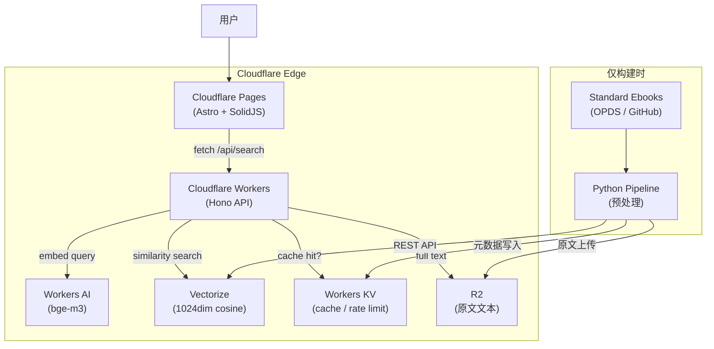
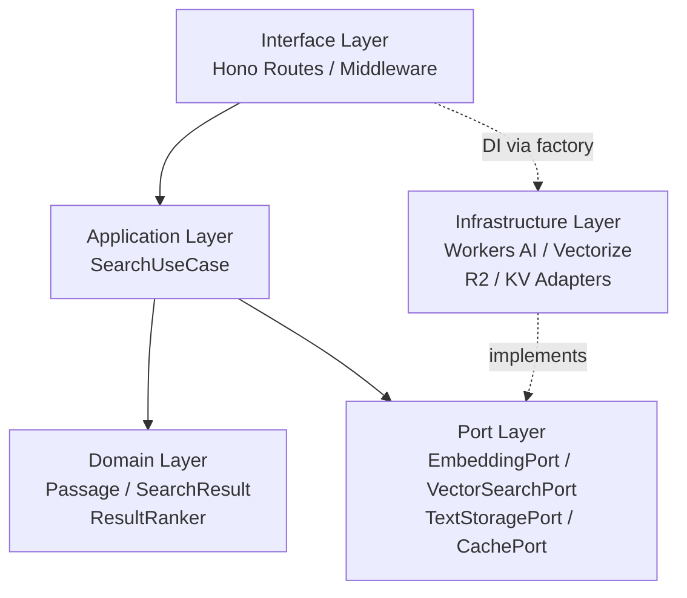
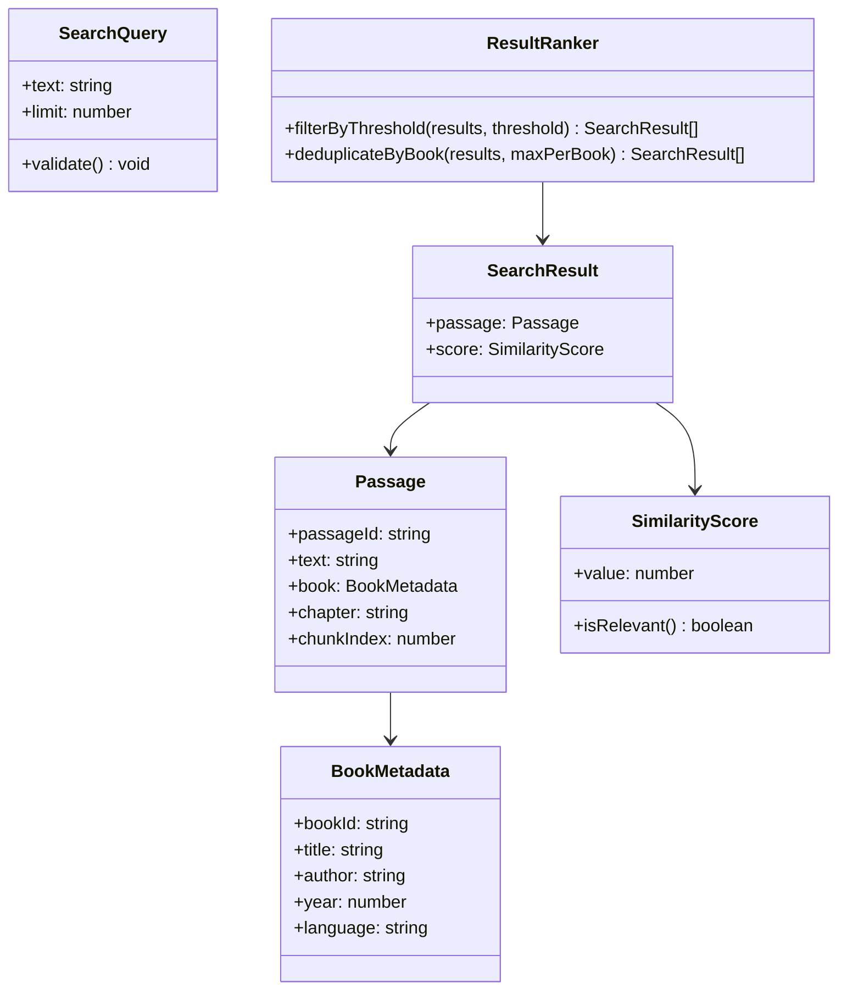
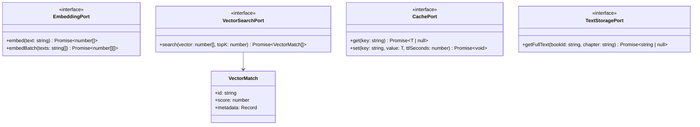
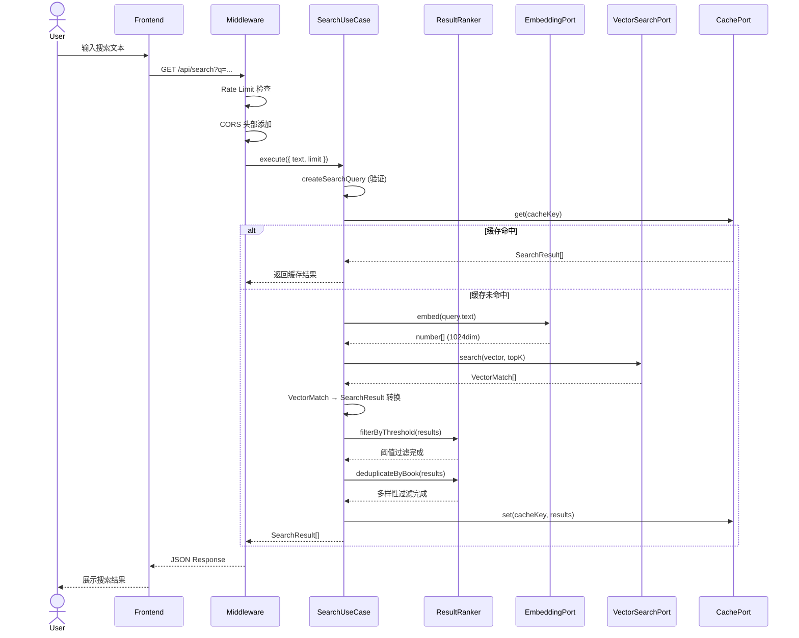
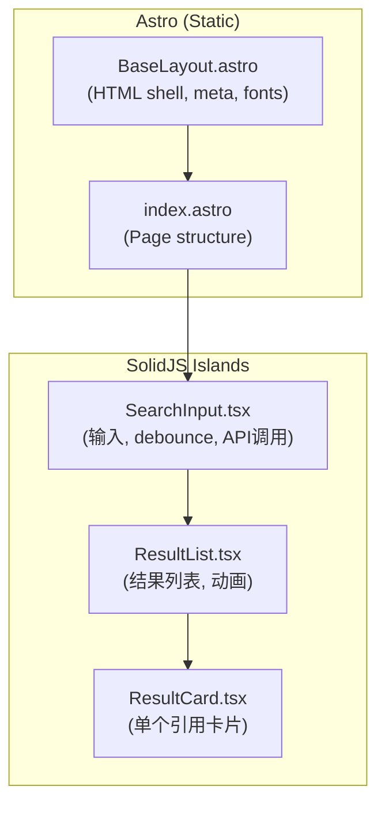
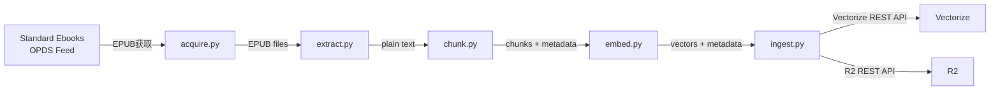
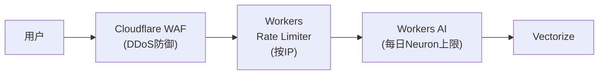
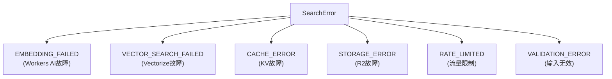

<!-- Translated from DESIGN.ja.md v1.0.1 -->
**[English](DESIGN.en.md)** | **[日本語](DESIGN.ja.md)** | **[中文](DESIGN.zh-CN.md)**

# Passage 技术设计文档

> 📋 **文档信息**
>
> *项目名称:* Passage
> *版本:* 1.0.1
> *作者:* 坂下 康信
> *最后更新:* 2026-03-08
> *状态:* Final (Reviewed)

## 1. 概述

**Passage** 是一个通过语义搜索从世界文学名著中发现"触动心灵的段落"的Web服务。用户输入自由文本（心情、场景、情感等），系统将显示语义上最接近的文学作品段落及其引用来源。

传统的名言汇总网站仅收录由人工策划的有限名言，而Passage将数百部文学作品的全文向量化，实现基于自然语言的语义搜索。系统构建在Cloudflare Workers生态系统之上，通过边缘计算实现低延迟，通过无服务器架构实现零运维负担。

**设计目标**

- 通过自然语言跨文学作品搜索的直观用户体验
- 零配置、零运维的无服务器架构
- 将领域逻辑与云服务完全隔离的六边形架构
- 月运营成本控制在$15以下的可持续运营
- 即使在访问量激增时也能防止成本爆炸的防御性设计

---

## 2. 背景与问题

世界文学凝聚了人类数千年的智慧与情感。然而，从如此庞大的文本中找到"与当前心情完美契合的段落"是非常困难的。

现有的名言网站（如BrainyQuote、Goodreads等）仅收录由人工策划的知名语句，覆盖范围有限。关键词搜索无法应对"深夜独处，有些伤感，却又莫名地感到畅快"这类基于情感的查询。

> 💡 **解决方案:** 将公共领域的文学作品全文转换为向量嵌入，存储在Cloudflare Vectorize中。使用相同模型将用户的自然语言输入向量化，通过余弦相似度进行语义搜索。由此，即使面对情感、场景、氛围等抽象查询，也能返回语义上相近的文学段落。

---

## 3. 需求定义

### 3.1 功能需求

- **FR-01** 用户可以输入自由文本，搜索语义上相似的文学作品段落
- **FR-02** 搜索结果包含段落文本、作品名、作者名、章节信息
- **FR-03** 单次搜索最多返回20条结果（默认10条）
- **FR-04** 搜索结果按余弦相似度分数排序
- **FR-05** 支持多语言查询（英语、日语、法语等）搜索英文文本
- **FR-06** API提供符合OpenAPI规范的REST端点
- **FR-07** 前端为包含搜索输入和结果展示的单页应用
- **FR-08** 提供健康检查端点

### 3.2 非功能需求

- **NFR-01** 搜索响应时间在500ms以内（p95）
- **NFR-02** 能承受每月100万请求的负载
- **NFR-03** 正常运营时月度运营成本在$15以下
- **NFR-04** 每月1000万请求时月度费用不超过$120
- **NFR-05** 前端Lighthouse性能评分达到90以上
- **NFR-06** API响应包含CORS支持
- **NFR-07** 基于IP的速率限制，每IP每分钟上限30个请求
- **NFR-08** 服务可用性月度达到99.9%以上（遵循Cloudflare Workers基础设施SLA）

### 3.3 约束条件

- 数据源限定为公共领域的文学作品（基于美国版权法标准）
- 遵守Cloudflare Workers的执行时间限制（CPU时间30秒，Workers Paid）
- 在Vectorize每索引最大1000万向量的约束内运营
- 前端静态资源托管在Cloudflare Pages上

---

## 4. 技术栈

### 4.1 运行时与框架

- **TypeScript 5.x**
    - 在Workers API、Hono、前端所有层统一使用。通过类型安全性提升开发体验和代码质量
- **Hono 4.x** (MIT)
    - 针对Cloudflare Workers优化的Web框架。提供中间件机制、Zod集成、OpenAPI自动生成
    - 选择理由: 类似Express/Fastify的API，但原生支持边缘运行时。极小的打包体积（14KB），适合Workers的约束
- **Astro 5.x** (MIT)
    - 静态站点生成 + 岛屿架构的Web框架。通过Cloudflare Pages适配器实现零配置部署
    - 选择理由: 在以内容为主的页面中消除不必要的JS，仅将搜索UI作为SolidJS岛屿进行水合
- **SolidJS 1.x** (MIT)
    - 细粒度响应式UI库。无虚拟DOM实现高性能
    - 选择理由: 与React相比打包体积缩小至1/5以下，运行时开销最小。最适合作为Astro的岛屿使用

### 4.2 Cloudflare服务

- **Cloudflare Workers** (Paid plan, $5/月基础费用)
    - API服务器。在全球200多个城市的边缘节点运行，零数据传输费（egress）
- **Workers AI**
    - `@cf/baai/bge-m3` embedding模型。1024维，多语言支持，8,192 token上下文
    - `@cf/baai/bge-reranker-base` 重排序器（v2扩展用）
- **Vectorize**
    - 向量数据库。每索引最大1000万向量，余弦相似度搜索
- **Workers KV**
    - 搜索结果缓存及速率限制计数器的持久化
- **R2**
    - 文学作品原文文本存储。零egress费用
- **Cloudflare Pages**
    - 前端静态站点托管

> 💡 **embedding模型的选择依据:** 选择`bge-m3`的理由有以下三点。(1) 多语言支持: 可以用日语或法语查询搜索英文文本。(2) 成本: $0.012/M token，与bge-base-en-v1.5的$0.067/M相比便宜约6倍。(3) 上下文长度: 支持8,192 token的输入，可以无需截断地处理长段落。在精度方面，英语专用的bge-base-en-v1.5可能略有优势，因此会在初期基准测试中进行对比验证后做最终判断。

### 4.3 预处理工具

- **Python 3.12+**
    - 仅用于预处理流水线。不会部署到生产环境
- **ebooklib** (AGPL-3.0)
    - EPUB文件的读取与解析。由于是AGPL-3.0许可证，需要注意处理方式。本项目仅限于构建时的预处理流水线使用，不包含在Web服务本体中，因此不属于许可证传播对象。若将流水线本身作为OSS公开，则需要遵守AGPL
- **BeautifulSoup4** (MIT)
    - 从XHTML中提取文本
- **NLTK** (Apache 2.0) *v2计划*
    - 句子级别分割（`sent_tokenize`）。v1采用段落单位分割，尚未使用
- **httpx** (BSD-3)
    - 向Cloudflare REST API发送异步HTTP请求

### 4.4 测试

- **Vitest** + Workers环境插件
    - 领域层的单元测试、Workers API的集成测试
- **Playwright**
    - 前端的E2E测试
- **pytest**
    - 预处理流水线的测试

### 4.5 构建与部署

- **Wrangler CLI**
    - Workers / Vectorize / KV / R2 的本地开发与部署
- **GitHub Actions**
    - CI/CD流水线。测试、lint、部署的自动化

---

## 5. 系统架构设计

### 5.1 设计原则

- **六边形架构（Ports & Adapters）**: 将领域逻辑与Cloudflare服务完全隔离，最大化可测试性
- **依赖反转原则（DIP）**: 领域层定义Port接口，基础设施层实现它。依赖方向始终从外部指向内部
- **单一职责原则**: 每个模块只承担一个职责。搜索逻辑、embedding生成、向量搜索、缓存全部是独立模块
- **防御性设计**: 多层实现速率限制、超时、降级，防止成本爆炸和故障级联

### 5.2 整体架构图



### 5.3 分层结构



- **Domain Layer**: 不依赖Cloudflare。负责搜索结果的值对象、评分和过滤逻辑
- **Port Layer**: 定义领域对外部服务所需的接口
- **Infrastructure Layer**: 使用Cloudflare服务实现Port。将服务特定的处理封装在此层
- **Application Layer**: 组合领域与Port的编排层。搜索用例的执行单元
- **Interface Layer**: 通过Hono实现路由、验证、中间件、入口点

### 5.4 包结构

```
passage/
├── packages/
│   ├── api/                          # Cloudflare Workers API
│   │   ├── src/
│   │   │   ├── domain/
│   │   │   │   ├── model/
│   │   │   │   │   ├── passage.ts
│   │   │   │   │   ├── search-query.ts
│   │   │   │   │   ├── search-result.ts
│   │   │   │   │   └── book-metadata.ts
│   │   │   │   └── service/
│   │   │   │       └── result-ranker.ts
│   │   │   ├── port/
│   │   │   │   ├── embedding-port.ts
│   │   │   │   ├── vector-search-port.ts
│   │   │   │   ├── text-storage-port.ts
│   │   │   │   ├── cache-port.ts
│   │   │   │   └── error/
│   │   │   │       └── search-error.ts
│   │   │   ├── application/
│   │   │   │   ├── search-use-case.ts
│   │   │   │   └── types.ts
│   │   │   ├── infrastructure/
│   │   │   │   ├── workers-ai-embedding-adapter.ts
│   │   │   │   ├── vectorize-search-adapter.ts
│   │   │   │   ├── r2-text-storage-adapter.ts
│   │   │   │   └── kv-cache-adapter.ts
│   │   │   ├── interface/
│   │   │   │   ├── routes/
│   │   │   │   │   ├── search.ts
│   │   │   │   │   └── health.ts
│   │   │   │   ├── middleware/
│   │   │   │   │   ├── rate-limiter.ts
│   │   │   │   │   ├── cors.ts
│   │   │   │   │   └── error-handler.ts
│   │   │   │   └── app.ts
│   │   │   ├── config/
│   │   │   │   └── bindings.ts
│   │   │   └── index.ts
│   │   ├── test/
│   │   ├── wrangler.toml
│   │   ├── tsconfig.json
│   │   ├── vitest.config.ts
│   │   └── package.json
│   ├── web/                          # Frontend (Astro + SolidJS)
│   │   ├── src/
│   │   │   ├── components/
│   │   │   │   ├── SearchInput.tsx    # SolidJS island
│   │   │   │   ├── ResultCard.tsx     # SolidJS island
│   │   │   │   └── ResultList.tsx     # SolidJS island
│   │   │   ├── layouts/
│   │   │   │   └── BaseLayout.astro
│   │   │   ├── pages/
│   │   │   │   └── index.astro
│   │   │   └── styles/
│   │   │       └── global.css
│   │   ├── astro.config.mjs
│   │   └── package.json
│   └── pipeline/                     # Python预处理
│       ├── src/
│       │   ├── acquire.py            # Standard Ebooks获取
│       │   ├── extract.py            # EPUB→文本提取
│       │   ├── chunk.py              # 分块
│       │   ├── embed.py              # Embedding生成
│       │   ├── ingest.py             # 向Vectorize/R2/KV导入
│       │   └── main.py               # 流水线执行
│       ├── tests/
│       ├── pyproject.toml
│       └── README.md
├── .github/
│   └── workflows/
│       ├── ci.yml
│       └── deploy.yml
└── README.md
```

---

## 6. 领域模型设计

领域层不依赖任何Cloudflare服务。由纯TypeScript代码构成，负责搜索结果的类型定义和评分逻辑。

### 6.1 类图



### 6.2 值对象

所有值对象通过 `readonly` 属性和 Branded Type 模式保证不可变性和类型安全性。

#### BookMetadata

表示作品的元数据。

```tsx
// domain/model/book-metadata.ts

export interface BookMetadata {
  readonly bookId: string;
  readonly title: string;
  readonly author: string;
  readonly year: number;
  readonly language: string;
}

export function createBookMetadata(params: {
  bookId: string;
  title: string;
  author: string;
  year: number;
  language: string;
}): BookMetadata {
  if (!params.bookId || !params.title || !params.author) {
    throw new Error(
      `BookMetadata requires non-empty bookId, title, and author`
    );
  }
  if (!Number.isInteger(params.year) || params.year < 0) {
    throw new Error(
      `BookMetadata year must be a non-negative integer: ${params.year}`
    );
  }
  return Object.freeze(params);
}
```

#### Passage

表示文学作品的一个段落。是搜索的最小单位，对应Vectorize上的一个向量。

```tsx
// domain/model/passage.ts

import type { BookMetadata } from "./book-metadata.js";

export interface Passage {
  readonly passageId: string;
  readonly text: string;
  readonly book: BookMetadata;
  readonly chapter: string;
  readonly chunkIndex: number;
}

export function createPassage(params: {
  passageId: string;
  text: string;
  book: BookMetadata;
  chapter: string;
  chunkIndex: number;
}): Passage {
  if (!params.passageId || !params.text) {
    throw new Error("Passage requires non-empty passageId and text");
  }
  if (params.chunkIndex < 0) {
    throw new Error("chunkIndex must be non-negative");
  }
  return Object.freeze({
    ...params,
    book: Object.freeze(params.book),
  });
}
```

#### SearchQuery

表示搜索查询。将验证逻辑集中在领域层。

```tsx
// domain/model/search-query.ts

export interface SearchQuery {
  readonly text: string;
  readonly limit: number;
}

const MAX_QUERY_LENGTH = 500;
const MIN_LIMIT = 1;
const MAX_LIMIT = 20;
const DEFAULT_LIMIT = 10;

export function createSearchQuery(params: {
  text: string;
  limit?: number;
}): SearchQuery {
  const trimmed = params.text.trim();

  if (trimmed.length === 0) {
    throw new SearchQueryValidationError("Search query must not be empty");
  }
  if (trimmed.length > MAX_QUERY_LENGTH) {
    throw new SearchQueryValidationError(
      `Search query must not exceed ${MAX_QUERY_LENGTH} characters`
    );
  }

  const limit = params.limit ?? DEFAULT_LIMIT;
  if (limit < MIN_LIMIT || limit > MAX_LIMIT) {
    throw new SearchQueryValidationError(
      `Limit must be between ${MIN_LIMIT} and ${MAX_LIMIT}`
    );
  }

  return Object.freeze({ text: trimmed, limit });
}

export class SearchQueryValidationError extends Error {
  constructor(message: string) {
    super(message);
    this.name = "SearchQueryValidationError";
  }
}
```

#### SimilarityScore

表示余弦相似度分数。Vectorize的cosine度量返回-1（最不相似）到1（完全相同）的范围。

```tsx
// domain/model/search-result.ts

import type { Passage } from "./passage.js";

export interface SimilarityScore {
  readonly value: number;
}

const RELEVANCE_THRESHOLD = 0.3;

export function createSimilarityScore(value: number): SimilarityScore {
  if (value < -1 || value > 1) {
    throw new Error(`Similarity score must be between -1 and 1: ${value}`);
  }
  return Object.freeze({ value });
}

export function isRelevant(score: SimilarityScore): boolean {
  return score.value >= RELEVANCE_THRESHOLD;
}

export interface SearchResult {
  readonly passage: Passage;
  readonly score: SimilarityScore;
}
```

### 6.3 领域服务: ResultRanker

负责搜索结果过滤和多样性保证的无状态领域服务。实现"多样性过滤器"以防止同一作品的结果垄断前排。

```tsx
// domain/service/result-ranker.ts

import type { SearchResult } from "../model/search-result.js";
import { isRelevant } from "../model/search-result.js";

export class ResultRanker {
  /**
   * 过滤掉相似度分数低于阈值的结果。
   * 作为质量门控，不向用户返回低质量结果。
   */
  filterByThreshold(results: readonly SearchResult[]): SearchResult[] {
    return results.filter((r) => isRelevant(r.score));
  }

  /**
   * 限制同一作品的结果最多为 maxPerBook 条。
   * 防止特定作品垄断前排，确保搜索结果的多样性。
   *
   * 算法:
   * 前提是输入按分数降序排列。
   * 统计每部作品的出现次数，当超过 maxPerBook 时
   * 跳过该作品的后续结果。
   */
  deduplicateByBook(
    results: readonly SearchResult[],
    maxPerBook: number = 3
  ): SearchResult[] {
    const bookCounts = new Map<string, number>();
    const diversified: SearchResult[] = [];

    for (const result of results) {
      const bookId = result.passage.book.bookId;
      const count = bookCounts.get(bookId) ?? 0;

      if (count < maxPerBook) {
        diversified.push(result);
        bookCounts.set(bookId, count + 1);
      }
    }

    return diversified;
  }
}
```

---

## 7. Port层设计

Port层定义领域对外部服务所需的接口。以TypeScript的 `interface` 声明，由基础设施层提供实现。

### 7.1 类图



### 7.2 接口定义

#### EmbeddingPort

将文本转换为向量嵌入的Port。Workers AI的抽象层。

```tsx
// port/embedding-port.ts

export interface EmbeddingPort {
  /**
   * 将单个文本转换为向量嵌入。
   * @param text 输入文本
   * @returns 1024维的float数组
   */
  embed(text: string): Promise<number[]>;

  /**
   * 将多个文本批量转换为向量嵌入。
   * 用于预处理流水线的批处理。
   * @param texts 输入文本数组（最多100条）
   * @returns 每个文本对应的1024维float数组
   */
  embedBatch(texts: string[]): Promise<number[][]>;
}
```

#### VectorSearchPort

执行向量相似度搜索的Port。Vectorize的抽象层。

```tsx
// port/vector-search-port.ts

export interface VectorMatch {
  readonly id: string;
  readonly score: number;
  readonly metadata: Record<string, string | number>;
}

export interface VectorSearchPort {
  /**
   * 搜索与查询向量最相似的向量。
   * @param vector 查询向量（1024维）
   * @param topK 返回的最大条数（1-20）
   * @returns 按分数降序排列的匹配结果
   */
  search(vector: number[], topK: number): Promise<VectorMatch[]>;
}
```

#### CachePort

搜索结果缓存及速率限制持久化的Port。Workers KV的抽象层。

```tsx
// port/cache-port.ts

export interface CachePort {
  get<T>(key: string): Promise<T | null>;
  set<T>(key: string, value: T, ttlSeconds: number): Promise<void>;
  increment(key: string, ttlSeconds: number): Promise<number>;
}
```

#### TextStoragePort

获取原文文本的Port。R2的抽象层。v2的"周边上下文展示"功能中使用。

```tsx
// port/text-storage-port.ts

export interface TextStoragePort {
  getFullText(
    bookId: string,
    chapter: string
  ): Promise<string | null>;
}
```

### 7.3 错误类型

```tsx
// port/error/search-error.ts

export class SearchError extends Error {
  constructor(
    message: string,
    public readonly code: SearchErrorCode,
    public readonly cause?: unknown
  ) {
    super(message);
    this.name = "SearchError";
  }
}

export type SearchErrorCode =
  | "EMBEDDING_FAILED"
  | "VECTOR_SEARCH_FAILED"
  | "CACHE_ERROR"
  | "STORAGE_ERROR"
  | "RATE_LIMITED"
  | "VALIDATION_ERROR";
```

---

## 8. 基础设施层设计

使用Cloudflare服务实现Port层的接口。每个适配器封装Cloudflare特有的处理，仅对外公开Port接口。

### 8.1 Cloudflare绑定类型定义

对应Wrangler配置的TypeScript类型定义。所有对Cloudflare服务的访问都通过此 `Env` 类型以类型安全的方式进行。

```tsx
// config/bindings.ts

export interface Env {
  AI: Ai;
  VECTORIZE: VectorizeIndex;
  CACHE: KVNamespace;
  TEXTS: R2Bucket;
}
```

### 8.2 Workers AI Embedding Adapter

```tsx
// infrastructure/workers-ai-embedding-adapter.ts

import type { EmbeddingPort } from "../port/embedding-port.js";
import { SearchError } from "../port/error/search-error.js";

const MODEL = "@cf/baai/bge-m3" as const;
const MAX_BATCH_SIZE = 100;

export class WorkersAiEmbeddingAdapter implements EmbeddingPort {
  constructor(private readonly ai: Ai) {}

  async embed(text: string): Promise<number[]> {
    try {
      const response = await this.ai.run(MODEL, {
        text: [text],
      });
      const vectors = response.data;
      if (!vectors || vectors.length === 0) {
        throw new Error("Empty embedding response");
      }
      return vectors[0];
    } catch (error) {
      throw new SearchError(
        `Failed to generate embedding: ${error}`,
        "EMBEDDING_FAILED",
        error
      );
    }
  }

  async embedBatch(texts: string[]): Promise<number[][]> {
    if (texts.length > MAX_BATCH_SIZE) {
      throw new SearchError(
        `Batch size ${texts.length} exceeds maximum ${MAX_BATCH_SIZE}`,
        "EMBEDDING_FAILED"
      );
    }
    try {
      const response = await this.ai.run(MODEL, {
        text: texts,
      });
      return response.data;
    } catch (error) {
      throw new SearchError(
        `Failed to generate batch embeddings: ${error}`,
        "EMBEDDING_FAILED",
        error
      );
    }
  }
}
```

### 8.3 Vectorize Search Adapter

```tsx
// infrastructure/vectorize-search-adapter.ts

import type {
  VectorMatch,
  VectorSearchPort,
} from "../port/vector-search-port.js";
import { SearchError } from "../port/error/search-error.js";

export class VectorizeSearchAdapter implements VectorSearchPort {
  constructor(private readonly index: VectorizeIndex) {}

  async search(
    vector: number[],
    topK: number
  ): Promise<VectorMatch[]> {
    try {
      const results = await this.index.query(vector, {
        topK,
        returnMetadata: "all",
      });

      return results.matches.map((match) => ({
        id: match.id,
        score: match.score ?? 0,
        metadata: (match.metadata ?? {}) as Record<
          string,
          string | number
        >,
      }));
    } catch (error) {
      throw new SearchError(
        `Vector search failed: ${error}`,
        "VECTOR_SEARCH_FAILED",
        error
      );
    }
  }
}
```

### 8.4 KV Cache Adapter

```tsx
// infrastructure/kv-cache-adapter.ts

import type { CachePort } from "../port/cache-port.js";

export class KvCacheAdapter implements CachePort {
  constructor(private readonly kv: KVNamespace) {}

  async get<T>(key: string): Promise<T | null> {
    const value = await this.kv.get(key, "json");
    return value as T | null;
  }

  async set<T>(
    key: string,
    value: T,
    ttlSeconds: number
  ): Promise<void> {
    await this.kv.put(key, JSON.stringify(value), {
      expirationTtl: ttlSeconds,
    });
  }

  async increment(
    key: string,
    ttlSeconds: number
  ): Promise<number> {
    // KV不支持原子递增，因此采用
    // 读取-修改-写入方式实现。
    // 这是一个优先可用性而非速率限制严格性的设计决策。
    const current = await this.kv.get(key, "json") as number | null;
    const next = (current ?? 0) + 1;
    await this.kv.put(key, JSON.stringify(next), {
      expirationTtl: ttlSeconds,
    });
    return next;
  }
}
```

> ⚠️ **关于KV递增的非原子性:** Workers KV的读取-修改-写入不是原子操作，来自同一IP的并发请求可能发生竞态条件。由于速率限制的目的不是严格的流量控制，而是防止明显的滥用，因此这一设计上的权衡在可接受范围内。如果需要严格的速率限制，应考虑使用Durable Objects。

### 8.5 R2 Text Storage Adapter

```tsx
// infrastructure/r2-text-storage-adapter.ts

import type { TextStoragePort } from "../port/text-storage-port.js";
import { SearchError } from "../port/error/search-error.js";

export class R2TextStorageAdapter implements TextStoragePort {
  constructor(private readonly bucket: R2Bucket) {}

  async getFullText(
    bookId: string,
    chapter: string
  ): Promise<string | null> {
    // 防止路径遍历攻击: 对输入值进行清理
    const safeBookId = bookId.replace(/[^a-z0-9-]/g, "");
    const safeChapter = chapter.replace(/[^a-z0-9-]/g, "");
    if (!safeBookId || !safeChapter) return null;
    const key = `${safeBookId}/${safeChapter}.txt`;
    try {
      const object = await this.bucket.get(key);
      if (!object) return null;
      return await object.text();
    } catch (error) {
      throw new SearchError(
        `Failed to retrieve text: ${key}`,
        "STORAGE_ERROR",
        error
      );
    }
  }
}
```

---

## 9. 应用层设计

应用层是组合领域与Port执行用例的编排层。

### 9.1 SearchUseCase

```tsx
// application/search-use-case.ts

import type { EmbeddingPort } from "../port/embedding-port.js";
import type { VectorSearchPort } from "../port/vector-search-port.js";
import type { CachePort } from "../port/cache-port.js";
import {
  createSearchQuery,
  type SearchQuery,
} from "../domain/model/search-query.js";
import {
  createPassage,
  type Passage,
} from "../domain/model/passage.js";
import { createBookMetadata } from "../domain/model/book-metadata.js";
import {
  createSimilarityScore,
  type SearchResult,
} from "../domain/model/search-result.js";
import { ResultRanker } from "../domain/service/result-ranker.js";

const CACHE_TTL_SECONDS = 3600; // 1小时

export class SearchUseCase {
  private readonly ranker = new ResultRanker();

  constructor(
    private readonly embedding: EmbeddingPort,
    private readonly vectorSearch: VectorSearchPort,
    private readonly cache: CachePort
  ) {}

  async execute(params: {
    text: string;
    limit?: number;
  }): Promise<SearchResult[]> {
    // 1. 查询验证（在领域层执行）
    const query = createSearchQuery(params);

    // 2. 缓存命中判断
    const cacheKey = this.buildCacheKey(query);
    const cached = await this.cache.get<SearchResult[]>(cacheKey);
    if (cached) return cached;

    // 3. 将查询文本向量化
    const queryVector = await this.embedding.embed(query.text);

    // 4. 向量相似度搜索
    //    考虑到多样性过滤可能减少结果数量，
    //    先获取请求量3倍（最多50条）再进行过滤
    const fetchSize = Math.min(query.limit * 3, 50);
    const matches = await this.vectorSearch.search(
      queryVector,
      fetchSize
    );

    // 5. 将VectorMatch转换为领域模型
    const results: SearchResult[] = matches.map((match) => {
      const book = createBookMetadata({
        bookId: String(match.metadata.bookId ?? ""),
        title: String(match.metadata.title ?? ""),
        author: String(match.metadata.author ?? ""),
        year: Number(match.metadata.year ?? 0),
        language: String(match.metadata.language ?? "en"),
      });

      const passage = createPassage({
        passageId: match.id,
        text: String(match.metadata.text ?? ""),
        book,
        chapter: String(match.metadata.chapter ?? ""),
        chunkIndex: Number(match.metadata.chunkIndex ?? 0),
      });

      return {
        passage,
        score: createSimilarityScore(match.score),
      };
    });

    // 6. 通过领域服务进行过滤
    const filtered = this.ranker.filterByThreshold(results);
    const diversified = this.ranker.deduplicateByBook(filtered);
    const final = diversified.slice(0, query.limit);

    // 7. 保存到缓存
    if (final.length > 0) {
      await this.cache
        .set(cacheKey, final, CACHE_TTL_SECONDS)
        .catch((e) => console.error("[WARN] Cache write failed:", e));
    }

    return final;
  }

  private buildCacheKey(query: SearchQuery): string {
    // 用查询文本和limit的组合生成键
    // 规范化: 仅移除连续空格（为保持与embedding输入的一致性，保留大小写）
    const normalized = query.text.replace(/\s+/g, " ");
    return `search:${normalized}:${query.limit}`;
  }
}
```

### 9.2 序列图



---

## 10. API设计

### 10.1 Wrangler配置

```toml
# wrangler.toml
name = "passage-api"
main = "src/index.ts"
compatibility_date = "2026-01-01"

[ai]
binding = "AI"

[[vectorize]]
binding = "VECTORIZE"
index_name = "passage-index"

[[kv_namespaces]]
binding = "CACHE"
id = "<KV_NAMESPACE_ID>"

[[r2_buckets]]
binding = "TEXTS"
bucket_name = "passage-texts"
```

### 10.2 入口点与DI

在Worker入口点进行手动DI（构造函数注入），明确地组装依赖关系。不使用DI框架。

```tsx
// index.ts

import { createApp } from "./interface/app.js";
import type { Env } from "./config/bindings.js";
import { WorkersAiEmbeddingAdapter } from "./infrastructure/workers-ai-embedding-adapter.js";
import { VectorizeSearchAdapter } from "./infrastructure/vectorize-search-adapter.js";
import { KvCacheAdapter } from "./infrastructure/kv-cache-adapter.js";
import { SearchUseCase } from "./application/search-use-case.js";

export default {
  async fetch(
    request: Request,
    env: Env,
    ctx: ExecutionContext
  ): Promise<Response> {
    // Manual DI: 组装依赖关系
    const embedding = new WorkersAiEmbeddingAdapter(env.AI);
    const vectorSearch = new VectorizeSearchAdapter(env.VECTORIZE);
    const cache = new KvCacheAdapter(env.CACHE);
    const searchUseCase = new SearchUseCase(
      embedding,
      vectorSearch,
      cache
    );

    const app = createApp({ searchUseCase, cache });
    return app.fetch(request, env, ctx);
  },
};
```

### 10.3 Hono应用定义

```tsx
// interface/app.ts

import { OpenAPIHono } from "@hono/zod-openapi";
import { cors } from "hono/cors";
import type { SearchUseCase } from "../application/search-use-case.js";
import type { CachePort } from "../port/cache-port.js";
import { searchRoute } from "./routes/search.js";
import { healthRoute } from "./routes/health.js";
import { rateLimiter } from "./middleware/rate-limiter.js";
import { errorHandler } from "./middleware/error-handler.js";

interface AppDeps {
  searchUseCase: SearchUseCase;
  cache: CachePort;
}

export function createApp(deps: AppDeps) {
  const app = new OpenAPIHono();

  // 全局中间件
  app.use("*", cors({ origin: "*" }));
  app.use("/api/*", rateLimiter(deps.cache));
  app.onError(errorHandler);

  // 路由注册
  searchRoute(app, deps.searchUseCase);
  healthRoute(app);

  // OpenAPI文档
  app.doc("/openapi.json", {
    openapi: "3.1.0",
    info: {
      title: "Passage API",
      version: "1.0.0",
      description:
        "Semantic search across world literature",
    },
  });

  return app;
}
```

### 10.4 搜索端点

```tsx
// interface/routes/search.ts

import { createRoute, z } from "@hono/zod-openapi";
import type { OpenAPIHono } from "@hono/zod-openapi";
import type { SearchUseCase } from "../../application/search-use-case.js";

const SearchQuerySchema = z.object({
  q: z
    .string()
    .min(1, "Query must not be empty")
    .max(500, "Query must not exceed 500 characters")
    .openapi({ description: "Search query text", example: "lonely night, yet strangely refreshing" }),
  limit: z.coerce
    .number()
    .int()
    .min(1)
    .max(20)
    .default(10)
    .openapi({ description: "Maximum number of results" }),
});

const PassageSchema = z.object({
  passageId: z.string(),
  text: z.string(),
  book: z.object({
    bookId: z.string(),
    title: z.string(),
    author: z.string(),
    year: z.number(),
    language: z.string(),
  }),
  chapter: z.string(),
  score: z.number(),
});

const SearchResponseSchema = z.object({
  results: z.array(PassageSchema),
  count: z.number(),
  query: z.string(),
});

const route = createRoute({
  method: "get",
  path: "/api/search",
  request: { query: SearchQuerySchema },
  responses: {
    200: {
      content: {
        "application/json": { schema: SearchResponseSchema },
      },
      description: "Search results",
    },
  },
});

export function searchRoute(
  app: OpenAPIHono,
  useCase: SearchUseCase
) {
  app.openapi(route, async (c) => {
    const { q, limit } = c.req.valid("query");

    const results = await useCase.execute({
      text: q,
      limit,
    });

    return c.json({
      results: results.map((r) => ({
        passageId: r.passage.passageId,
        text: r.passage.text,
        book: {
          bookId: r.passage.book.bookId,
          title: r.passage.book.title,
          author: r.passage.book.author,
          year: r.passage.book.year,
          language: r.passage.book.language,
        },
        chapter: r.passage.chapter,
        score: r.score.value,
      })),
      count: results.length,
      query: q,
    });
  });
}
```

### 10.5 Rate Limiter中间件

```tsx
// interface/middleware/rate-limiter.ts

import type { MiddlewareHandler } from "hono";
import type { CachePort } from "../../port/cache-port.js";

const MAX_REQUESTS_PER_MINUTE = 30;
const WINDOW_SECONDS = 60;

export function rateLimiter(
  cache: CachePort
): MiddlewareHandler {
  return async (c, next) => {
    const ip =
      c.req.header("cf-connecting-ip") ?? "unknown";
    const key = `ratelimit:${ip}`;

    const count = await cache.increment(
      key,
      WINDOW_SECONDS
    );

    // 始终附加速率限制头部
    c.header("X-RateLimit-Limit", String(MAX_REQUESTS_PER_MINUTE));
    c.header("X-RateLimit-Remaining", String(Math.max(0, MAX_REQUESTS_PER_MINUTE - count)));

    if (count > MAX_REQUESTS_PER_MINUTE) {
      return c.json(
        {
          error: "Too many requests",
          retryAfter: WINDOW_SECONDS,
        },
        429
      );
    }

    await next();
  };
}
```

### 10.6 错误处理器

```tsx
// interface/middleware/error-handler.ts

import type { ErrorHandler } from "hono";
import { SearchError } from "../../port/error/search-error.js";
import { SearchQueryValidationError } from "../../domain/model/search-query.js";

export const errorHandler: ErrorHandler = (err, c) => {
  console.error(`[ERROR] ${err.message}`, err);

  if (err instanceof SearchQueryValidationError) {
    return c.json({ error: err.message }, 400);
  }

  if (err instanceof SearchError) {
    switch (err.code) {
      case "RATE_LIMITED":
        return c.json({ error: "Too many requests" }, 429);
      case "VALIDATION_ERROR":
        return c.json({ error: err.message }, 400);
      default:
        return c.json(
          { error: "Internal search error" },
          500
        );
    }
  }

  return c.json({ error: "Internal server error" }, 500);
};
```

---

## 11. 前端设计

### 11.1 技术选型

- **Astro**: 生成静态HTML，最小化JS包体积。通过Cloudflare Pages适配器实现边缘部署
- **SolidJS**: 仅将搜索输入和结果展示的交互部分作为岛屿进行水合
- **Vanilla CSS**: 不使用CSS框架。通过自定义属性（CSS变量）实现一致的设计系统

### 11.2 组件结构



### 11.3 SearchInput组件

```tsx
// components/SearchInput.tsx

import { createSignal, Show, onCleanup } from "solid-js";
import { ResultList } from "./ResultList.js";

const API_BASE = import.meta.env.PUBLIC_API_URL;
const DEBOUNCE_MS = 400;

interface SearchResult {
  passageId: string;
  text: string;
  book: {
    title: string;
    author: string;
    year: number;
  };
  chapter: string;
  score: number;
}

export function SearchInput() {
  const [query, setQuery] = createSignal("");
  const [results, setResults] = createSignal<SearchResult[]>([]);
  const [loading, setLoading] = createSignal(false);
  const [error, setError] = createSignal<string | null>(null);
  let debounceTimer: ReturnType<typeof setTimeout>;
  onCleanup(() => clearTimeout(debounceTimer));

  async function handleSearch(text: string) {
    setQuery(text);
    clearTimeout(debounceTimer);

    if (text.trim().length === 0) {
      setResults([]);
      return;
    }

    debounceTimer = setTimeout(async () => {
      setLoading(true);
      setError(null);
      try {
        const url = new URL("/api/search", API_BASE);
        url.searchParams.set("q", text.trim());
        url.searchParams.set("limit", "10");

        const res = await fetch(url.toString());
        if (!res.ok) throw new Error(`HTTP ${res.status}`);

        const data = await res.json();
        setResults(data.results);
      } catch (e) {
        setError("Search failed. Please try again.");
        setResults([]);
      } finally {
        setLoading(false);
      }
    }, DEBOUNCE_MS);
  }

  return (
    <div class="search-container">
      <textarea
        class="search-input"
        placeholder="Describe a feeling, a scene, a mood..."
        value={query()}
        onInput={(e) => handleSearch(e.currentTarget.value)}
        rows={3}
      />
      <Show when={loading()}>
        <div class="loading-indicator" aria-label="Searching..." />
      </Show>
      <Show when={error()}>
        <p class="error-message">{error()}</p>
      </Show>
      <ResultList results={results()} />
    </div>
  );
}
```

### 11.4 UI设计理念

以深色调为基础的设计，表达文学氛围。

- **排版**: 以衬线体（EB Garamond / Cormorant Garamond）为主。再现古典书籍的气质
- **色彩方案**: 深海军蓝背景配以复古金色点缀。引用文本以奶油色显示
- **动画**: 搜索结果的淡入效果、卡片的微妙滚动联动。利用View Transitions API
- **响应式**: 移动端优先设计。搜索输入始终固定在视口顶部

---

## 12. 预处理流水线设计

### 12.1 流水线全景



### 12.2 EPUB获取 ([acquire.py](http://acquire.py))

从Standard Ebooks的OPDS Feed批量下载EPUB文件。OPDS是Atom Feed的扩展，提供目录中所有书籍信息和下载链接。

```python
# pipeline/src/acquire.py

import httpx
from pathlib import Path
from xml.etree import ElementTree

OPDS_URL = "https://standardebooks.org/feeds/opds"
OUTPUT_DIR = Path("data/epubs")

# ElementTree命名空间前缀（在常量中包含花括号）
ATOM_NS = "{http://www.w3.org/2005/Atom}"
OPDS_NS = "{http://opds-spec.org/2010/catalog}"

def fetch_catalog(url: str) -> list[dict]:
    """解析OPDS目录并返回书籍信息列表。"""
    entries = []
    next_url = url

    while next_url:
        resp = httpx.get(next_url, follow_redirects=True, timeout=30)
        resp.raise_for_status()
        root = ElementTree.fromstring(resp.content)

        for entry in root.findall(f"{ATOM_NS}entry"):
            title = entry.findtext(f"{ATOM_NS}title", "")
            author = entry.findtext(
                f"{ATOM_NS}author/{ATOM_NS}name", ""
            )

            # 提取EPUB下载链接
            epub_link = None
            for link in entry.findall(f"{ATOM_NS}link"):
                if "application/epub+zip" in link.get("type", ""):
                    epub_link = link.get("href")
                    break

            if epub_link:
                entries.append({
                    "title": title,
                    "author": author,
                    "epub_url": epub_link,
                })

        # 分页: 获取下一页的链接
        next_el = root.find(
            f'{ATOM_NS}link[@rel="next"]'
        )
        next_url = (
            next_el.get("href") if next_el is not None else None
        )

    return entries

def download_epub(url: str, output_path: Path) -> None:
    """下载并保存EPUB文件。"""
    if output_path.exists():
        return  # 已下载过

    resp = httpx.get(url, follow_redirects=True, timeout=60)
    resp.raise_for_status()
    output_path.parent.mkdir(parents=True, exist_ok=True)
    output_path.write_bytes(resp.content)
```

### 12.3 文本提取 ([extract.py](http://extract.py))

解析EPUB文件中的XHTML，提取保留章节结构的纯文本。利用Standard Ebooks的语义化标记，通过 `<section>` 元素进行章节分割。

```python
# pipeline/src/extract.py

import ebooklib
from ebooklib import epub
from bs4 import BeautifulSoup
from dataclasses import dataclass

@dataclass
class Chapter:
    title: str
    text: str
    index: int

@dataclass
class ExtractedBook:
    book_id: str
    title: str
    author: str
    language: str
    year: int
    chapters: list[Chapter]

def extract_book(epub_path: str) -> ExtractedBook:
    """从EPUB文件中提取结构化文本。"""
    book = epub.read_epub(epub_path)

    # 获取元数据
    title = book.get_metadata("DC", "title")[0][0]
    author = book.get_metadata("DC", "creator")[0][0]
    language = book.get_metadata("DC", "language")[0][0]

    # 获取出版年份 (Standard Ebooks格式)
    date_str = book.get_metadata("DC", "date")[0][0]
    year = int(date_str[:4]) if date_str else 0

    # 生成book_id (作者名-标题的slug)
    book_id = _slugify(f"{author}-{title}")

    chapters = []
    for idx, item in enumerate(
        book.get_items_of_type(ebooklib.ITEM_DOCUMENT)
    ):
        soup = BeautifulSoup(
            item.get_content(), "html.parser"
        )
        body = soup.find("body")
        if not body:
            continue

        # 获取章节标题
        heading = body.find(["h1", "h2", "h3"])
        chapter_title = (
            heading.get_text(strip=True) if heading else f"Chapter {idx + 1}"
        )

        # 文本提取 (以段落为单位用换行分隔)
        paragraphs = []
        for p in body.find_all("p"):
            text = p.get_text(strip=True)
            if text:
                paragraphs.append(text)

        if paragraphs:
            chapters.append(
                Chapter(
                    title=chapter_title,
                    text="\n\n".join(paragraphs),
                    index=idx,
                )
            )

    return ExtractedBook(
        book_id=book_id,
        title=title,
        author=author,
        language=language,
        year=year,
        chapters=chapters,
    )

def _slugify(text: str) -> str:
    import re
    slug = text.lower().strip()
    slug = re.sub(r"[^a-z0-9]+", "-", slug)
    return slug.strip("-")
```

### 12.4 分块 ([chunk.py](http://chunk.py))

以段落为单位进行分割，过短的段落与前后合并。为每个分块附加元数据（作品名、作者、章节、位置）。

```python
# pipeline/src/chunk.py

from dataclasses import dataclass

MIN_CHUNK_CHARS = 80
MAX_CHUNK_CHARS = 1500

@dataclass
class TextChunk:
    chunk_id: str          # "{book_id}:{chunk_index}"
    text: str
    book_id: str
    title: str
    author: str
    year: int
    language: str
    chapter: str
    chunk_index: int

def chunk_book(
    book: "ExtractedBook",
) -> list[TextChunk]:
    """将整本书分割为分块。"""
    chunks: list[TextChunk] = []
    global_index = 0

    for chapter in book.chapters:
        paragraphs = chapter.text.split("\n\n")
        buffer = ""

        for para in paragraphs:
            candidate = (
                f"{buffer}\n\n{para}".strip()
                if buffer
                else para
            )

            if len(candidate) > MAX_CHUNK_CHARS and buffer:
                # 如果缓冲区有足够的长度则确定为分块
                chunks.append(
                    TextChunk(
                        chunk_id=f"{book.book_id}:{global_index:05d}",
                        text=buffer,
                        book_id=book.book_id,
                        title=book.title,
                        author=book.author,
                        year=book.year,
                        language=book.language,
                        chapter=chapter.title,
                        chunk_index=global_index,
                    )
                )
                global_index += 1
                buffer = para
            else:
                buffer = candidate

        # 刷新剩余的缓冲区
        if buffer and len(buffer) >= MIN_CHUNK_CHARS:
            chunks.append(
                TextChunk(
                    chunk_id=f"{book.book_id}:{global_index:05d}",
                    text=buffer,
                    book_id=book.book_id,
                    title=book.title,
                    author=book.author,
                    year=book.year,
                    language=book.language,
                    chapter=chapter.title,
                    chunk_index=global_index,
                )
            )
            global_index += 1
        elif buffer and chunks:
            # 如果过短则合并到前一个分块
            last = chunks[-1]
            chunks[-1] = TextChunk(
                chunk_id=last.chunk_id,
                text=f"{last.text}\n\n{buffer}",
                book_id=last.book_id,
                title=last.title,
                author=last.author,
                year=last.year,
                language=last.language,
                chapter=last.chapter,
                chunk_index=last.chunk_index,
            )

    return chunks
```

> 💡 **分块策略的依据:** 以段落为基本单位的原因是，在文学文本中段落本身就是意义的单元。与固定长度token分割或句子分割相比，段落分割在上下文保持和搜索粒度之间取得了最佳平衡。MIN/MAX_CHUNK_CHARS的阈值是根据bge-m3推荐的512 token输入长度（约相当于英文2,000字符）反推设定的。

### 12.5 Embedding生成与存储 ([embed.py](http://embed.py), [ingest.py](http://ingest.py))

使用Cloudflare REST API生成embedding并存储到Vectorize。通过NDJSON格式进行批量上传，最大化吞吐量。

```python
# pipeline/src/embed.py

import httpx
import json
from dataclasses import dataclass

CF_API_BASE = "https://api.cloudflare.com/client/v4/accounts"
EMBEDDING_MODEL = "@cf/baai/bge-m3"
BATCH_SIZE = 50  # Workers AI每请求最多100个文本

def generate_embeddings(
    texts: list[str],
    account_id: str,
    api_token: str,
) -> list[list[float]]:
    """使用Cloudflare Workers AI API生成embedding。"""
    url = f"{CF_API_BASE}/{account_id}/ai/run/{EMBEDDING_MODEL}"
    headers = {"Authorization": f"Bearer {api_token}"}

    all_embeddings: list[list[float]] = []

    for i in range(0, len(texts), BATCH_SIZE):
        batch = texts[i : i + BATCH_SIZE]
        resp = httpx.post(
            url,
            headers=headers,
            json={"text": batch},
            timeout=120,
        )
        resp.raise_for_status()
        result = resp.json()
        all_embeddings.extend(result["result"]["data"])
        print(
            f"  Embedded {len(all_embeddings)}/{len(texts)} chunks"
        )

    return all_embeddings
```

```python
# pipeline/src/ingest.py

import httpx
import json
import io
from pathlib import Path

CF_API_BASE = "https://api.cloudflare.com/client/v4/accounts"
VECTORIZE_BATCH_SIZE = 1000  # Vectorize HTTP API上限: 5000

def upload_to_vectorize(
    chunks: list["TextChunk"],
    embeddings: list[list[float]],
    account_id: str,
    api_token: str,
    index_name: str,
) -> None:
    """以NDJSON格式批量上传到Vectorize。"""
    url = (
        f"{CF_API_BASE}/{account_id}"
        f"/vectorize/v2/indexes/{index_name}/upsert"
    )
    headers = {"Authorization": f"Bearer {api_token}"}

    for i in range(0, len(chunks), VECTORIZE_BATCH_SIZE):
        batch_chunks = chunks[i : i + VECTORIZE_BATCH_SIZE]
        batch_vectors = embeddings[i : i + VECTORIZE_BATCH_SIZE]

        # 生成NDJSON格式
        ndjson = io.BytesIO()
        for chunk, vector in zip(batch_chunks, batch_vectors):
            record = {
                "id": chunk.chunk_id,
                "values": vector,
                "metadata": {
                    "text": chunk.text[:2000],
                    "bookId": chunk.book_id,
                    "title": chunk.title,
                    "author": chunk.author,
                    "year": chunk.year,
                    "language": chunk.language,
                    "chapter": chunk.chapter,
                    "chunkIndex": chunk.chunk_index,
                },
            }
            ndjson.write(
                json.dumps(record).encode() + b"\n"
            )

        ndjson.seek(0)
        resp = httpx.post(
            url,
            headers=headers,
            files={"vectors": ("batch.ndjson", ndjson)},
            timeout=120,
        )
        resp.raise_for_status()
        print(
            f"  Uploaded {min(i + VECTORIZE_BATCH_SIZE, len(chunks))}"
            f"/{len(chunks)} vectors"
        )
```

---

## 13. 数据模型设计

### 13.1 Vectorize索引

**索引名:** `passage-index`

**索引配置:**

- 维度数: 1024（bge-m3输出）
- 距离度量: cosine
- 最大向量数: 约270,000（900册 x 300分块/册）

**向量Schema:**

- `id`: `{book_id}:{chunk_index:05d}` 格式的字符串（例: `shakespeare-hamlet:00042`）
- `values`: 1024维的float数组
- `metadata`:
    - `text` (string): 分块文本（最多2,000字符。限制在10KiB元数据上限内）
    - `bookId` (string): 作品标识符
    - `title` (string): 作品名
    - `author` (string): 作者名
    - `year` (number): 出版年份
    - `language` (string): 语言代码
    - `chapter` (string): 章节标题
    - `chunkIndex` (number): 分块序号

**元数据索引:**

- `bookId` (string类型): 用于按作品过滤
- `author` (string类型): 用于按作者过滤

> 📊 **元数据大小估算:** 分块文本2,000字符（约2KB）+ 作品名200字符 + 作者名100字符 + 其他字段200字符 = 合计约3KB。相对于Vectorize的10KiB元数据限制有充足的余量。

索引创建命令:

```bash
npx wrangler vectorize create passage-index \
  --dimensions=1024 \
  --metric=cosine

npx wrangler vectorize create-metadata-index passage-index \
  --property-name=bookId --type=string

npx wrangler vectorize create-metadata-index passage-index \
  --property-name=author --type=string
```

### 13.2 Workers KV

**命名空间:** `passage-cache`

**键设计:**

- 搜索缓存: `search:{normalized_query}:{limit}` → JSON (SearchResult[])
    - TTL: 3,600秒（1小时）
- 速率限制: `ratelimit:{ip_address}` → number
    - TTL: 60秒（1分钟窗口）

### 13.3 R2存储桶

**存储桶名:** `passage-texts`

**对象键设计:**

- `{book_id}/{chapter_slug}.txt` : 每章的全文文本
- `{book_id}/metadata.json` : 作品元数据（标题、作者、章节列表等）
- `catalog.json` : 全部作品的目录信息

R2在v1中不是必需的（因为Vectorize的元数据已包含搜索所需的全部信息）。将在v2的"周边上下文展示"功能中使用。

---

## 14. 搜索质量优化

### 14.1 分块策略的评估标准

分块的质量直接影响搜索结果的质量。按以下标准评估。

- **召回率（Recall）**: 符合用户意图的段落出现在搜索结果中的比例
- **精确率（Precision）**: 搜索结果中实际具有相关性的段落的比例
- **多样性（Diversity）**: 结果来自多部作品和多位作者的比例
- **可读性（Readability）**: 返回的段落在没有上下文的情况下是否能表达完整意义

### 14.2 查询预处理

在输入embedding模型之前，对查询文本进行规范化。

- 去除前后空白
- 规范化连续空白
- 生成缓存键时规范化连续空白（为保持与embedding输入的一致性，保留大小写）

不进行查询语言的自动检测。bge-m3支持多语言，可以直接将日语、英语、法语的查询转换为embedding。

### 14.3 结果质量提升（v2路线图）

**重排序:** 对初次向量搜索获取的候选结果，使用 `bge-reranker-base` 进行精确重排序。两阶段流水线:

1. Vectorize topK=50（无元数据，仅ID和分数） → 50条候选
2. 使用bge-reranker-base对查询与每条候选文本的配对进行评分
3. 返回重排序后的前20条

**多粒度搜索:** 并行存储段落级别和句子级别两种分块，在搜索时进行混合。

---

## 15. 成本分析

### 15.1 数据规模估算

- Standard Ebooks收录: 约900册
- 平均分块数/册: 约300
- 总分块数: 约270,000
- 平均分块token数: 约300
- 总token数: 约81,000,000（81M token）

### 15.2 初始构建成本（一次性）

- Embedding生成: 81M token x $0.012/M = **$0.97**
- Vectorize写入: 批量上传免费（仅存储计费）
- R2上传: 写入免费（存储按$0.015/GB/月计费，数百MB实质免费）
- **合计: 约$1**

### 15.3 月度运营成本

**正常情况（月10万查询）**

- Workers Paid基础费用: $5.00
- Workers AI（查询embedding）: 10万 x 20 token x $0.012/M = $0.02
- Vectorize stored: 270K x 1024dim = 276M dim。超出266M x $0.05/100M = $0.13
- Vectorize queried: 10万 x 1024dim = 102M dim。超出52M x $0.01/M = $0.52
- KV reads: 10万次 = 在免费额度内
- **合计: 约$5.67/月**

**热门情况（月100万查询）**

- Workers Paid基础费用: $5.00
- Workers AI: 100万 x 20 token x $0.012/M = $0.24
- Workers requests: 100万 - 包含在1000万以内 = 在免费额度内
- Vectorize queried: 1024M dim。超出974M x $0.01/M = $9.74
- **合计: 约$15.11/月**

**爆发情况（月1000万查询）**

- Workers AI: $2.40
- Vectorize queried: $97.40
- Workers requests: 约$2.70
- **合计: 约$107.50/月**

> 💡 **成本安全性评估:** 月1000万查询相当于日均33万请求（约每秒4个请求）。作为个人项目这已经是相当热门的状态，但月费用控制在$107内。由于Cloudflare的数据传输费（egress）为零，因此不会像AWS/GCP那样因带宽计费导致成本爆炸。NFR-04的"$120以下"目标通过成本分析结果$107.50得以实现。

---

## 16. 安全与速率限制

### 16.1 多层防御设计



- **第1层: Cloudflare WAF/DDoS防御**
    - 在Cloudflare网络层自动缓解DDoS攻击
    - 免费方案也启用基本的DDoS防御
- **第2层: Workers Rate Limiter**
    - 基于KV的IP速率限制（30req/min/IP）
    - 通过429响应通知客户端
- **第3层: Workers AI每日上限**
    - 免费额度10,000 Neurons/日作为硬性限制
    - Paid plan也可设置用量告警

### 16.2 成本保护

- 在Cloudflare仪表板设置**Billing Alerts**（$20、$50、$100三个梯度）
- 监控Workers AI的每日Neuron消耗量，异常时发出告警
- 定期汇总Rate Limiter的计数器值，检测异常流量模式

### 16.3 CORS、CSP与可追溯性

**CORS配置:**

- 生产环境: `Access-Control-Allow-Origin: https://passage.example.com`（仅允许前端来源）
- 开发环境: `Access-Control-Allow-Origin: *`
- 允许方法: `GET, OPTIONS`
- 允许头部: `Content-Type`

**安全头部:**

- `Content-Security-Policy: default-src 'self'; script-src 'self'; style-src 'self' 'unsafe-inline'; font-src 'self' https://fonts.gstatic.com; connect-src 'self' https://api.passage.example.com`
- `X-Content-Type-Options: nosniff`
- `X-Frame-Options: DENY`
- `Referrer-Policy: strict-origin-when-cross-origin`

**请求可追溯性:**

- 所有API响应附加 `X-Request-ID` 头部（使用 `crypto.randomUUID()` 生成）
- 在结构化日志中包含 `requestId` 字段，实现按请求粒度的追踪

---

## 17. 错误处理

### 17.1 错误分类



### 17.2 错误响应格式

所有错误响应以统一的JSON格式返回。

```tsx
interface ErrorResponse {
  error: string;       // 人类可读的错误信息
  code?: string;       // 机器可读的错误代码
  retryAfter?: number; // 429时的建议重试秒数
}
```

HTTP状态码映射:

- 400: 验证错误（查询为空、limit超出范围）
- 429: 超出速率限制
- 500: 内部错误（embedding失败、Vectorize故障）
- 503: 服务暂时不可用

### 17.3 优雅降级

- **缓存故障**: 忽略缓存的读写失败，始终回退到Vectorize
- **R2故障**: v1不使用R2，因此无影响。v2中在没有原文文本的情况下仅返回搜索结果

---

## 18. 测试策略

### 18.1 测试金字塔

- **单元测试（领域层）**: 零外部依赖。值对象的验证、ResultRanker的过滤逻辑
- **单元测试（应用层）**: 对Port接口进行Mock化，测试SearchUseCase的编排逻辑
- **集成测试**: 使用Wrangler的 `unstable_dev` API在Workers环境中进行端到端测试
- **E2E测试**: 使用Playwright验证前端的搜索流程

### 18.2 领域层测试示例

```tsx
import { describe, it, expect } from "vitest";
import { ResultRanker } from "../src/domain/service/result-ranker.js";
import type { SearchResult } from "../src/domain/model/search-result.js";

describe("ResultRanker", () => {
  const ranker = new ResultRanker();

  function makeResult(
    bookId: string,
    score: number
  ): SearchResult {
    return {
      passage: {
        passageId: `${bookId}:00001`,
        text: "Some passage text",
        book: {
          bookId,
          title: `Book ${bookId}`,
          author: "Author",
          year: 1900,
          language: "en",
        },
        chapter: "Chapter 1",
        chunkIndex: 1,
      },
      score: { value: score },
    };
  }

  describe("filterByThreshold", () => {
    it("should remove results below 0.3", () => {
      const results = [
        makeResult("a", 0.8),
        makeResult("b", 0.2),
        makeResult("c", 0.5),
      ];
      const filtered = ranker.filterByThreshold(results);
      expect(filtered).toHaveLength(2);
      expect(filtered[0].score.value).toBe(0.8);
      expect(filtered[1].score.value).toBe(0.5);
    });
  });

  describe("deduplicateByBook", () => {
    it("should limit results per book to maxPerBook", () => {
      const results = [
        makeResult("hamlet", 0.95),
        makeResult("hamlet", 0.90),
        makeResult("hamlet", 0.85),
        makeResult("hamlet", 0.80),
        makeResult("macbeth", 0.75),
      ];
      const deduped = ranker.deduplicateByBook(results, 2);
      expect(deduped).toHaveLength(3);
      expect(
        deduped.filter(
          (r) => r.passage.book.bookId === "hamlet"
        )
      ).toHaveLength(2);
    });
  });
});
```

### 18.3 应用层测试示例

```tsx
import { describe, it, expect, vi } from "vitest";
import { SearchUseCase } from "../src/application/search-use-case.js";

describe("SearchUseCase", () => {
  function createMocks() {
    return {
      embedding: {
        embed: vi.fn().mockResolvedValue(new Array(1024).fill(0.1)),
        embedBatch: vi.fn(),
      },
      vectorSearch: {
        search: vi.fn().mockResolvedValue([
          {
            id: "book-a:00001",
            score: 0.85,
            metadata: {
              text: "A beautiful passage",
              bookId: "book-a",
              title: "Book A",
              author: "Author A",
              year: 1850,
              language: "en",
              chapter: "Chapter 1",
              chunkIndex: 1,
            },
          },
        ]),
      },
      cache: {
        get: vi.fn().mockResolvedValue(null),
        set: vi.fn().mockResolvedValue(undefined),
        increment: vi.fn(),
      },
    };
  }

  it("should return search results for valid query", async () => {
    const mocks = createMocks();
    const useCase = new SearchUseCase(
      mocks.embedding,
      mocks.vectorSearch,
      mocks.cache
    );

    const results = await useCase.execute({
      text: "lonely night",
    });

    expect(results).toHaveLength(1);
    expect(results[0].passage.text).toBe(
      "A beautiful passage"
    );
    expect(mocks.embedding.embed).toHaveBeenCalledWith(
      "lonely night"
    );
    expect(mocks.cache.set).toHaveBeenCalled();
  });

  it("should return cached results on cache hit", async () => {
    const mocks = createMocks();
    const cachedResults = [
      {
        passage: {
          passageId: "cached:00001",
          text: "Cached passage",
          book: {
            bookId: "cached",
            title: "Cached",
            author: "Author",
            year: 1900,
            language: "en",
          },
          chapter: "Ch1",
          chunkIndex: 0,
        },
        score: { value: 0.9 },
      },
    ];
    mocks.cache.get.mockResolvedValue(cachedResults);

    const useCase = new SearchUseCase(
      mocks.embedding,
      mocks.vectorSearch,
      mocks.cache
    );
    const results = await useCase.execute({
      text: "lonely night",
    });

    expect(results).toEqual(cachedResults);
    // 确认embedding和vectorSearch都未被调用
    expect(mocks.embedding.embed).not.toHaveBeenCalled();
    expect(mocks.vectorSearch.search).not.toHaveBeenCalled();
  });
});
```

---

## 19. CI/CD与部署策略

### 19.1 GitHub Actions

```yaml
# .github/workflows/ci.yml
name: CI

on:
  push:
    branches: [main]
  pull_request:
    branches: [main]

jobs:
  api-test:
    runs-on: ubuntu-latest
    defaults:
      run:
        working-directory: packages/api
    steps:
      - uses: actions/checkout@v4
      - uses: actions/setup-node@v4
        with:
          node-version: "22"
          cache: "npm"
          cache-dependency-path: packages/api/package-lock.json
      - run: npm ci
      - run: npm run lint
      - run: npm run typecheck
      - run: npm test

  web-test:
    runs-on: ubuntu-latest
    defaults:
      run:
        working-directory: packages/web
    steps:
      - uses: actions/checkout@v4
      - uses: actions/setup-node@v4
        with:
          node-version: "22"
          cache: "npm"
          cache-dependency-path: packages/web/package-lock.json
      - run: npm ci
      - run: npm run build

  pipeline-test:
    runs-on: ubuntu-latest
    defaults:
      run:
        working-directory: packages/pipeline
    steps:
      - uses: actions/checkout@v4
      - uses: actions/setup-python@v5
        with:
          python-version: "3.12"
      - run: pip install -e ".[dev]"
      - run: pytest
```

```yaml
# .github/workflows/deploy.yml
name: Deploy

on:
  push:
    branches: [main]

jobs:
  deploy-api:
    runs-on: ubuntu-latest
    defaults:
      run:
        working-directory: packages/api
    steps:
      - uses: actions/checkout@v4
      - uses: actions/setup-node@v4
        with:
          node-version: "22"
      - run: npm ci
      - run: npx wrangler deploy
        env:
          CLOUDFLARE_API_TOKEN: $ secrets.CF_API_TOKEN

  deploy-web:
    runs-on: ubuntu-latest
    defaults:
      run:
        working-directory: packages/web
    steps:
      - uses: actions/checkout@v4
      - uses: actions/setup-node@v4
        with:
          node-version: "22"
      - run: npm ci
      - run: npm run build
      - run: npx wrangler pages deploy dist
        env:
          CLOUDFLARE_API_TOKEN: $ secrets.CF_API_TOKEN
```

> 💡 **与分支保护的联动:** deploy.yml在向main分支push时直接执行。为确保生产环境的安全性，应在GitHub的分支保护规则中设置合并到main之前必须通过ci.yml的所有作业。这样CI和CD就在逻辑上实现了串行化。

### 19.2 环境配置

- **Development**: 通过 `wrangler dev` 进行本地开发。Vectorize/KV/R2的本地模拟
- **Preview**: 每个PR自动生成的预览URL（Cloudflare Pages功能）
- **Production**: 合并到 `main` 分支时自动部署。CI工作流同时执行，测试失败时通知开发者

---

## 20. 监控与可观测性

### 20.1 日志设计

在Workers环境中，`console.log` 会发送到Cloudflare的日志系统。以JSON格式输出结构化日志。

```tsx
function log(
  level: "info" | "warn" | "error",
  message: string,
  context?: Record<string, unknown>
): void {
  console[level](JSON.stringify({
    timestamp: new Date().toISOString(),
    level,
    message,
    ...context,
  }));
}
```

**日志输出点:**

- 收到搜索请求时: 查询文本长度、客户端IP（哈希化）
- embedding生成完成时: 延迟
- Vectorize搜索完成时: 延迟、结果数量
- 缓存命中/未命中: 缓存键
- 发生错误时: 错误代码、堆栈跟踪

### 20.2 指标

通过 `wrangler tail` 和 Cloudflare Analytics API监控以下指标。

- 请求数/分钟
- 响应时间（p50, p95, p99）
- 错误率（4xx, 5xx）
- 缓存命中率
- Workers AI每日Neuron消耗量

### 20.3 告警

- Cloudflare Billing Alert: $20、$50、$100三个梯度
- Workers AI每日Neuron消耗超过8,000时（免费额度10,000的80%）

---

## 21. 未来扩展

以下为当前范围之外，但架构上可支持的扩展候选。

- **重排序**: 使用 `bge-reranker-base` 的两阶段搜索流水线。预期精度大幅提升
- **多粒度**: 句子级别与段落级别的并行搜索。兼顾"单句"的精确匹配和上下文理解
- **周边上下文展示**: 从R2获取前后段落，高亮显示匹配位置
- **作者/时代过滤**: 利用Vectorize的元数据过滤进行精确筛选搜索
- **收藏与分享**: 用户保存喜爱的引用并分享到社交媒体的功能
- **数据源扩展**: 从Project Gutenberg追加导入。扩展到数千册规模
- **多语言文本**: 添加法语、德语等非英语原文文本
- **MCP Server**: 作为Model Context Protocol服务器公开。使LLM可以直接搜索文学引用
- **PWA支持**: 通过Service Worker实现离线缓存和可安装的Web应用

---

## 22. 术语表

- **bge-m3**: 由BAAI（北京智源人工智能研究院）开发的多语言多功能embedding模型。是Multi-Functionality、Multi-Linguality、Multi-Granularity的缩写
- **CORS (Cross-Origin Resource Sharing)**: 控制跨源HTTP请求的浏览器安全机制
- **cosine similarity**: 通过两个向量之间角度的余弦值来度量相似度的方法。范围从-1（完全相反）到1（同一方向）
- **embedding**: 将文本或图像等数据转换为固定长度数值向量的过程。语义上相似的数据会被映射到相近的向量
- **Hono**: 针对Cloudflare Workers优化的TypeScript Web框架。源自日本的OSS项目
- **NDJSON (Newline Delimited JSON)**: 每行是一个独立JSON对象的格式。适合流式处理和批量上传
- **OPDS (Open Publication Distribution System)**: 电子书目录的分发协议。定义为Atom Feed的扩展
- **Standard Ebooks**: 将公共领域电子书进行高质量排版并分发的志愿者项目。所有成果均献给公共领域
- **Vectorize**: Cloudflare的全球分布式向量数据库。与Workers AI集成，实现边缘语义搜索
- **Workers KV**: Cloudflare的边缘分布式键值存储。采用最终一致性模型，针对低延迟读取进行优化

---

## 23. 变更历史

- **v1.0.0** (2026-03-08): 初版创建
- **v1.0.1** (2026-03-08): 企业级评审对应。修正成本目标值的一致性、修复缓存键规范化bug、添加BookMetadata年份验证、防止R2路径遍历、修复SolidJS资源泄漏、添加AGPL许可证风险注释、具体化安全头部、整理未使用的依赖、添加可用性NFR、优化fetchSize、添加CI/CD联动说明
