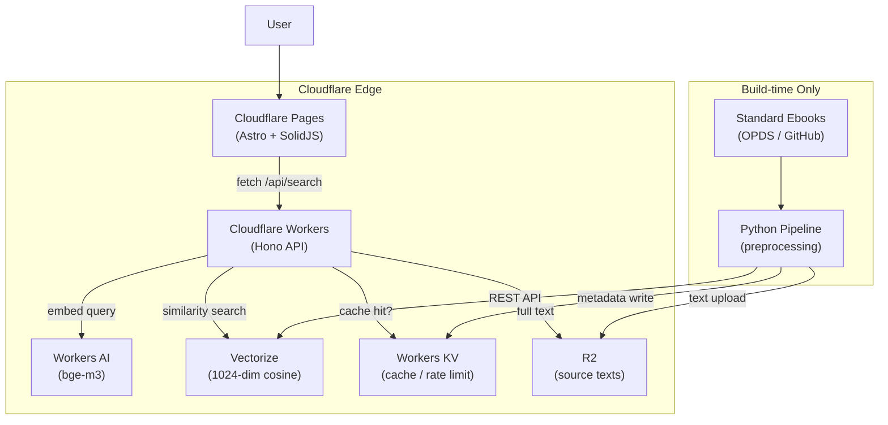

**[English](README.md)** | **[日本語](README.ja.md)** | **[中文](README.zh-CN.md)**

# Passage

セマンティック検索で文学作品の一節を発見 — Cloudflare のエッジ AI スタックで構築。

---

## 概要

Passage は、数百冊のパブリックドメイン文学作品の全文をベクトル化し、Cloudflare Vectorize に格納します。ユーザーが自由なテキスト（気分、情景、感情など）を入力すると、同一モデル（BGE-M3）でクエリを埋め込み、コサイン類似度でコーパスとマッチングします。結果は本文、書籍タイトル、著者、章情報とともに返されます。

キュレーションされた名言サイトとは異なり、Passage は各作品の *全文* を検索し、人間のキュレーターでは選ばないような一節を掘り起こします。

## アーキテクチャ



要件定義、データフロー、コスト分析、運用設計を含む詳細な設計ドキュメントは [DESIGN.md](DESIGN.md) を参照してください。

## 主要な設計判断

- **ヘキサゴナルアーキテクチャ（ポート＆アダプター）** — ドメインロジックは Cloudflare サービスから完全に分離。すべての外部依存はポートインターフェースの背後に配置し、インフラなしで包括的なユニットテストを実現。クラウド認証情報不要で数秒で実行できる 200 以上のテストを提供。

- **段落ベースチャンキングとデュアルリミットバッチング** — 文学テキストを段落境界（80〜1,500 文字）で分割し、意味的一貫性を保持。埋め込みリクエストはデュアルリミットバッチング（最大 50 件、最大 40,000 文字）を使用し、BGE-M3 のコンテキストウィンドウ内に収めつつスループットを最大化。

- **セマフォベースの非同期並行処理** — Python パイプラインは `asyncio.Semaphore` で書籍を並行処理し、スループットと API レート制限のバランスを確保。各書籍は acquire → extract → chunk → embed → store → ingest を独立して進行。

- **KV エッジキャッシュとコスト防御** — 検索結果を Workers KV でエッジキャッシュし、トラフィックスパイク時のコスト爆発を防止。IP ベースのレート制限（30 req/min）で二重の防御レイヤーを追加。非アトミックな KV インクリメントは意図的なトレードオフ — 厳密なレート制限ではなく、不正利用防止が目的。

- **Cloudflare ネイティブスタック（ゼロ運用）** — Workers、Pages、Vectorize、Workers AI、KV、R2 による完全マネージドスタック。サーバーのプロビジョニング不要、コンテナオーケストレーション不要、エグレス料金なし。推定コスト：通常トラフィックで月額 $15 以下、1,000 万リクエストでも月額 $120 以下。

## 技術スタック

| レイヤー | 技術 | 用途 |
|---|---|---|
| フロントエンド | Astro 5, SolidJS | 静的サイト生成 + インタラクティブ検索アイランド |
| API | Hono 4, Zod OpenAPI | エッジネイティブ REST API（ランタイム型バリデーション付き） |
| 検索 | Cloudflare Vectorize | 1024 次元コサイン類似度ベクトル検索 |
| 埋め込み | Workers AI (BGE-M3) | 多言語テキストからベクトルへの変換（クエリ＆コーパス） |
| ストレージ | Cloudflare R2 | 全文パッセージ保存（S3 互換） |
| キャッシュ | Workers KV | エッジキャッシュ + レート制限 |
| パイプライン | Python 3.12, httpx | EPUB 取得、抽出、チャンキング、埋め込み |
| CI/CD | GitHub Actions | 3 並列ジョブ：パイプライン、API、Web |
| パッケージ管理 | uv (Python), bun (JS) | 高速なロックファイルベースの依存関係管理 |

## プロジェクト構成

```
Passage/
├── src/passage_pipeline/      # Python 前処理パイプライン
│   ├── models.py              #   データクラス (Chapter, TextChunk 等)
│   ├── acquire.py             #   OPDS カタログ取得 + EPUB ダウンロード
│   ├── extract.py             #   EPUB → 構造化テキスト (ebooklib + bs4)
│   ├── chunk.py               #   段落ベースのテキスト分割
│   ├── embed.py               #   Cloudflare Workers AI 埋め込み
│   ├── store.py               #   R2 テキストアップロード
│   ├── ingest.py              #   Vectorize NDJSON バッチアップロード
│   └── main.py                #   CLI オーケストレーター
├── packages/
│   ├── api/                   # Cloudflare Workers API (Hono)
│   │   └── src/
│   │       ├── domain/        #   値オブジェクト、ランカー
│   │       ├── port/          #   インターフェース (embedding, vector, cache)
│   │       ├── application/   #   ユースケース (SearchUseCase)
│   │       ├── infrastructure/#   Cloudflare サービスアダプター
│   │       └── interface/     #   Hono ルート、ミドルウェア
│   └── web/                   # Cloudflare Pages フロントエンド (Astro + SolidJS)
│       └── src/
│           ├── components/    #   SearchInput, ResultList, ResultCard
│           └── pages/         #   Astro ページ
├── tests/                     # Python パイプラインテスト (pytest + respx)
├── .github/workflows/ci.yml   # CI: 3 並列ジョブ
├── DESIGN.md                  # 技術設計ドキュメント（詳細）
└── SECURITY.md                # シークレット管理ポリシー
```

## はじめに

### 前提条件

- Python 3.12+
- [uv](https://docs.astral.sh/uv/)（Python パッケージマネージャー）
- [bun](https://bun.sh/)（JavaScript ランタイム）
- [Wrangler CLI](https://developers.cloudflare.com/workers/wrangler/)（API/Web 開発用）

### パイプライン（Python）

```bash
cp .env.example .env           # 認証情報を設定
uv sync                        # 依存関係をインストール
uv run main.py --dry-run       # テスト実行（認証情報不要）
uv run main.py --max-books 5   # 最大5冊を処理
```

### API（Cloudflare Workers）

```bash
cd packages/api
bun install
bun run dev                    # ローカル開発サーバーを :8787 で起動
bun run test                   # API テストを実行
```

### フロントエンド（Cloudflare Pages）

```bash
cd packages/web
bun install
bun run dev                    # ローカル開発サーバーを起動
bun run test                   # フロントエンドテストを実行
```

## テスト

プロジェクトは TDD を採用しており、3 つのテストスイートで 200 以上のテストを並列 CI ジョブで実行します：

| スイート | ランナー | テスト数 | モッキング |
|---|---|---|---|
| Python パイプライン | pytest | 102 | respx (HTTP), moto (S3/R2) |
| API | vitest + miniflare | 83 | @cloudflare/vitest-pool-workers |
| Web フロントエンド | vitest + jsdom | 16 | @solidjs/testing-library |

```bash
# 全テスト実行
uv run pytest                              # パイプライン
cd packages/api && bun run test            # API
cd packages/web && bun run test            # Web
```

## デプロイ

API とフロントエンドは Cloudflare にデプロイされます：

```bash
cd packages/api && bun run deploy          # Workers API をデプロイ
cd packages/web && bun run build           # Cloudflare Pages 用にビルド
```

CI は `main` へのプッシュおよびプルリクエスト時に自動実行されます。詳細は [`.github/workflows/ci.yml`](.github/workflows/ci.yml) を参照してください。

## ドキュメント

- [DESIGN.md](DESIGN.md) — 技術設計ドキュメント：要件定義、アーキテクチャ、データフロー、コスト分析、運用設計（2,400 行以上）
- [SECURITY.md](SECURITY.md) — シークレット管理と認証情報ローテーションポリシー

## ライセンス

[MIT](LICENSE)
