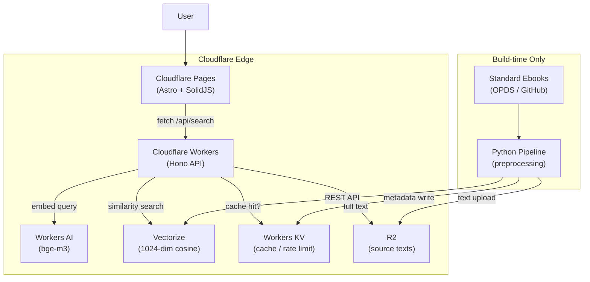

# Passage

Discover literary passages through semantic search — powered by Cloudflare's edge AI stack.

---

> **日本語サマリ**
>
> Passage は、パブリックドメインの世界文学作品から「心に響く一節」をセマンティック検索で発見する Web サービスです。
> ユーザーが自由なテキスト（気分、情景、感情など）を入力すると、意味的に最も近い文学作品の一節が引用元とともに表示されます。
>
> 数百冊の文学作品をベクトル化し、Cloudflare Workers エコシステム上に構築。
> ヘキサゴナルアーキテクチャによるテスタビリティ、エッジコンピューティングによる低レイテンシ、サーバーレスによるゼロ運用を実現しています。
>
> **ライブデモ:** [passage-web.pages.dev](https://passage-web.pages.dev)

---

## What It Does

Passage vectorizes the full text of hundreds of public-domain literary works and stores them in Cloudflare Vectorize. When a user enters free-form text — a mood, a scene, an emotion — the query is embedded with the same model (BGE-M3) and matched against the corpus via cosine similarity. Results are returned with the passage text, book title, author, and chapter information.

Unlike curated quote sites, Passage searches the *entire text* of each work, surfacing passages that no human curator would have selected.

## Architecture



For detailed design documentation including requirements, data flow, cost analysis, and operational design, see [DESIGN.md](DESIGN.md).

## Key Design Decisions

- **Hexagonal Architecture (Ports & Adapters)** — Domain logic is fully isolated from Cloudflare services. Every external dependency is behind a port interface, enabling comprehensive unit testing without infrastructure. This yields 200+ tests that run in seconds with zero cloud credentials.

- **Paragraph-based Chunking with Dual-limit Batching** — Literary text is split at paragraph boundaries (80–1,500 chars) to preserve semantic coherence. Embedding requests use dual-limit batching (max 50 items, max 40,000 chars) to stay within BGE-M3's context window while maximizing throughput.

- **Semaphore-based Async Concurrency** — The Python pipeline processes books concurrently with `asyncio.Semaphore`, balancing throughput against API rate limits. Each book progresses through acquire → extract → chunk → embed → store → ingest independently.

- **KV Edge Cache with Cost Safeguards** — Search results are cached at the edge in Workers KV to prevent cost explosion under traffic spikes. IP-based rate limiting (30 req/min) adds a second defense layer. The non-atomic KV increment is an intentional trade-off — precise rate limiting isn't the goal, abuse prevention is.

- **Cloudflare-native Stack (Zero Ops)** — Workers, Pages, Vectorize, Workers AI, KV, and R2 form a fully managed stack with no servers to provision, no containers to orchestrate, and no egress fees. Estimated cost: under $15/month for normal traffic, under $120/month even at 10M requests.

## Tech Stack

| Layer | Technology | Purpose |
|---|---|---|
| Frontend | Astro 5, SolidJS | Static site generation + interactive search island |
| API | Hono 4, Zod OpenAPI | Edge-native REST API with runtime type validation |
| Search | Cloudflare Vectorize | 1024-dim cosine similarity vector search |
| Embedding | Workers AI (BGE-M3) | Multilingual text-to-vector (query & corpus) |
| Storage | Cloudflare R2 | Full-text passage storage (S3-compatible) |
| Cache | Workers KV | Edge cache + rate limiting |
| Pipeline | Python 3.12, httpx | EPUB acquisition, extraction, chunking, embedding |
| CI/CD | GitHub Actions | 3 parallel jobs: pipeline, API, web |
| Package Mgmt | uv (Python), bun (JS) | Fast, lockfile-based dependency management |

## Project Structure

```
Passage/
├── src/passage_pipeline/      # Python preprocessing pipeline
│   ├── models.py              #   Data classes (Chapter, TextChunk, etc.)
│   ├── acquire.py             #   OPDS catalog fetch + EPUB download
│   ├── extract.py             #   EPUB → structured text (ebooklib + bs4)
│   ├── chunk.py               #   Paragraph-based text splitting
│   ├── embed.py               #   Cloudflare Workers AI embedding
│   ├── store.py               #   R2 text upload
│   ├── ingest.py              #   Vectorize NDJSON batch upload
│   └── main.py                #   CLI orchestrator
├── packages/
│   ├── api/                   # Cloudflare Workers API (Hono)
│   │   └── src/
│   │       ├── domain/        #   Value objects, ranker
│   │       ├── port/          #   Interfaces (embedding, vector, cache)
│   │       ├── application/   #   Use cases (SearchUseCase)
│   │       ├── infrastructure/#   Cloudflare service adapters
│   │       └── interface/     #   Hono routes, middleware
│   └── web/                   # Cloudflare Pages frontend (Astro + SolidJS)
│       └── src/
│           ├── components/    #   SearchInput, ResultList, ResultCard
│           └── pages/         #   Astro pages
├── tests/                     # Python pipeline tests (pytest + respx)
├── .github/workflows/ci.yml   # CI: 3 parallel jobs
├── DESIGN.md                  # Technical design document (detailed)
└── SECURITY.md                # Secrets management policy
```

## Getting Started

### Prerequisites

- Python 3.12+
- [uv](https://docs.astral.sh/uv/) (Python package manager)
- [bun](https://bun.sh/) (JavaScript runtime)
- [Wrangler CLI](https://developers.cloudflare.com/workers/wrangler/) (for API/web dev)

### Pipeline (Python)

```bash
cp .env.example .env           # Configure credentials
uv sync                        # Install dependencies
uv run main.py --dry-run       # Test run (no credentials needed)
uv run main.py --max-books 5   # Process up to 5 books
```

### API (Cloudflare Workers)

```bash
cd packages/api
bun install
bun run dev                    # Start local dev server on :8787
bun run test                   # Run API tests
```

### Frontend (Cloudflare Pages)

```bash
cd packages/web
bun install
bun run dev                    # Start local dev server
bun run test                   # Run frontend tests
```

## Testing

The project follows TDD with 200+ tests across three test suites, all running in parallel CI jobs:

| Suite | Runner | Tests | Mocking |
|---|---|---|---|
| Python Pipeline | pytest | 102 | respx (HTTP), moto (S3/R2) |
| API | vitest + miniflare | 83 | @cloudflare/vitest-pool-workers |
| Web Frontend | vitest + jsdom | 16 | @solidjs/testing-library |

```bash
# Run all tests
uv run pytest                              # Pipeline
cd packages/api && bun run test            # API
cd packages/web && bun run test            # Web
```

## Deployment

The API and frontend are deployed to Cloudflare:

```bash
cd packages/api && bun run deploy          # Deploy Workers API
cd packages/web && bun run build           # Build for Cloudflare Pages
```

CI runs automatically on push to `main` and on pull requests. See [`.github/workflows/ci.yml`](.github/workflows/ci.yml) for details.

## Documentation

- [DESIGN.md](DESIGN.md) — Technical design document: requirements, architecture, data flow, cost analysis, operational design (2,400+ lines)
- [SECURITY.md](SECURITY.md) — Secrets management and credential rotation policy

## License

[MIT](LICENSE)
