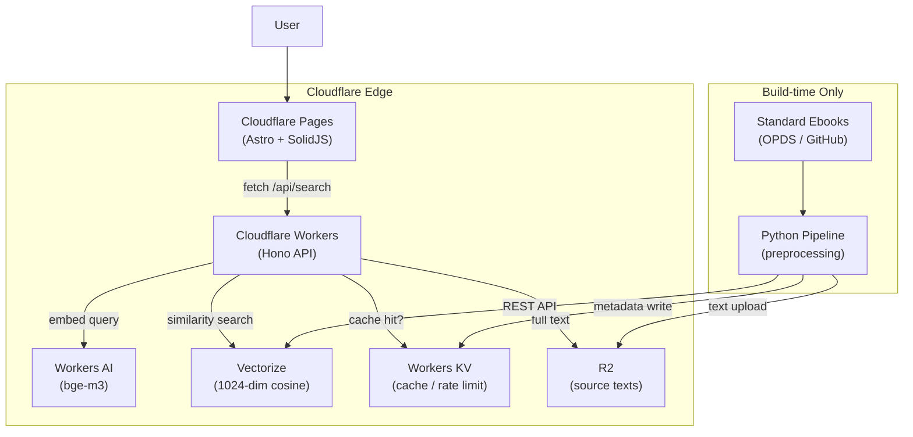

**[English](README.md)** | **[日本語](README.ja.md)** | **[中文](README.zh-CN.md)**

# Passage

通过语义搜索发现文学作品中的精彩段落 ——基于 Cloudflare 边缘 AI 技术栈构建。

---

## 功能简介

Passage 将数百部公共领域文学作品的全文向量化，并存储在 Cloudflare Vectorize 中。当用户输入自由格式的文本——一种情绪、一个场景、一种情感——查询会使用相同的模型（BGE-M3）进行嵌入，并通过余弦相似度与语料库进行匹配。返回结果包含段落文本、书名、作者和章节信息。

与人工策划的名言网站不同，Passage 搜索每部作品的*完整文本*，挖掘出人工策划者不会选取的段落。

## 架构



详细的设计文档（包括需求、数据流、成本分析和运维设计）请参阅 [DESIGN.md](DESIGN.md)。

## 关键设计决策

- **六边形架构（端口与适配器）** ——领域逻辑与 Cloudflare 服务完全隔离。每个外部依赖都位于端口接口之后，从而实现无需基础设施的全面单元测试。这带来了 200 多个测试，在几秒内即可完成运行且无需任何云凭证。

- **基于段落的分块与双限制批处理** ——文学文本按段落边界分割（80–1,500 字符），以保持语义连贯性。嵌入请求使用双限制批处理（最多 50 项、最多 40,000 字符），在 BGE-M3 的上下文窗口内最大化吞吐量。

- **基于信号量的异步并发** ——Python 管道使用 `asyncio.Semaphore` 并发处理书籍，在吞吐量和 API 速率限制之间取得平衡。每本书独立经历 acquire → extract → chunk → embed → store → ingest 流程。

- **KV 边缘缓存与成本防护** ——搜索结果在 Workers KV 中进行边缘缓存，防止流量突增导致的成本爆炸。基于 IP 的速率限制（30 次请求/分钟）提供第二层防护。非原子性的 KV 递增是有意为之的权衡——目标不是精确的速率限制，而是滥用防护。

- **Cloudflare 原生技术栈（零运维）** ——Workers、Pages、Vectorize、Workers AI、KV 和 R2 构成完全托管的技术栈，无需配置服务器、无需编排容器、无出口流量费用。预估成本：正常流量下每月不到 15 美元，即使在 1000 万请求的情况下每月也不到 120 美元。

## 技术栈

| 层级 | 技术 | 用途 |
|---|---|---|
| 前端 | Astro 5, SolidJS | 静态站点生成 + 交互式搜索岛 |
| API | Hono 4, Zod OpenAPI | 边缘原生 REST API，运行时类型校验 |
| 搜索 | Cloudflare Vectorize | 1024 维余弦相似度向量搜索 |
| 嵌入 | Workers AI (BGE-M3) | 多语言文本向量化（查询和语料库） |
| 存储 | Cloudflare R2 | 全文段落存储（S3 兼容） |
| 缓存 | Workers KV | 边缘缓存 + 速率限制 |
| 管道 | Python 3.12, httpx | EPUB 获取、提取、分块、嵌入 |
| CI/CD | GitHub Actions | 3 个并行任务：管道、API、前端 |
| 包管理 | uv (Python), bun (JS) | 基于锁文件的快速依赖管理 |

## 项目结构

```
Passage/
├── src/passage_pipeline/      # Python 预处理管道
│   ├── models.py              #   数据类（Chapter, TextChunk 等）
│   ├── acquire.py             #   OPDS 目录获取 + EPUB 下载
│   ├── extract.py             #   EPUB → 结构化文本（ebooklib + bs4）
│   ├── chunk.py               #   基于段落的文本分割
│   ├── embed.py               #   Cloudflare Workers AI 嵌入
│   ├── store.py               #   R2 文本上传
│   ├── ingest.py              #   Vectorize NDJSON 批量上传
│   └── main.py                #   CLI 编排器
├── packages/
│   ├── api/                   # Cloudflare Workers API (Hono)
│   │   └── src/
│   │       ├── domain/        #   值对象、排序器
│   │       ├── port/          #   接口（嵌入、向量、缓存）
│   │       ├── application/   #   用例（SearchUseCase）
│   │       ├── infrastructure/#   Cloudflare 服务适配器
│   │       └── interface/     #   Hono 路由、中间件
│   └── web/                   # Cloudflare Pages 前端（Astro + SolidJS）
│       └── src/
│           ├── components/    #   SearchInput, ResultList, ResultCard
│           └── pages/         #   Astro 页面
├── tests/                     # Python 管道测试（pytest + respx）
├── .github/workflows/ci.yml   # CI：3 个并行任务
├── DESIGN.md                  # 技术设计文档（详细）
└── SECURITY.md                # 密钥管理策略
```

## 快速开始

### 前置条件

- Python 3.12+
- [uv](https://docs.astral.sh/uv/)（Python 包管理器）
- [bun](https://bun.sh/)（JavaScript 运行时）
- [Wrangler CLI](https://developers.cloudflare.com/workers/wrangler/)（用于 API/前端开发）

### 管道（Python）

```bash
cp .env.example .env           # 配置凭证
uv sync                        # 安装依赖
uv run main.py --dry-run       # 测试运行（无需凭证）
uv run main.py --max-books 5   # 最多处理 5 本书
```

### API（Cloudflare Workers）

```bash
cd packages/api
bun install
bun run dev                    # 启动本地开发服务器（端口 :8787）
bun run test                   # 运行 API 测试
```

### 前端（Cloudflare Pages）

```bash
cd packages/web
bun install
bun run dev                    # 启动本地开发服务器
bun run test                   # 运行前端测试
```

## 测试

项目遵循 TDD 开发方式，拥有 200 多个测试，分布在三个测试套件中，全部在 CI 中并行运行：

| 套件 | 运行器 | 测试数 | 模拟方式 |
|---|---|---|---|
| Python 管道 | pytest | 102 | respx (HTTP), moto (S3/R2) |
| API | vitest + miniflare | 83 | @cloudflare/vitest-pool-workers |
| 前端 | vitest + jsdom | 16 | @solidjs/testing-library |

```bash
# 运行所有测试
uv run pytest                              # 管道
cd packages/api && bun run test            # API
cd packages/web && bun run test            # 前端
```

## 部署

API 和前端部署到 Cloudflare：

```bash
cd packages/api && bun run deploy          # 部署 Workers API
cd packages/web && bun run build           # 构建 Cloudflare Pages
```

CI 在推送到 `main` 分支和拉取请求时自动运行。详情请参阅 [`.github/workflows/ci.yml`](.github/workflows/ci.yml)。

## 文档

- [DESIGN.md](DESIGN.md) ——技术设计文档：需求、架构、数据流、成本分析、运维设计（2,400 多行）
- [SECURITY.md](SECURITY.md) ——密钥管理和凭证轮换策略

## 许可证

[MIT](LICENSE)
